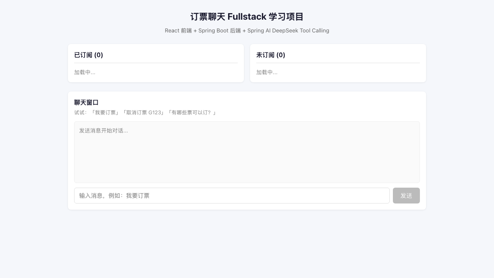
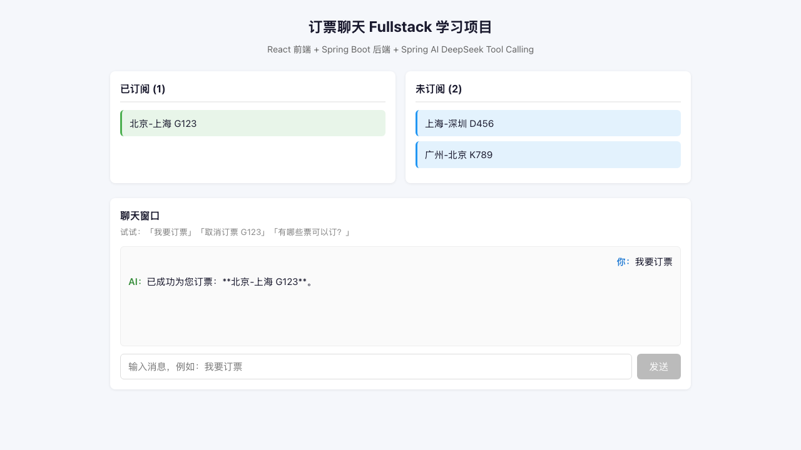
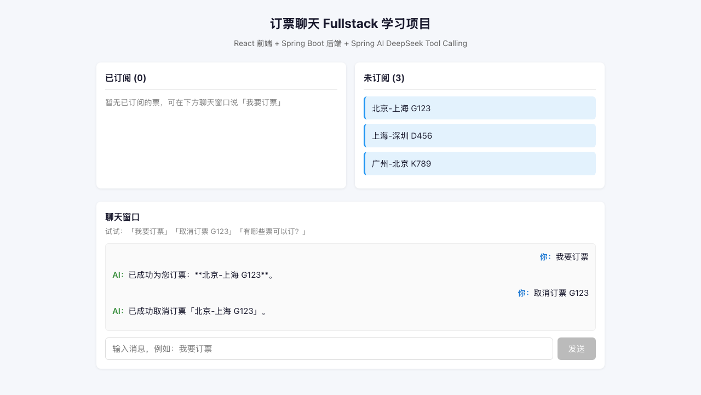

# springai_demo

React + Spring Boot + Spring AI（DeepSeek Tool Calling）全栈学习项目。

通过「订票列表 + 自然语言聊天」演示 **ReAct**（Reason + Act）：大模型理解用户意图 → 调用 Java `@Tool` → 修改数据库 → 前端列表实时刷新。

> 仓库地址：[github.com/liweinan/springai_demo](https://github.com/liweinan/springai_demo)

**详细架构说明（自学向）** → [docs/ARCHITECTURE.md](docs/ARCHITECTURE.md)

**Spring AI Advisor API 设计说明** → [docs/ADVISOR_API.md](docs/ADVISOR_API.md)

**前端聊天与列表刷新流程** → [docs/FRONTEND_CHAT_FLOW.md](docs/FRONTEND_CHAT_FLOW.md)

**Tool Call 调用格式（@Tool → DeepSeek API）** → [docs/TOOL_CALL_FORMAT.md](docs/TOOL_CALL_FORMAT.md)

**PromptLoggingAdvisor 调用链与 before/after 时机** → [docs/PROMPT_LOGGING_ADVISOR.md](docs/PROMPT_LOGGING_ADVISOR.md)

**跨域与 Vite Proxy / CORS** → [docs/CORS.md](docs/CORS.md)

---

## 效果预览

| 初始状态（3 条可订票） | 聊天「我要订票」后 |
|:---:|:---:|
|  |  |

| 聊天「取消订票」后 |
|:---:|
|  |

截图由 Playwright 自动生成：`pnpm run capture-screenshots`（需先 `pnpm install`）

---

## 前置要求

- Java 17+、Maven
- [pnpm](https://pnpm.io/installation) 9+（本项目使用 pnpm workspace 管理 `frontend` 与 `e2e`）

## 技术栈

| 层级 | 技术 |
|------|------|
| 前端 | React 18、TypeScript、Vite |
| 后端 | Java 17、Spring Boot 4.1、Spring Data JPA、H2 |
| AI | Spring AI 2.0、DeepSeek `deepseek-chat`、Tool Calling |
| 测试 | Playwright E2E |

---

## Spring AI 2.0 主要变化（相对 1.x）

本项目已从 Spring AI 1.x + Spring Boot 3.x 升级到 **Spring AI 2.0.0 + Spring Boot 4.1.0**。对本 Demo 影响最大的几点如下：

| 变化 | 说明 |
|------|------|
| **必须搭配 Spring Boot 4** | Spring AI 2.0 基于 Boot 4 依赖模型，不能与 Boot 3.x 混用。 |
| **`ToolCallingAdvisor` 自动注册** | 调用 `defaultTools(...)` 后，框架会自动在 Advisor 链中注册 `ToolCallingAdvisor`（order ≈ +300），**无需**在 `ChatConfig` 里手动 `new ToolCallAdvisor`。 |
| **ReAct 循环进入 Advisor 链** | 1.x 中工具循环多在 `ChatModel` 内部执行，外层 Advisor 往往只能看到首尾两次调用；2.0 把循环放进 Advisor 链，便于观测与扩展。 |
| **`PromptLoggingAdvisor` 可逐步打印** | 本项目自定义 `PromptLoggingAdvisor`（order +400，位于 `ToolCallingAdvisor` 之内），控制台以 `[AI 第N步]` 输出每轮实际 Prompt 与 Response。 |
| **配置更精简** | `ChatConfig` 只保留 `defaultSystem` + `defaultTools` + 日志 Advisor；`ToolCallingManager` 仍由 Spring Boot 自动配置，业务代码无需注入。 |

**日志里如何读 ReAct**（需 `DEEPSEEK_API_KEY` 且后端 INFO 日志开启）：

```
[Chat] 收到用户消息: 我要订票
[AI 第1步] 发送 Prompt: ...          ← 发给 DeepSeek 的完整消息
[AI 第1步] 收到 Response: ... (tool_calls)
[Tool 被调用] subscribeTicket       ← 工具真正执行
[AI 第2步] 发送 Prompt: ...（含 TOOL_RESPONSE）
[AI 第2步] 收到 Response: ...       ← 最终中文回复
[Chat] AI 回复: ...
```

更多 API 级破坏性变更见官方 [Upgrade Notes 2.0](https://docs.spring.io/spring-ai/reference/2.0/upgrade-notes.html)。

---

## Docker 一键启动

需已安装 [Docker](https://docs.docker.com/get-docker/) 与 Docker Compose。

```bash
# 配置 Key（勿写入镜像；compose 从环境变量或 .env 读取）
export DEEPSEEK_API_KEY=your-key-here
# 或：cp .env.example .env 并编辑

docker compose up --build
```

| 地址 | 说明 |
|------|------|
| http://localhost:5173 | 前端（Vite dev，/api 代理到 backend） |
| http://localhost:8080 | 后端 API |

Docker 容器探活使用 `GET /api/health/live`（不调用 DeepSeek）；手动验收 Key 与连通性仍用 `GET /api/health`。

Compose 下 backend 日志默认为 **DEBUG**：除 INFO 的 messages 外，还会打印注册工具的 name / description / inputSchema（对应 API `tools` 字段，不在 messages 里）。

**JDWP 远程调试**（断点调试 Advisor 链等）：

```bash
JDWP_ENABLED=true docker compose up --build
# IDE：Remote JVM Debug → Attach → localhost:5005
```

`.env` 中设 `JDWP_ENABLED=true` 亦可。`JDWP_SUSPEND=y` 会等调试器连接后再启动 JVM。

停止：`docker compose down`

---

## 快速启动

### 1. 配置 API Key（必做）

从 [DeepSeek 开放平台](https://platform.deepseek.com/) 获取 Key，**仅通过环境变量注入，绝不写入代码或 Git**：

```bash
export DEEPSEEK_API_KEY=your-key-here
# 或复制 .env.example 为 .env 后填入（.env 已在 .gitignore 中）
```

### 2. 启动后端

```bash
cd backend
mvn spring-boot:run
```

→ `http://localhost:8080`

### 3. 安装依赖并启动前端

在项目根目录：

```bash
pnpm install
pnpm dev
```

或在 `frontend` 目录：`pnpm install && pnpm dev`

→ `http://localhost:5173`

### 4. 健康检查

```bash
curl http://localhost:8080/api/health
# {"deepseekConfigured":true,"deepseekReachable":true}
```

---

## 架构一览

```
React 页面
  ├─ GET  /api/bookings?status=...     → 双栏列表
  └─ POST /api/chat                    → 聊天

Spring Boot
  ├─ BookingController / BookingService / BookingRepository  → 经典三层
  └─ ChatController → ChatService → ChatClient
                                        ↓ ReAct 循环
                                   BookingTools (@Tool)
                                        ↓
                                   BookingService（同一写入口）
                                        ↓
                                   DeepSeek API
```

**ReAct 由谁驱动**：Spring AI 2.0 在注册 `defaultTools` 后自动启用 `ToolCallingAdvisor`，完成「推理 → 调工具 → 回传结果 → 生成回复」，无需手写 `while`。

**如何确认工具被调用**：后端日志出现 `[Tool 被调用] subscribeTicket`；若需看每步 Prompt/Response，搜索 `[AI 第`。

---

## Spring AI 四个核心文件

| 文件 | 作用 |
|------|------|
| `config/ChatConfig.java` | 组装 `ChatClient` + system prompt + tools + `PromptLoggingAdvisor` |
| `advisor/PromptLoggingAdvisor.java` | 打印 ReAct 每步 Prompt / Response（Spring AI 2.0 Advisor 链内） |
| `tools/BookingTools.java` | 3 个 `@Tool` 方法（订票 / 取消 / 查列表） |
| `service/ChatService.java` | **唯一**调用大模型：`chatClient.prompt().user().call()` |
| `controller/ChatController.java` | HTTP 入口，不含 AI 逻辑 |

---

## API 一览

| 方法 | 路径 | 说明 |
|------|------|------|
| GET | `/api/bookings?status=SUBSCRIBED` | 已订阅列表 |
| GET | `/api/bookings?status=UNSUBSCRIBED` | 未订阅列表 |
| POST | `/api/chat` | 聊天，`{"message":"我要订票"}` |
| GET | `/api/health/live` | 存活探针（不调用 DeepSeek，Docker 用） |
| GET | `/api/health` | Key 配置与 DeepSeek 连通性（手动调用） |

---

## curl 验收（不启前端）

```bash
curl "http://localhost:8080/api/bookings?status=UNSUBSCRIBED"

curl -X POST http://localhost:8080/api/chat \
  -H "Content-Type: application/json" \
  -d '{"message":"我要订票"}'

curl "http://localhost:8080/api/bookings?status=SUBSCRIBED"
```

---

## E2E 测试（Playwright）

```bash
export DEEPSEEK_API_KEY=your-key-here
pnpm install
pnpm --dir e2e exec playwright install chromium
pnpm test:e2e
```

或在 `e2e` 目录：`pnpm test`

| 用例 | 验证 |
|------|------|
| 初始加载 | 3 未订阅 / 0 已订阅 |
| 聊天订票 | 「我要订票」→ 左栏 +1（不假定具体订哪张票） |
| 聊天取消 | 取消当前左栏已订阅票 → 回到右栏 |
| 健康检查 | `/api/health` 正常 |

---

## 项目结构

```
springai_demo/
├── docker-compose.yml    # 一键启动前后端
├── package.json          # 根脚本（pnpm dev / test:e2e）
├── pnpm-workspace.yaml   # workspace：frontend + e2e
├── backend/              # Spring Boot + Spring AI
├── frontend/             # React + Vite
├── e2e/                  # Playwright 测试 + 截图脚本
├── docs/screenshots/     # README 用截图
├── .env.example          # Key 配置示例（不含真实 Key）
└── README.md
```

---

## 可扩展方向

- 用户登录、SQLite 持久化、SSE 流式聊天、意图识别规则兜底

---

## License

MIT
