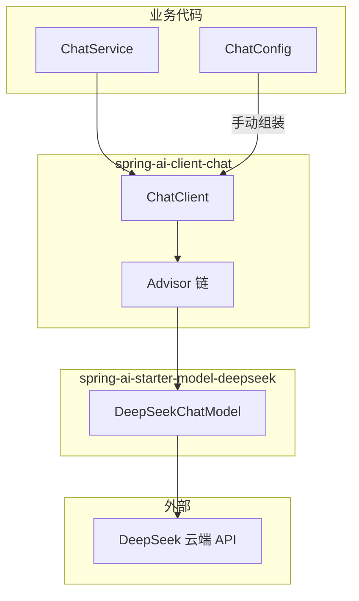

# Spring AI Advisor API 设计说明

> Spring AI `Advisor` 接口的设计目的、责任链机制，以及在本 Demo 中的体现。

本文档说明 **Advisor 为什么存在**、**接口如何分层**、**责任链如何运转**，并串联 `ChatClient`、`spring-ai-starter-model-deepseek` 与本项目的 `PromptLoggingAdvisor`。框架行为基于 [spring-projects/spring-ai v2.0.0](https://github.com/spring-projects/spring-ai/tree/v2.0.0)。

适合配合 [ARCHITECTURE.md](./ARCHITECTURE.md)（全局架构）、[SPRING_AI_INTEGRATION.md](./SPRING_AI_INTEGRATION.md)（大模型接入）、[PROMPT_LOGGING_ADVISOR.md](./PROMPT_LOGGING_ADVISOR.md)（本 Demo 自定义 Advisor 的调用时机）阅读。

---

## 1. 设计目的（一句话）

`Advisor` 是 Spring AI **ChatClient 层的拦截/增强机制**：把生成式 AI 里反复出现的模式（对话记忆、RAG、Tool Calling、日志、安全校验等）从业务代码里抽出来，做成**可组合、可排序、可跨模型复用**的插件。

官方文档表述：

> 封装 recurring Generative AI patterns，转换发给/来自 LLM 的数据，并在不同模型和用例间提供可移植性。

参考：[Spring AI Advisors 官方文档](https://docs.spring.io/spring-ai/reference/api/advisors.html)

---

## 2. 解决的核心问题

没有 Advisor 时，每次调用大模型都要手写：

- 加载对话历史
- 检索向量库拼进 Prompt
- Tool Calling 多轮循环
- 日志、观测、安全过滤

这些逻辑会散落在 `ChatService` 里，**难复用、难测试、换模型要改一堆代码**。

Advisor 把这些横切逻辑标准化为独立组件，挂到 `ChatClient` 的调用链上。本 Demo 的业务代码因此只需：

```java
chatClient.prompt().user(msg).call().content();
```

ReAct 循环、逐步日志等均由 Advisor 链完成，详见 [ChatService.java](../backend/src/main/java/com/demo/booking/service/ChatService.java)。

---

## 3. 与 ChatClient、DeepSeek Starter 的关系

三者职责不同，通过 **`ChatModel` 接口** 解耦：



| 组件 | 所在模块 | 职责 |
|------|----------|------|
| `ChatClient` | `spring-ai-client-chat` | Fluent API、Advisor 链、结构化输出 |
| `Advisor` | `spring-ai-client-chat` | 拦截/增强每次模型往返 |
| `DeepSeekChatModel` | `spring-ai-deepseek`（由 Starter 引入） | 实现 `ChatModel`，Prompt ↔ DeepSeek HTTP |
| `spring-ai-starter-model-deepseek` | Maven Starter | 聚合 DeepSeek 模型 + ChatClient + 自动配置 |

- **`ChatClient` 不感知 DeepSeek**——它只依赖 `ChatModel` 接口。
- **Starter 同时提供** `DeepSeekChatModel` Bean 与 `ChatClient` API；本 Demo 在 `ChatConfig` 中手动组装 `ChatClient`，注入自动配置的 `ChatModel`。

---

## 4. 接口层次结构

### 4.1 父接口 `Advisor`

```java
// spring-ai-client-chat/.../advisor/api/Advisor.java
public interface Advisor extends Ordered {
    int DEFAULT_CHAT_MEMORY_PRECEDENCE_ORDER = Ordered.HIGHEST_PRECEDENCE + 200;
    String getName();
}
```

`Advisor` 本身只定义：

- `getName()`：标识 Advisor，用于观测与调试
- `getOrder()`（继承自 Spring `Ordered`）：控制链中执行顺序

### 4.2 实际干活的子接口

| 接口 | 场景 | 核心方法 |
|------|------|----------|
| `CallAdvisor` | 同步调用 | `adviseCall(request, chain)` |
| `StreamAdvisor` | 流式调用 | `adviseStream(request, chain)` |

```java
// CallAdvisor.java
public interface CallAdvisor extends Advisor {
    ChatClientResponse adviseCall(ChatClientRequest chatClientRequest, CallAdvisorChain callAdvisorChain);
}
```

每个 Advisor 可以：

- **继续往下传**：`chain.nextCall(request)`
- **拦截请求**：不调用 `nextCall`，自己构造 `ChatClientResponse` 返回

### 4.3 降低实现成本：`BaseAdvisor`

大多数 Advisor 只需关心「请求前改什么、响应后改什么」。`BaseAdvisor` 提供模板：

```java
// BaseAdvisor.java（简化）
default ChatClientResponse adviseCall(ChatClientRequest request, CallAdvisorChain chain) {
    ChatClientRequest processed = before(request, chain);
    ChatClientResponse response = chain.nextCall(processed);
    return after(response, chain);
}
```

实现者只需实现 `before()` / `after()`。本 Demo 的 [`PromptLoggingAdvisor`](../backend/src/main/java/com/demo/booking/advisor/PromptLoggingAdvisor.java) 即采用此模式。

---

## 5. 责任链（Chain of Responsibility）

Advisor 通过 `CallAdvisorChain` / `StreamAdvisorChain` 串联，形成**栈式责任链**：

```
用户请求
  → Advisor A（before：注入记忆）
    → Advisor B（before：RAG 检索）
      → ToolCallingAdvisor（多轮 tool 循环）
        → ChatModelCallAdvisor（链尾，真正调 ChatModel）
      ← Advisor B（after）
    ← Advisor A（after）
  ← 返回 ChatClientResponse
```

**链尾由框架自动追加** `ChatModelCallAdvisor`，负责调用 `ChatModel`（本 Demo 中为 `DeepSeekChatModel`）：

```java
// DefaultChatClient.buildAdvisorChain()（Spring AI 2.0.0，简化）
chain.add(ChatModelCallAdvisor.builder().chatModel(this.chatModel).build());
chain.add(ChatModelStreamAdvisor.builder().chatModel(this.chatModel).build());
```

### 5.1 order 语义

| 规则 | 说明 |
|------|------|
| `order` 越小 | 越**先**处理请求、越**后**处理响应（栈语义） |
| `HIGHEST_PRECEDENCE`（最小整数） | 最靠外，最先看到请求 |
| `LOWEST_PRECEDENCE`（最大整数） | 最靠内，紧贴 `ChatModel` |

本 Demo 中的 order：

| Advisor | order | 位置 |
|---------|-------|------|
| `ToolCallingAdvisor` | `+300` | 外层：包住整个 ReAct 循环 |
| `PromptLoggingAdvisor` | `+400` | 内层：每一轮模型 HTTP 往返前后打日志 |
| `ChatModelCallAdvisor` | `LOWEST_PRECEDENCE` | 链尾：调用 DeepSeek |

逐步日志与 `before`/`after` 时机 → [PROMPT_LOGGING_ADVISOR.md](./PROMPT_LOGGING_ADVISOR.md)

---

## 6. 共享状态：`context`

`ChatClientRequest` / `ChatClientResponse` 都带一个 `context`（`Map`），Advisor 之间可共享运行时状态（如 `conversationId`、结构化输出 schema），无需全局变量。

---

## 7. Spring AI 2.0 的重要变化：ReAct 上移到 Advisor 链

`ToolCallingAdvisor` **不使用** `BaseAdvisor` 的默认模板，而是在 Advisor 链内实现 `do { ... } while (isToolCall)` 循环：

```java
// ToolCallingAdvisor.java（注释摘要）
/**
 * Recursive Advisor ... implements the tool calling loop as part of the advisor chain.
 * This enables intercepting the tool calling loop by the rest of the advisors next in the chain.
 */
```

**好处**：自定义 Advisor（如 `PromptLoggingAdvisor`）可以**观察到 Tool Calling 的每一步**——第 1 步模型返回 `tool_calls`、第 2 步带上工具结果再请求——而不是只能看到最终结果。

| 版本 | ReAct 循环位置 | 外层 Advisor 能看到的 |
|------|----------------|----------------------|
| 1.x（早期） | 多在 `ChatModel` 内部 | 通常只有首尾 |
| **2.0.x** | `ToolCallingAdvisor`（+300）在链内 | 每步往返（需 order 位于其内侧，如 +400） |

---

## 8. 内置 Advisor 与封装的模式

| Advisor | 封装的模式 |
|---------|-----------|
| `MessageChatMemoryAdvisor` | 对话记忆 |
| `QuestionAnswerAdvisor` | RAG 检索增强 |
| `ToolCallingAdvisor` | ReAct / Function Calling 多轮循环 |
| `ChatModelCallAdvisor` | 最终调用大模型（框架内置） |
| `SimpleLoggerAdvisor` | 请求/响应日志 |
| `SafeGuardAdvisor` | 内容安全过滤 |
| `StructuredOutputValidationAdvisor` | 结构化输出校验 |

本 Demo 额外实现：

| Advisor | 职责 |
|---------|------|
| `PromptLoggingAdvisor` | 每轮 DeepSeek 往返前后打 INFO/DEBUG 日志 |

---

## 9. 本 Demo 中的注册方式

```java
// ChatConfig.java
return ChatClient.builder(chatModel)   // chatModel = 自动配置的 DeepSeekChatModel
        .defaultSystem("...")
        .defaultTools(bookingTools)    // → 自动注册 ToolCallingAdvisor（+300）
        .defaultAdvisors(new PromptLoggingAdvisor())  // 显式注册（+400）
        .build();
```

| 方式 | 说明 |
|------|------|
| **手动组装 `ChatClient` Bean**（本 Demo） | 固定 system prompt、tools、自定义 Advisor |
| **注入 `ChatClient.Builder`**（Starter 自动配置） | prototype scope，适合简单或多 Client 场景 |

**注意**：不要再手动 `.advisors(ToolCallingAdvisor.builder()...)`，会与 `defaultTools()` 自动注册的实例重复。

---

## 10. 一次 `call()` 的完整调用链

以 `chatClient.prompt().user(msg).call().content()` 为例：

```
ChatService.chat()
  └─ ChatClient.call()                          ← spring-ai-client-chat
       └─ Advisor 链
            ├─ ToolCallingAdvisor（ReAct 外层循环）
            ├─ PromptLoggingAdvisor（每步 before/after 日志）
            └─ ChatModelCallAdvisor（链尾）
                 └─ chatModel.call(Prompt)     ← ChatModel 接口
                      └─ DeepSeekChatModel     ← spring-ai-deepseek
                           └─ DeepSeekApi → api.deepseek.com
```

Tool 定义与 `tool_calls` 格式 → [TOOL_CALL_FORMAT.md](./TOOL_CALL_FORMAT.md)

---

## 11. 类比理解

| Spring 生态 | Spring AI |
|-------------|-----------|
| `HandlerInterceptor` / `Filter` | `Advisor` |
| `RestClient` / `WebClient` | `ChatClient` |
| 具体 HTTP 驱动 | `DeepSeekChatModel` |

Advisor 相当于专门为 **LLM 对话流水线** 设计的拦截器：业务面向 `ChatClient` 写，横切逻辑以 Advisor 插件形式组合，底层模型可替换。

---

## 12. 源码与文档索引

### 本仓库

| 文件 | 说明 |
|------|------|
| [`ChatConfig.java`](../backend/src/main/java/com/demo/booking/config/ChatConfig.java) | 注册 Advisor + `defaultTools` |
| [`ChatService.java`](../backend/src/main/java/com/demo/booking/service/ChatService.java) | 唯一 `.call()` 入口 |
| [`PromptLoggingAdvisor.java`](../backend/src/main/java/com/demo/booking/advisor/PromptLoggingAdvisor.java) | 自定义观测 Advisor |

### Spring AI 框架（v2.0.0）

| 类 | 链接 |
|----|------|
| `Advisor` | [Advisor.java](https://github.com/spring-projects/spring-ai/blob/v2.0.0/spring-ai-client-chat/src/main/java/org/springframework/ai/chat/client/advisor/api/Advisor.java) |
| `CallAdvisor` | [CallAdvisor.java](https://github.com/spring-projects/spring-ai/blob/v2.0.0/spring-ai-client-chat/src/main/java/org/springframework/ai/chat/client/advisor/api/CallAdvisor.java) |
| `BaseAdvisor` | [BaseAdvisor.java](https://github.com/spring-projects/spring-ai/blob/v2.0.0/spring-ai-client-chat/src/main/java/org/springframework/ai/chat/client/advisor/api/BaseAdvisor.java) |
| `DefaultAroundAdvisorChain` | [DefaultAroundAdvisorChain.java](https://github.com/spring-projects/spring-ai/blob/v2.0.0/spring-ai-client-chat/src/main/java/org/springframework/ai/chat/client/advisor/DefaultAroundAdvisorChain.java) |
| `ToolCallingAdvisor` | [ToolCallingAdvisor.java](https://github.com/spring-projects/spring-ai/blob/v2.0.0/spring-ai-client-chat/src/main/java/org/springframework/ai/chat/client/advisor/ToolCallingAdvisor.java) |
| `ChatModelCallAdvisor` | [ChatModelCallAdvisor.java](https://github.com/spring-projects/spring-ai/blob/v2.0.0/spring-ai-client-chat/src/main/java/org/springframework/ai/chat/client/advisor/ChatModelCallAdvisor.java) |
| `DefaultChatClient` | [DefaultChatClient.java](https://github.com/spring-projects/spring-ai/blob/v2.0.0/spring-ai-client-chat/src/main/java/org/springframework/ai/chat/client/DefaultChatClient.java) |

### 延伸阅读

- [Spring AI Advisors 官方文档](https://docs.spring.io/spring-ai/reference/api/advisors.html)
- [PROMPT_LOGGING_ADVISOR.md](./PROMPT_LOGGING_ADVISOR.md) — 本 Demo 中 `before`/`after` 与 ReAct 的先后关系
- [TOOL_CALL_FORMAT.md](./TOOL_CALL_FORMAT.md) — `@Tool` → DeepSeek `tools` / `tool_calls`
