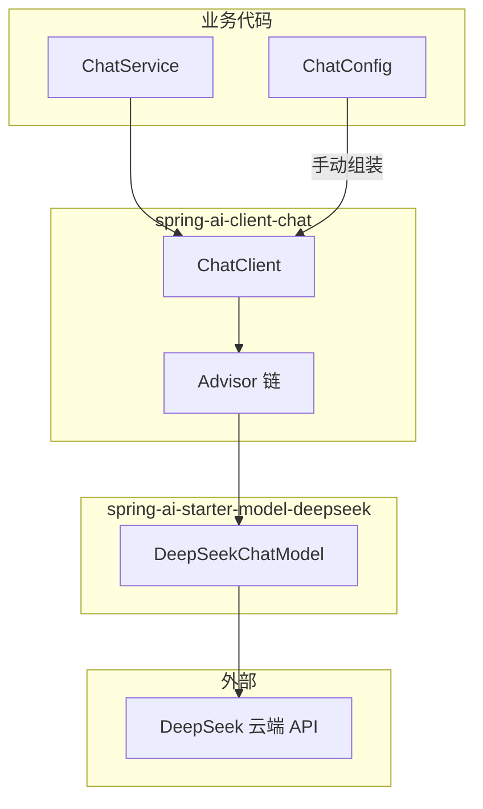
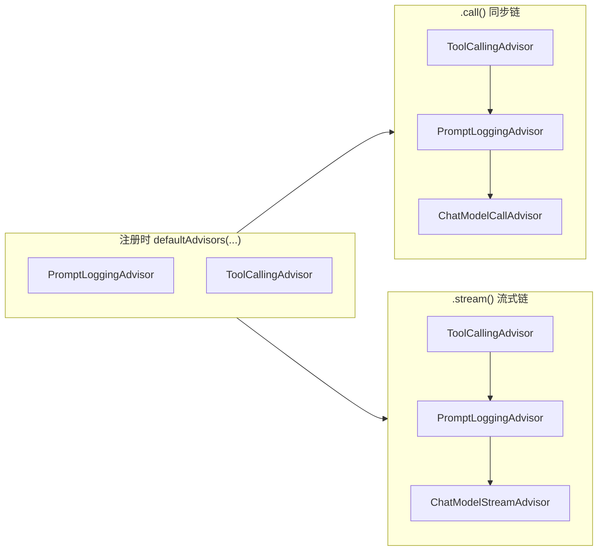

# Spring AI Advisor API 设计说明

> Spring AI `Advisor` 接口的设计目的、**接口层次与根契约**（`adviseCall` / `adviseStream`）、**同步链与流式链**、**Reactor 流式与逐块/聚合**，以及责任链机制，以及在本 Demo 中的体现。

本文档说明 **Advisor 为什么存在**、**`Advisor` / `CallAdvisor` / `BaseAdvisor` 各定什么契约**、**`StreamAdvisor` 两条平行链与 Reactor 流式语义**、**逐块处理 vs 聚合**、责任链如何运转，并串联 `ChatClient`、`spring-ai-starter-model-deepseek` 与本项目的 `PromptLoggingAdvisor`。框架行为基于 [spring-projects/spring-ai v2.0.0](https://github.com/spring-projects/spring-ai/tree/v2.0.0)。

适合配合 [ARCHITECTURE.md](./ARCHITECTURE.md)（全局架构）、[SPRING_AI_INTEGRATION.md](./SPRING_AI_INTEGRATION.md)（大模型接入）、[PROMPT_LOGGING_ADVISOR.md](./PROMPT_LOGGING_ADVISOR.md)（本 Demo 自定义 Advisor 的调用时机）阅读。

---

## 1. 设计目的（一句话）

`Advisor` 是 Spring AI **ChatClient 层的拦截/增强机制**：把生成式 AI 里反复出现的模式（对话记忆、RAG、Tool Calling、日志、安全校验等）从业务代码里抽出来，做成**可组合、可排序、可跨模型复用**的插件。

官方文档表述：

> 封装 recurring Generative AI patterns，转换发给/来自 LLM 的数据，并在不同模型和用例间提供可移植性。

参考：[Spring AI Advisors 官方文档](https://docs.spring.io/spring-ai/reference/api/advisors.html)

---

## 2. 解决的核心问题

没有 Advisor 时，每次调用大模型都要手写：

- 加载对话历史
- 检索向量库拼进 Prompt
- Tool Calling 多轮循环
- 日志、观测、安全过滤

这些逻辑会散落在 `ChatService` 里，**难复用、难测试、换模型要改一堆代码**。

Advisor 把这些横切逻辑标准化为独立组件，挂到 `ChatClient` 的调用链上。本 Demo 的业务代码因此只需：

```java
chatClient.prompt().user(msg).call().content();
```

ReAct 循环、逐步日志等均由 Advisor 链完成，详见 [ChatService.java](../backend/src/main/java/com/demo/booking/service/ChatService.java)。

---

## 3. 与 ChatClient、DeepSeek Starter 的关系

三者职责不同，通过 **`ChatModel` 接口** 解耦：



| 组件 | 所在模块 | 职责 |
|------|----------|------|
| `ChatClient` | `spring-ai-client-chat` | Fluent API、Advisor 链、结构化输出 |
| `Advisor` | `spring-ai-client-chat` | 拦截/增强每次模型往返 |
| `DeepSeekChatModel` | `spring-ai-deepseek`（由 Starter 引入） | 实现 `ChatModel`，Prompt ↔ DeepSeek HTTP |
| `spring-ai-starter-model-deepseek` | Maven Starter | 聚合 DeepSeek 模型 + ChatClient + 自动配置 |

- **`ChatClient` 不感知 DeepSeek**——它只依赖 `ChatModel` 接口。
- **Starter 同时提供** `DeepSeekChatModel` Bean 与 `ChatClient` API；本 Demo 在 `ChatConfig` 中手动组装 `ChatClient`，注入自动配置的 `ChatModel`。

---

## 4. 接口层次结构（框架定了什么、没定什么）

Spring AI **全是 interface，没有 abstract class**。链调度器真正调用的契约是 `adviseCall` / `adviseStream`，**不是**根接口 `Advisor` 上的方法。

### 4.1 完整继承树

```
Advisor                         ← getName() + getOrder()（extends Ordered）
├── CallAdvisor                 ← adviseCall(request, chain)     【同步根契约】
├── StreamAdvisor               ← adviseStream(request, chain)   【流式根契约】
├── ToolAdvisor                 ← 空 marker 接口
└── MemoryAdvisor               ← 空 marker 接口

BaseAdvisor extends CallAdvisor, StreamAdvisor
    └── BaseChatMemoryAdvisor extends BaseAdvisor, MemoryAdvisor
```

| 接口 | 源文件（`spring-ai-client-chat/.../advisor/api/`） |
|------|-----------------------------------------------------|
| `Advisor` | `Advisor.java` |
| `CallAdvisor` | `CallAdvisor.java` |
| `StreamAdvisor` | `StreamAdvisor.java` |
| `BaseAdvisor` | `BaseAdvisor.java` |
| `CallAdvisorChain` | `CallAdvisorChain.java` |
| `StreamAdvisorChain` | `StreamAdvisorChain.java` |
| `ToolAdvisor` | `ToolAdvisor.java` |
| `MemoryAdvisor` | `MemoryAdvisor.java` |
| `BaseChatMemoryAdvisor` | `BaseChatMemoryAdvisor.java` |

### 4.2 父接口 `Advisor`：最薄的一层

```java
// Advisor.java
public interface Advisor extends Ordered {
    int DEFAULT_CHAT_MEMORY_PRECEDENCE_ORDER = Ordered.HIGHEST_PRECEDENCE + 200;
    String getName();
}
```

`Advisor` **只有** `getName()` 和 `getOrder()`，**没有** `adviseCall`、`before`、`after`。

### 4.3 同步 / 流式根契约：`CallAdvisor` 与 `StreamAdvisor`

链的「根契约」定义在**两个子接口**上，分别对应 `.call()` 与 `.stream()`：

```java
// CallAdvisor.java — 同步
public interface CallAdvisor extends Advisor {
    ChatClientResponse adviseCall(ChatClientRequest chatClientRequest,
                                  CallAdvisorChain callAdvisorChain);
}

// StreamAdvisor.java — 流式
public interface StreamAdvisor extends Advisor {
    Flux<ChatClientResponse> adviseStream(ChatClientRequest chatClientRequest,
                                          StreamAdvisorChain streamAdvisorChain);
}
```

「下一跳」由链接口提供：

```java
// CallAdvisorChain.java
ChatClientResponse nextCall(ChatClientRequest chatClientRequest);

// StreamAdvisorChain.java
Flux<ChatClientResponse> nextStream(ChatClientRequest chatClientRequest);
```

`DefaultAroundAdvisorChain`（`DefaultAroundAdvisorChain.java`）从 deque 弹出 Advisor，调用 `advisor.adviseCall(request, this)` 或 `advisor.adviseStream(request, this)`。

每个 Advisor 在 `adviseCall` 内可以：

- **继续往下传**：`chain.nextCall(request)`
- **拦截请求**：不调用 `nextCall`，自己构造 `ChatClientResponse` 返回

### 4.4 `before` / `after` 在哪？——可选的 `BaseAdvisor`

`before` / `after` **不在** `Advisor` 根接口上，而是定义在 **`BaseAdvisor` 接口**（同样是 interface + default 方法）：

```java
// BaseAdvisor.java（简化）
public interface BaseAdvisor extends CallAdvisor, StreamAdvisor {

    @Override
    default ChatClientResponse adviseCall(ChatClientRequest request, CallAdvisorChain chain) {
        ChatClientRequest processed = before(request, chain);
        ChatClientResponse response = chain.nextCall(processed);
        return after(response, chain);
    }

    ChatClientRequest before(ChatClientRequest chatClientRequest, AdvisorChain advisorChain);

    ChatClientResponse after(ChatClientResponse chatClientResponse, AdvisorChain advisorChain);
}
```

要点：

- `BaseAdvisor` 用 **default 方法** 把 `adviseCall` 模板写好，子类只实现 `before` / `after`
- **框架没有强制**所有 Advisor 都必须有 `before` / `after`
- 链只认 `adviseCall` / `adviseStream`，不认 `before` / `after`

本 Demo 的 [`PromptLoggingAdvisor`](../backend/src/main/java/com/demo/booking/advisor/PromptLoggingAdvisor.java) 实现 `BaseAdvisor`，走环绕模板。

### 4.5 两种实现路径

| 路径 | 实现方式 | 典型类 | 适用场景 |
|------|----------|--------|----------|
| **A：环绕模板** | `implements BaseAdvisor`，写 `before` / `after` | `MessageChatMemoryAdvisor`、`PromptLoggingAdvisor` | 请求前改 Prompt、响应后处理结果 |
| **B：完全自定义** | 直接 `implements CallAdvisor`（± `StreamAdvisor`），自己写 `adviseCall` | `ToolCallingAdvisor`、`ChatModelCallAdvisor`、`SimpleLoggerAdvisor`、`SafeGuardAdvisor` | 多轮循环、链尾直调模型、拦截短路等 |

一个类可以只实现同步或流式之一，也可以两个都实现：

| 类 | 实现的接口 |
|----|-----------|
| `ChatModelCallAdvisor` | 仅 `CallAdvisor` |
| `ChatModelStreamAdvisor` | 仅 `StreamAdvisor` |
| `ToolCallingAdvisor` | `CallAdvisor` + `StreamAdvisor` + `ToolAdvisor` |

`ToolCallingAdvisor` **不使用** `BaseAdvisor` 默认模板，而是在 `adviseCall` 内手写 `do { copy(this).nextCall(); 执行工具 } while (有 tool_calls)`。

### 4.6 Marker 接口：`ToolAdvisor` / `MemoryAdvisor`

空接口（marker），无方法，供 `DefaultChatClient` 检测链中是否已有某类 Advisor，**避免重复自动注册**：

```java
// ToolAdvisor.java — 标记「我负责 tool-call 生命周期」
public interface ToolAdvisor extends Advisor { }

// MemoryAdvisor.java — 标记「我负责 memory 生命周期」
public interface MemoryAdvisor extends Advisor { }
```

- `defaultTools(...)` 后框架自动注册 `ToolCallingAdvisor`；若链中已有 `ToolAdvisor`，不再重复注册
- 配置 memory 时若链中已有 `MemoryAdvisor`，会调整 `ToolCallingAdvisor` 的内部历史行为

### 4.7 各层强制契约小结

| 层级 | 强制契约 | 是否必须实现 |
|------|----------|--------------|
| `Advisor` | `getName()`、`getOrder()` | 所有 Advisor |
| `CallAdvisor` | `adviseCall()` | 参与同步链的 Advisor |
| `StreamAdvisor` | `adviseStream()` | 参与流式链的 Advisor |
| `BaseAdvisor` | `before()` / `after()` | **可选**便利层，非必须 |

---

## 5. 责任链（Chain of Responsibility）

Advisor 通过 `CallAdvisorChain` / `StreamAdvisorChain` 串联，可视为**责任链 + 环绕拦截（Around Advice）** 的组合。

### 5.0 为什么是责任链，又不完全是教科书式责任链

| 责任链特征 | Spring AI Advisor |
|-----------|-------------------|
| 多个处理器串联 | `ToolCallingAdvisor` → `PromptLoggingAdvisor` → `ChatModelCallAdvisor` |
| 请求沿链传递 | `callAdvisorChain.nextCall(request)` |
| 处理器可决定是否继续 | 可不调用 `nextCall()`，自行返回 |
| 顺序可控 | `getOrder()` |

与经典责任链的差异：

1. **有固定链尾**：框架自动追加 `ChatModelCallAdvisor`，最终必经 `ChatModel`，不是「谁先处理完谁返回」。
2. **`BaseAdvisor` 是环绕式**：`before → nextCall → after`，更像 **Servlet Filter 链** 或 **`HandlerInterceptor`**（请求向下、响应向上），而非单向传递。

更准确类比：

| 模式 | 相似点 |
|------|--------|
| 责任链 | 多节点串联，`nextCall()` 传递 |
| Filter / Interceptor 链 | 栈式 order，先处理请求、后处理响应 |
| AOP `@Around` | `before` / `after` 包住核心调用 |

`ToolCallingAdvisor` 还在链内嵌套 `do-while` 递归循环，比标准责任链更复杂。

### 5.1 栈式调用顺序

Advisor 形成**栈式责任链**：

```
用户请求
  → Advisor A（before：注入记忆）
    → Advisor B（before：RAG 检索）
      → ToolCallingAdvisor（多轮 tool 循环）
        → ChatModelCallAdvisor（链尾，真正调 ChatModel）
      ← Advisor B（after）
    ← Advisor A（after）
  ← 返回 ChatClientResponse
```

**链尾由框架自动追加** `ChatModelCallAdvisor`，负责调用 `ChatModel`（本 Demo 中为 `DeepSeekChatModel`）：

```java
// DefaultChatClient.buildAdvisorChain()（Spring AI 2.0.0，简化）
chain.add(ChatModelCallAdvisor.builder().chatModel(this.chatModel).build());
chain.add(ChatModelStreamAdvisor.builder().chatModel(this.chatModel).build());
```

### 5.2 order 语义

| 规则 | 说明 |
|------|------|
| `order` 越小 | 越**先**处理请求、越**后**处理响应（栈语义） |
| `HIGHEST_PRECEDENCE`（最小整数） | 最靠外，最先看到请求 |
| `LOWEST_PRECEDENCE`（最大整数） | 最靠内，紧贴 `ChatModel` |

本 Demo 中的 order：

| Advisor | order | 位置 |
|---------|-------|------|
| `ToolCallingAdvisor` | `+300` | 外层：包住整个 ReAct 循环 |
| `PromptLoggingAdvisor` | `+400` | 内层：每一轮模型 HTTP 往返前后打日志 |
| `ChatModelCallAdvisor` | `LOWEST_PRECEDENCE` | 链尾：调用 DeepSeek |

逐步日志与 `before`/`after` 时机 → [PROMPT_LOGGING_ADVISOR.md](./PROMPT_LOGGING_ADVISOR.md)

---

## 6. 共享状态：`context`

`ChatClientRequest` / `ChatClientResponse` 都带一个 `context`（`Map`），Advisor 之间可共享运行时状态（如 `conversationId`、结构化输出 schema），无需全局变量。

---

## 7. `StreamAdvisor` 与两条平行链

### 7.1 `StreamAdvisor` 是什么？

`StreamAdvisor` 是 **`CallAdvisor` 的流式对应物**，服务于 `ChatClient` 的 `.stream()` 入口（不是 `.call()`）。

| | 同步 | 流式 |
|--|------|------|
| Advisor 接口 | `CallAdvisor` | `StreamAdvisor` |
| 核心方法 | `adviseCall()` → 一个 `ChatClientResponse` | `adviseStream()` → `Flux<ChatClientResponse>` |
| 链尾 Advisor | `ChatModelCallAdvisor` | `ChatModelStreamAdvisor` |
| 业务写法 | `.call().content()` → `String` | `.stream().content()` → `Flux<String>` |
| 底层模型 API | `chatModel.call(prompt)` | `chatModel.stream(prompt)` |

**一句话**：`CallAdvisor` 服务 **`.call()` 同步一次性调用**；`StreamAdvisor` 服务 **`.stream()` 流式调用**，通过 `Flux` 逐步推送——不是泛指「传统业务」与「流式业务」。

链尾 `ChatModelStreamAdvisor` 调用 `chatModel.stream(prompt)`，模型每生成一小段 token 就 emit 一个 `ChatClientResponse`；订阅方（如 SSE 前端）可**边生成边收到**，无需等整段回复完成。

```java
// ChatModelStreamAdvisor.java（简化）
public Flux<ChatClientResponse> adviseStream(...) {
    return this.chatModel.stream(chatClientRequest.prompt())
        .map(chatResponse -> ChatClientResponse.builder()
            .chatResponse(chatResponse)
            .build());
}
```

**注意**：「一边处理一边及时输出」主要体现在 **`ChatModel.stream()` + `Flux` 逐步推送**；`StreamAdvisor` 本身是流式场景下 Advisor 链的拦截/增强契约，单个 Advisor 不一定每个 chunk 都往外吐（`BaseAdvisor` 的 `after` 通常在 `finish_reason` 出现时才执行）。

### 7.2 能混在一条链里吗？——两条平行链，不能混跑

`DefaultAroundAdvisorChain` 内部维护**两个独立的 deque**：

```java
private final Deque<CallAdvisor> callAdvisors;
private final Deque<StreamAdvisor> streamAdvisors;
```

- `.call()` → 只走 `nextCall()` → 只弹出 `CallAdvisor`
- `.stream()` → 只走 `nextStream()` → 只弹出 `StreamAdvisor`

**同一次请求不会**出现「先 `adviseCall` 再 `adviseStream`」的混搭；它们是**结构对称、运行时互不交叉**的两条管道。



### 7.3 注册时如何分流？

`DefaultAroundAdvisorChain.Builder.pushAll()` 按类型拆分：

```java
// 实现 CallAdvisor → 进入 callAdvisors
advisors.stream().filter(a -> a instanceof CallAdvisor)...

// 实现 StreamAdvisor → 进入 streamAdvisors
advisors.stream().filter(a -> a instanceof StreamAdvisor)...
```

| 实现的接口 | 同步链 | 流式链 |
|-----------|--------|--------|
| 只 `CallAdvisor` | ✅ | ❌ |
| 只 `StreamAdvisor` | ❌ | ✅ |
| **两个都实现**（如 `BaseAdvisor`、`ToolCallingAdvisor`） | ✅ **同一实例** | ✅ **同一实例** |

因此 `ChatConfig` 里 `.defaultAdvisors(new PromptLoggingAdvisor())` **只注册一次**，若将来改用 `.stream()`，该 Advisor 也会自动参与流式链（因为 `BaseAdvisor` 同时实现了 `CallAdvisor` 与 `StreamAdvisor`）。

框架在 `buildAdvisorChain()` 时还会分别追加链尾：

```java
chain.add(ChatModelCallAdvisor.builder().chatModel(chatModel).build());   // 仅同步链
chain.add(ChatModelStreamAdvisor.builder().chatModel(chatModel).build()); // 仅流式链
```

### 7.4 本 Demo 的现状

[`ChatService`](../backend/src/main/java/com/demo/booking/service/ChatService.java) 仅使用同步路径：

```java
chatClient.prompt().user(msg).call().content();  // 走 CallAdvisor 链
```

流式链虽已随 `ChatClient` 构建好，但**未调用** `.stream()`，因此运行时不会执行 `StreamAdvisor` 那条链。ARCHITECTURE.md「可扩展方向」中的 SSE 流式输出即需改用 `.stream().content()` 并配合前端消费 `Flux`。

### 7.5 Tool Calling + 流式的额外复杂度

`ToolCallingAdvisor` 同时实现了 `adviseCall` 与 `adviseStream`。流式场景下模型可能先流式输出一段文本，再触发 `tool_calls`，执行工具后再开启新一轮流——**不是**简单的「纯文本一直流到底」。ReAct 循环在流式链内同样存在，实现比纯聊天流式更复杂。

### 7.6 技术栈：Reactor，不是 WebFlux

`StreamAdvisor` **不是**基于 Spring WebFlux 实现的，而是基于 **Project Reactor（`Flux` / `Mono`）**：

```
.stream() 调用
  └─ StreamAdvisor.adviseStream()     → Flux<ChatClientResponse>   【reactor-core】
       └─ ChatModel.stream()          → Flux<ChatResponse>         【reactor-core】
            └─ DeepSeekApi.chatCompletionStream()  → WebClient 读 SSE  【响应式 HTTP 客户端】
```

| 技术 | 角色 | `StreamAdvisor` 是否直接依赖 |
|------|------|------------------------------|
| **Project Reactor**（`Flux`） | 流式数据管道 | ✅ `spring-ai-client-chat` 依赖 `reactor-core` |
| **Spring WebFlux** | 响应式 Web 层（Controller 返回 `Flux` 等） | ❌ Advisor 层不依赖 |
| **WebClient** | 拉取模型 SSE 流（DeepSeek API） | 模型层使用；Starter 引入 `spring-boot-starter-webclient` |

- **WebFlux 建立在 Reactor 之上**，二者都出现 `Flux`，容易混淆。
- 本 Demo 使用 `spring-boot-starter-web`（Servlet/MVC），**不是** WebFlux 应用，但仍可在代码里调用 `.stream()` 得到 `Flux`；若要通过 HTTP 推给浏览器，需自行封装 SSE 等适配。

**推荐表述**：`StreamAdvisor` 基于 **Reactor** 实现流式 Advisor 链；底层 HTTP 常用 **WebClient**；与是否用 WebFlux 做 Web 层**无必然关系**。

### 7.7 逐块到达、「不完整」数据与聚合

流式里「一块一块」的通常是**模型响应**（token/chunk），不是用户请求（Prompt 一般一次性发完）：

```
用户 Prompt（完整） ──HTTP──► DeepSeek API
                                 │
                                 ▼  SSE 逐块返回
                           chunk: "你" / "好" / "，" / ... / finish_reason=stop
```

每个 `Flux` 元素往往只是**增量片段**，不是完整句子。`StreamAdvisor` 接口**只约定**返回 `Flux`，**不规定** chunk 如何拼接；各层实现各自处理：

| 层级 | 组件 | 如何处理「不完整」 |
|------|------|-------------------|
| HTTP | `DeepSeekApi` + `WebClient` | 解析 SSE，拆成 `ChatCompletionChunk` |
| 模型 | `DeepSeekChatModel` | 每 chunk → `ChatResponse`；`roleMap` 等补元数据 |
| 聚合 | `MessageAggregator` | 边流边拼成完整 `AssistantMessage`（可与下游并行） |
| ChatClient | `ChatClientMessageAggregator` | Client 层再聚合一层 |
| Advisor | `BaseAdvisor` | `after()` **仅当** `finish_reason` 非空时执行（`AdvisorUtils.onFinishReason()`） |
| Tool 流式 | `ToolCallingAdvisor` | 先 `aggregate` 完整响应，再判断 `tool_calls` 并递归 |

**是否聚合取决于业务**：

| 需求 | 做法 | 示例 |
|------|------|------|
| 边收边展示 | **不聚合**，直接消费每个 chunk | `.stream().content().subscribe(chunk -> sse.send(chunk))` |
| 等完整再决策 | 聚合或等 `finish_reason` | Tool Calling、结构化解析、写库 |

```java
// 路径 A：一块一块处理（打字机效果）
chatClient.prompt().user(msg).stream().content()
    .subscribe(chunk -> { /* 每块可能只是几个字 */ });

// 路径 B：框架内部聚合后再做事（ToolCallingAdvisor 默认路径）
// MessageAggregator 拼完整句 → 检测 tool_calls → 执行工具 → 下一轮
```

要点：

- 业务层**可以**不聚合，每个 chunk 来了就处理。
- **框架部分能力**默认需要「完整一轮」：`ToolCallingAdvisor`、`BaseAdvisor.after()` 等。
- Provider 内部可能仍做聚合（观测、usage），不妨碍上层只订阅增量 `content()`。
- 本 Demo 的 `PromptLoggingAdvisor` 若走流式：`before` 每轮一次，`after` 在该轮 `finish_reason` 出现后才触发，**中间 chunk 不会反复 `after`**。

### 7.8 小结

| 问题 | 答案 |
|------|------|
| `CallAdvisor` 与 `StreamAdvisor` 能混在同一次执行链吗？ | **不能**，一次调用只走一条链 |
| 能一起注册吗？ | **能**，框架按 `instanceof` 拆成两条链 |
| 自定义 Advisor 如何两边都生效？ | 实现 `CallAdvisor` + `StreamAdvisor`（或 `BaseAdvisor`） |
| 只实现 `CallAdvisor` 会怎样？ | `.stream()` 时该 Advisor **不参与** |
| `CallAdvisor` / `StreamAdvisor` 一句话？ | `.call()` 同步一次性返回 / `.stream()` 用 `Flux` 逐步推送 |
| 基于 WebFlux 吗？ | **否**，基于 **Project Reactor**；模型 HTTP 用 **WebClient** |
| 必须聚合吗？ | **否**，展示可逐块处理；Tool 等能力通常需等完整一轮 |

---

## 8. Spring AI 2.0 的重要变化：ReAct 上移到 Advisor 链

`ToolCallingAdvisor` **不使用** `BaseAdvisor` 的默认模板，而是在 Advisor 链内实现 `do { ... } while (isToolCall)` 循环：

```java
// ToolCallingAdvisor.java（注释摘要）
/**
 * Recursive Advisor ... implements the tool calling loop as part of the advisor chain.
 * This enables intercepting the tool calling loop by the rest of the advisors next in the chain.
 */
```

**好处**：自定义 Advisor（如 `PromptLoggingAdvisor`）可以**观察到 Tool Calling 的每一步**——第 1 步模型返回 `tool_calls`、第 2 步带上工具结果再请求——而不是只能看到最终结果。

| 版本 | ReAct 循环位置 | 外层 Advisor 能看到的 |
|------|----------------|----------------------|
| 1.x（早期） | 多在 `ChatModel` 内部 | 通常只有首尾 |
| **2.0.x** | `ToolCallingAdvisor`（+300）在链内 | 每步往返（需 order 位于其内侧，如 +400） |

---

## 9. 内置 Advisor 与封装的模式

| Advisor | 封装的模式 |
|---------|-----------|
| `MessageChatMemoryAdvisor` | 对话记忆 |
| `QuestionAnswerAdvisor` | RAG 检索增强 |
| `ToolCallingAdvisor` | ReAct / Function Calling 多轮循环 |
| `ChatModelCallAdvisor` | 同步链尾：调用 `chatModel.call()`（框架内置） |
| `ChatModelStreamAdvisor` | 流式链尾：调用 `chatModel.stream()`（框架内置） |
| `SimpleLoggerAdvisor` | 请求/响应日志 |
| `SafeGuardAdvisor` | 内容安全过滤 |
| `StructuredOutputValidationAdvisor` | 结构化输出校验 |

本 Demo 额外实现：

| Advisor | 职责 |
|---------|------|
| `PromptLoggingAdvisor` | 每轮 DeepSeek 往返前后打 INFO/DEBUG 日志 |

---

## 10. 本 Demo 中的注册方式

```java
// ChatConfig.java
return ChatClient.builder(chatModel)   // chatModel = 自动配置的 DeepSeekChatModel
        .defaultSystem("...")
        .defaultTools(bookingTools)    // → 自动注册 ToolCallingAdvisor（+300）
        .defaultAdvisors(new PromptLoggingAdvisor())  // 显式注册（+400）
        .build();
```

| 方式 | 说明 |
|------|------|
| **手动组装 `ChatClient` Bean**（本 Demo） | 固定 system prompt、tools、自定义 Advisor |
| **注入 `ChatClient.Builder`**（Starter 自动配置） | prototype scope，适合简单或多 Client 场景 |

**注意**：不要再手动 `.advisors(ToolCallingAdvisor.builder()...)`，会与 `defaultTools()` 自动注册的实例重复。

---

## 11. 一次 `call()` 的完整调用链（同步链）

以 `chatClient.prompt().user(msg).call().content()` 为例：

```
ChatService.chat()
  └─ ChatClient.call()                          ← spring-ai-client-chat
       └─ Advisor 链
            ├─ ToolCallingAdvisor（ReAct 外层循环）
            ├─ PromptLoggingAdvisor（每步 before/after 日志）
            └─ ChatModelCallAdvisor（链尾）
                 └─ chatModel.call(Prompt)     ← ChatModel 接口
                      └─ DeepSeekChatModel     ← spring-ai-deepseek
                           └─ DeepSeekApi → api.deepseek.com
```

Tool 定义与 `tool_calls` 格式 → [TOOL_CALL_FORMAT.md](./TOOL_CALL_FORMAT.md)

若改为流式，调用链结构相同，但走 **§7** 中的 `StreamAdvisor` 链，链尾为 `ChatModelStreamAdvisor`，返回 `Flux` 而非一次性 `String`。

---

## 12. 类比理解

| Spring 生态 | Spring AI |
|-------------|-----------|
| `Filter` / `HandlerInterceptor`（环绕 + 链式） | `Advisor`（`BaseAdvisor` 的 before/after） |
| `Filter.doFilter` / 完全自定义拦截器 | `CallAdvisor.adviseCall`（路径 B 完全自定义） |
| `RestClient` / `WebClient` | `ChatClient` |
| 具体 HTTP 驱动 | `DeepSeekChatModel` |

可以把它理解成：Spring Web 里 `HandlerInterceptor` 有 `preHandle`/`postHandle`，但你也可以直接实现 `Filter` 的 `doFilter`——**框架只要求你参与链（实现 `adviseCall`），不强制你用 `before`/`after` 写法**。

Advisor 相当于专门为 **LLM 对话流水线** 设计的拦截器链：业务面向 `ChatClient` 写，横切逻辑以 Advisor 插件形式组合，底层模型可替换。

---

## 13. 源码与文档索引

### 本仓库

| 文件 | 说明 |
|------|------|
| [`ChatConfig.java`](../backend/src/main/java/com/demo/booking/config/ChatConfig.java) | 注册 Advisor + `defaultTools` |
| [`ChatService.java`](../backend/src/main/java/com/demo/booking/service/ChatService.java) | 唯一 `.call()` 入口 |
| [`PromptLoggingAdvisor.java`](../backend/src/main/java/com/demo/booking/advisor/PromptLoggingAdvisor.java) | 自定义观测 Advisor |

### Spring AI 框架（v2.0.0）

| 类 | 链接 |
|----|------|
| `Advisor` | [Advisor.java](https://github.com/spring-projects/spring-ai/blob/v2.0.0/spring-ai-client-chat/src/main/java/org/springframework/ai/chat/client/advisor/api/Advisor.java) |
| `CallAdvisor` | [CallAdvisor.java](https://github.com/spring-projects/spring-ai/blob/v2.0.0/spring-ai-client-chat/src/main/java/org/springframework/ai/chat/client/advisor/api/CallAdvisor.java) |
| `StreamAdvisor` | [StreamAdvisor.java](https://github.com/spring-projects/spring-ai/blob/v2.0.0/spring-ai-client-chat/src/main/java/org/springframework/ai/chat/client/advisor/api/StreamAdvisor.java) |
| `BaseAdvisor` | [BaseAdvisor.java](https://github.com/spring-projects/spring-ai/blob/v2.0.0/spring-ai-client-chat/src/main/java/org/springframework/ai/chat/client/advisor/api/BaseAdvisor.java) |
| `CallAdvisorChain` | [CallAdvisorChain.java](https://github.com/spring-projects/spring-ai/blob/v2.0.0/spring-ai-client-chat/src/main/java/org/springframework/ai/chat/client/advisor/api/CallAdvisorChain.java) |
| `StreamAdvisorChain` | [StreamAdvisorChain.java](https://github.com/spring-projects/spring-ai/blob/v2.0.0/spring-ai-client-chat/src/main/java/org/springframework/ai/chat/client/advisor/api/StreamAdvisorChain.java) |
| `ToolAdvisor` | [ToolAdvisor.java](https://github.com/spring-projects/spring-ai/blob/v2.0.0/spring-ai-client-chat/src/main/java/org/springframework/ai/chat/client/advisor/api/ToolAdvisor.java) |
| `MemoryAdvisor` | [MemoryAdvisor.java](https://github.com/spring-projects/spring-ai/blob/v2.0.0/spring-ai-client-chat/src/main/java/org/springframework/ai/chat/client/advisor/api/MemoryAdvisor.java) |
| `BaseChatMemoryAdvisor` | [BaseChatMemoryAdvisor.java](https://github.com/spring-projects/spring-ai/blob/v2.0.0/spring-ai-client-chat/src/main/java/org/springframework/ai/chat/client/advisor/api/BaseChatMemoryAdvisor.java) |
| `DefaultAroundAdvisorChain` | [DefaultAroundAdvisorChain.java](https://github.com/spring-projects/spring-ai/blob/v2.0.0/spring-ai-client-chat/src/main/java/org/springframework/ai/chat/client/advisor/DefaultAroundAdvisorChain.java) |
| `ToolCallingAdvisor` | [ToolCallingAdvisor.java](https://github.com/spring-projects/spring-ai/blob/v2.0.0/spring-ai-client-chat/src/main/java/org/springframework/ai/chat/client/advisor/ToolCallingAdvisor.java) |
| `ChatModelCallAdvisor` | [ChatModelCallAdvisor.java](https://github.com/spring-projects/spring-ai/blob/v2.0.0/spring-ai-client-chat/src/main/java/org/springframework/ai/chat/client/advisor/ChatModelCallAdvisor.java) |
| `ChatModelStreamAdvisor` | [ChatModelStreamAdvisor.java](https://github.com/spring-projects/spring-ai/blob/v2.0.0/spring-ai-client-chat/src/main/java/org/springframework/ai/chat/client/advisor/ChatModelStreamAdvisor.java) |
| `DefaultChatClient` | [DefaultChatClient.java](https://github.com/spring-projects/spring-ai/blob/v2.0.0/spring-ai-client-chat/src/main/java/org/springframework/ai/chat/client/DefaultChatClient.java) |
| `MessageAggregator` | [MessageAggregator.java](https://github.com/spring-projects/spring-ai/blob/v2.0.0/spring-ai-model/src/main/java/org/springframework/ai/chat/model/MessageAggregator.java) |
| `ChatClientMessageAggregator` | [ChatClientMessageAggregator.java](https://github.com/spring-projects/spring-ai/blob/v2.0.0/spring-ai-client-chat/src/main/java/org/springframework/ai/chat/client/ChatClientMessageAggregator.java) |
| `AdvisorUtils`（`onFinishReason`） | [AdvisorUtils.java](https://github.com/spring-projects/spring-ai/blob/v2.0.0/spring-ai-client-chat/src/main/java/org/springframework/ai/chat/client/advisor/AdvisorUtils.java) |
| `DeepSeekChatModel`（`stream`） | [DeepSeekChatModel.java](https://github.com/spring-projects/spring-ai/blob/v2.0.0/models/spring-ai-deepseek/src/main/java/org/springframework/ai/deepseek/DeepSeekChatModel.java) |

### 延伸阅读

- [Spring AI Advisors 官方文档](https://docs.spring.io/spring-ai/reference/api/advisors.html)
- [PROMPT_LOGGING_ADVISOR.md](./PROMPT_LOGGING_ADVISOR.md) — 本 Demo 中 `before`/`after` 与 ReAct 的先后关系
- [TOOL_CALL_FORMAT.md](./TOOL_CALL_FORMAT.md) — `@Tool` → DeepSeek `tools` / `tool_calls`
