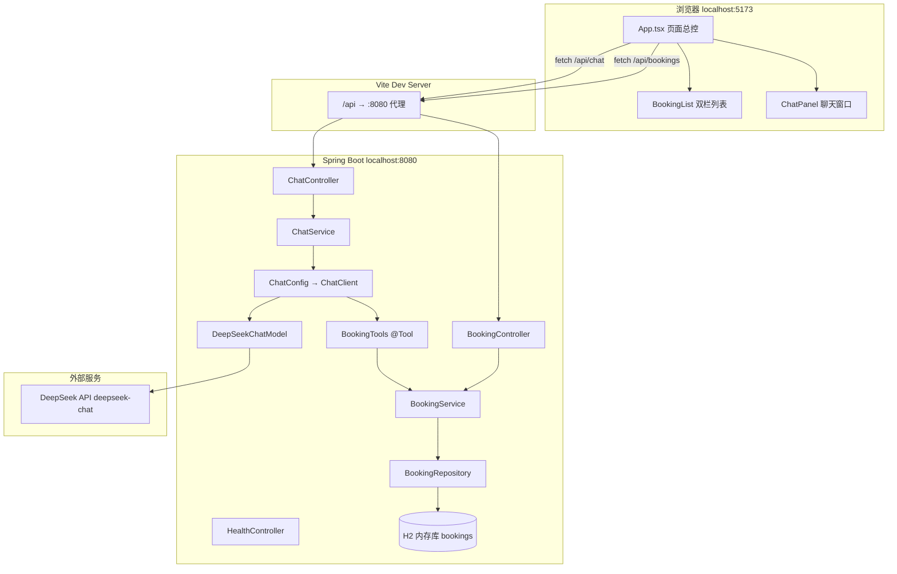
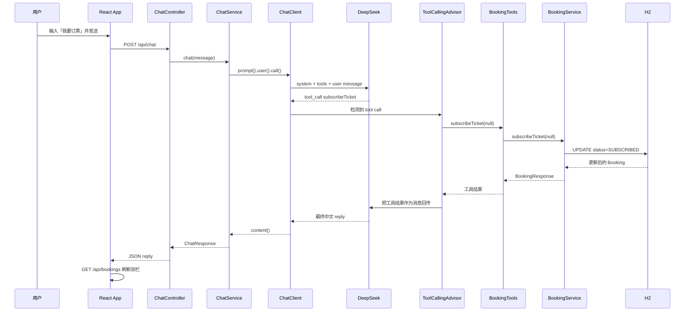

# 架构说明手册

本文档面向**自学**：从整体到细节说明本项目的结构、每个组件的职责，以及一次完整请求是如何流转的。

建议配合源码阅读，按文末「推荐阅读顺序」逐文件打开。

---

## 1. 项目是做什么的？

这是一个 **Fullstack Demo**：

- **前端（React）**：展示两栏订票列表（已订阅 / 未订阅），并提供聊天窗口。
- **后端（Spring Boot）**：提供 REST API 读写订票数据，并通过 **Spring AI** 连接 DeepSeek 大模型。
- **AI 能力**：用户用自然语言说「我要订票」「取消订票 G123」，大模型会**调用 Java 方法**（`@Tool`）去改数据库，而不是凭空编造结果。

核心模式叫 **ReAct**（Reason + Act）：

1. **Reason**：模型理解用户意图，决定调用哪个工具。
2. **Act**：Spring AI 执行对应的 Java 方法。
3. 工具结果回传模型，模型再生成最终中文回复。

循环由 Spring AI 的 `ToolCallingAdvisor` 自动完成，代码里不需要手写 `while`。

---

## 2. 整体架构



### 2.1 三层 + AI 工具层（后端）

| 层次 | 包路径 | 职责 | 能否直接访问数据库 |
|------|--------|------|-------------------|
| 表现层 | `controller/` | 接收 HTTP、返回 JSON | 否 |
| 业务层 | `service/` | 订票规则、事务 | 通过 Repository |
| 数据层 | `repository/` + `model/` | JPA 持久化 | 是 |
| AI 工具层 | `tools/` | 暴露给大模型的操作入口 | 否，只调 Service |
| 配置层 | `config/` | ChatClient、CORS 等 | 否 |
| 传输对象 | `dto/` | HTTP/工具 与 实体 之间的 JSON 形状 | 否 |

**设计原则**：所有**写数据库**的操作（订票、取消）只经过 `BookingService`。  
REST 接口和 AI 工具都调用它，避免「聊天改了一套数据、列表查的是另一套」。

### 2.2 前端结构

| 部分 | 路径 | 职责 |
|------|------|------|
| 页面总控 | `App.tsx` | 状态管理、拉列表、处理聊天回调 |
| 展示组件 | `components/` | 只负责 UI，不调 API |
| API 封装 | `api/` | `fetch` 请求后端 |
| 类型 | `types/` | TypeScript 接口，与后端 JSON 对齐 |

---

## 3. 领域模型与数据

### 3.1 订票实体 `Booking`

| 字段 | 类型 | 含义 |
|------|------|------|
| `id` | Long | 自增主键 |
| `title` | String | 票名，如「北京-上海 G123」 |
| `status` | 枚举 | `SUBSCRIBED`（已订阅）或 `UNSUBSCRIBED`（未订阅） |

对应数据库表 `bookings`，由 JPA 根据 `Booking.java` 自动建表。

### 3.2 状态含义

- **未订阅（UNSUBSCRIBED）**：票在系统里，用户还没订 → 显示在页面**右栏**。
- **已订阅（SUBSCRIBED）**：用户已订 → 显示在页面**左栏**。

### 3.3 种子数据 `data.sql`

启动时插入 3 条未订阅票：

- 北京-上海 G123  
- 上海-深圳 D456  
- 广州-北京 K789  

H2 是**内存库**，进程退出后数据清空；下次启动重新执行 `data.sql`。

### 3.4 状态流转（业务规则）

**订阅（订票）** — 实现在 `BookingService.subscribeTicket`：

1. 若传入 `title` → 在未订阅票中**模糊匹配** title，匹配到则改为已订阅。
2. 若传入 `title` 但未匹配到 → **新建**一条已订阅票。
3. 若 `title` 为空 → 订**第一张**未订阅票（按 id 排序），便于 AI 只说「我要订票」也能成功。

**取消订阅** — 实现在 `BookingService.cancelSubscription`：

1. 必须提供 `title` 关键词。
2. 在**已订阅**票中模糊匹配，找到后改回 `UNSUBSCRIBED`。

---

## 4. 后端组件详解

### 4.1 启动入口

| 文件 | 作用 |
|------|------|
| `BookingApplication.java` | Spring Boot 启动类，`@SpringBootApplication` 扫描 `com.demo.booking` 下所有组件。 |

### 4.2 表现层 Controller

#### `BookingController.java`

- 路径：`GET /api/bookings?status=SUBSCRIBED|UNSUBSCRIBED`
- 只做一件事：调用 `bookingService.listByStatus(status)`，返回 `List<BookingResponse>` JSON。
- 前端双栏列表的数据来源。

#### `ChatController.java`

- 路径：`POST /api/chat`
- 请求体：`{ "message": "我要订票" }`
- 委托 `ChatService.chat(message)`，返回 `{ "reply": "...", "error": null }`。
- **不包含**任何 AI 或业务逻辑。

#### `HealthController.java`

- 路径：`GET /api/health`
- 返回 `deepseekConfigured`（环境变量是否有 Key）、`deepseekReachable`（能否连通 DeepSeek）。
- 启动后先调此接口，可快速排查 Key / 网络问题。

### 4.3 业务层 Service

#### `BookingService.java` — 核心业务

| 方法 | 谁调用 | 作用 |
|------|--------|------|
| `listByStatus` | BookingController | 按状态查列表 |
| `listUnsubscribedTickets` | BookingTools | 查所有可订票 |
| `subscribeTicket` | BookingTools | 订票 |
| `cancelSubscription` | BookingTools | 取消 |

带 `@Transactional` 的写方法在同一事务内完成查询 + 更新。

#### `ChatService.java` — AI 调用唯一入口

```java
String reply = chatClient
    .prompt()
    .user(userMessage)
    .call()      // 内部触发 ToolCallingAdvisor / ReAct
    .content();
```

- 注入的 `ChatClient` 来自 `ChatConfig`。
- 捕获异常后返回友好 `ChatResponse.failure`，避免前端白屏。
- `pingDeepSeek()` 供健康检查使用。

### 4.4 AI 工具层 `BookingTools.java`

Spring AI 通过 `@Tool` 注解把 Java 方法注册为「大模型可调用的函数」。

| 工具方法 | description 要点 | 内部调用 |
|----------|------------------|----------|
| `listUnsubscribedTickets` | 用户问有哪些票可订 | `bookingService.listUnsubscribedTickets()` |
| `subscribeTicket(String title)` | 用户要订票 | `bookingService.subscribeTicket(title)` |
| `cancelSubscription(String title)` | 用户要取消 | `bookingService.cancelSubscription(title)` |

每个方法打日志 `[Tool 被调用] xxx` —— 自学时在控制台观察 ReAct 是否发生。

**为什么 Tools 不直接写 Repository？**  
保证 AI 路径与 REST 路径共用同一套业务规则（模糊匹配、兜底逻辑等）。

### 4.5 配置层

#### `ChatConfig.java`

创建 `ChatClient` Bean：

- `defaultSystem(...)`：系统提示词，约束模型**必须调工具**、禁止编造。
- `defaultTools(bookingTools)`：注册 3 个工具；同时启用 `ToolCallingAdvisor`。

#### `WebConfig.java`

配置 CORS，允许 `http://localhost:5173` 访问 `/api/**`。  
开发时 Vite 已做代理，但直连 8080 或工具测试时仍需要 CORS。

### 4.6 数据层

#### `Booking.java` / `BookingStatus.java`

JPA 实体与枚举，映射表 `bookings`。

#### `BookingRepository.java`

继承 `JpaRepository<Booking, Long>`，额外定义：

- `findByStatus`
- `findByStatusAndTitleContainingIgnoreCase` — 模糊匹配
- `findFirstByStatusOrderByIdAsc` — 订「第一张未订阅票」

Spring Data 根据方法名自动生成 SQL，无需手写。

### 4.7 传输对象 DTO

| 类 | 用途 |
|----|------|
| `BookingResponse` | 列表 API / 工具返回值 |
| `ChatRequest` | POST /api/chat 请求体 |
| `ChatResponse` | POST /api/chat 响应体 |
| `HealthResponse` | GET /api/health 响应体 |

实体 `Booking` 与 DTO 分离：避免把 JPA 实体直接暴露给前端，也便于以后扩展字段。

### 4.8 配置文件

#### `application.yml`

| 配置块 | 说明 |
|--------|------|
| `spring.datasource` | H2 内存库 `jdbc:h2:mem:bookingdb` |
| `spring.jpa` | `ddl-auto: create-drop` 每次启动重建表；`show-sql: true` 打印 SQL |
| `spring.sql.init` | 执行 `data.sql` |
| `spring.ai.deepseek` | API Key、模型 `deepseek-chat`、temperature `0.1` |
| `server.port` | 8080 |
| `logging.level` | Tools / ChatService 用 INFO 便于观察 |

Key 使用 `${DEEPSEEK_API_KEY:}`，**绝不写死在仓库里**。

---

## 5. Spring AI 与 ReAct 详解

### 5.1 涉及的核心概念

| 概念 | 在本项目中的体现 |
|------|------------------|
| `ChatModel` | Spring Boot 自动配置 `DeepSeekChatModel`（来自 starter） |
| `ChatClient` | 流式 API 封装，在 `ChatConfig` 中组装 |
| `@Tool` | `BookingTools` 上的注解，描述工具用途 |
| `ToolCallingAdvisor` | 注册 tools 后自动生效，驱动 ReAct 循环 |
| `Advisor` | ChatClient 拦截/增强机制；记忆、RAG、Tool 循环等横切逻辑的可组合插件 |
| System Prompt | `ChatConfig.defaultSystem`，约束模型行为 |

Spring AI 框架如何接入大模型、本项目为何用 DeepSeek 原生 Starter（非 Ollama）→ [SPRING_AI_INTEGRATION.md](./SPRING_AI_INTEGRATION.md)

Advisor 接口的设计目的、责任链与 `ChatClient` / DeepSeek Starter 的关系 → [ADVISOR_API.md](./ADVISOR_API.md)

Tool 定义如何变成 DeepSeek 请求里的 `tools` 字段、以及 `tool_calls` 往返格式 → [TOOL_CALL_FORMAT.md](./TOOL_CALL_FORMAT.md)

`PromptLoggingAdvisor` 由谁调用、`before`/`after` 与 `[Tool 被调用]` 的先后 → [PROMPT_LOGGING_ADVISOR.md](./PROMPT_LOGGING_ADVISOR.md)

### 5.2 一次「我要订票」的时序



### 5.3 如何确认 ReAct 真的发生了？

1. **后端日志**：出现 `[Tool 被调用] subscribeTicket`（在 `[AI 第N步] 收到 Response` **之后**）。
2. **逐步 Prompt**：出现 `[AI 第1步]` … `tool_calls`，再 `[AI 第2步]` … `TOOL_RESPONSE` → 详见 [PROMPT_LOGGING_ADVISOR.md](./PROMPT_LOGGING_ADVISOR.md)。
3. **Hibernate SQL**：出现 `update bookings set status=...`。
4. **前端列表**：左栏「已订阅」数量 +1。
5. 若只有 AI 文字回复、日志无 Tool、列表不变 → 模型可能未调工具（LLM 常见情况，可调 prompt 或重试）。

---

## 6. 前端组件详解

### 6.1 入口

| 文件 | 作用 |
|------|------|
| `main.tsx` | React 挂载到 `#root` |
| `index.html` | 页面骨架 |
| `vite.config.ts` | 开发服务器；`/api` 代理到 `localhost:8080` |

### 6.2 `App.tsx` — 状态中心

| state | 含义 |
|-------|------|
| `subscribed` / `unsubscribed` | 两栏数据 |
| `loading` | 列表加载中 |
| `messages` | 聊天历史 `{ role, content }[]` |
| `sending` | 等待 AI 回复 |
| `error` | 错误文案 |

关键函数：

- `loadBookings()`：`Promise.all` 并行请求两个 status，更新两栏。
- `handleSendMessage()`：追加用户消息 → `sendChatMessage` → 追加 AI 回复 → **再次** `loadBookings()`。

聊天成功后**必须**重新拉列表，因为数据库已被 `@Tool` 修改，前端 state 不会自动同步。

更完整的说明（含 Mermaid 时序图、代码索引）→ [FRONTEND_CHAT_FLOW.md](./FRONTEND_CHAT_FLOW.md)

### 6.3 `BookingList.tsx`

纯展示组件，接收 props：`subscribed`、`unsubscribed`、`loading`。  
不调用 API，便于理解「容器组件 vs 展示组件」。

### 6.4 `ChatPanel.tsx`

- 本地 state `input` 管理输入框。
- 提交时调用父组件传入的 `onSend(message)`。
- `sending` 时禁用输入和按钮；`error` 显示红色提示。

### 6.5 API 层

| 文件 | 作用 |
|------|------|
| `api/client.ts` | `getJson` / `postJson` 通用封装 |
| `api/bookingApi.ts` | `fetchBookings(status)` |
| `api/chatApi.ts` | `sendChatMessage(message)` |

### 6.6 `types/booking.ts`

定义 `Booking`、`ChatMessage`、`ChatResponse` 等，与后端 JSON 字段一致，TypeScript 编译期检查。

---

## 7. HTTP API 汇总

| 方法 | 路径 | 请求 | 响应 |
|------|------|------|------|
| GET | `/api/bookings?status=SUBSCRIBED` | — | `[{ id, title, status }, ...]` |
| GET | `/api/bookings?status=UNSUBSCRIBED` | — | 同上 |
| POST | `/api/chat` | `{ "message": "..." }` | `{ "reply": "...", "error": null }` |
| GET | `/api/health` | — | `{ "deepseekConfigured": bool, "deepseekReachable": bool }` |

---

## 8. 测试与文档资产

### 8.1 E2E `e2e/`

| 文件 | 作用 |
|------|------|
| `playwright.config.ts` | 浏览器配置；可自动拉起 backend + frontend |
| `tests/app.spec.ts` | 4 个功能测试（列表、订票、取消、健康检查） |
| `tests/capture-screenshots.spec.ts` | 生成 README 用截图到 `docs/screenshots/` |

### 8.2 截图 `docs/screenshots/`

Playwright 自动截取页面状态，供 README 效果预览使用。

---

## 9. 依赖与技术选型说明

### 9.1 后端 Maven 依赖（`backend/pom.xml`）

| 依赖 | 用途 |
|------|------|
| `spring-boot-starter-web` | REST API、内嵌 Tomcat |
| `spring-boot-starter-data-jpa` | JPA + Hibernate |
| `h2` | 内存数据库，零配置 |
| `spring-ai-starter-model-deepseek` | DeepSeek ChatModel + 自动配置 |

### 9.2 为何用 DeepSeek 原生 Starter？

- 配置直观：`spring.ai.deepseek.*`
- `deepseek-chat` 支持 function calling
- `ChatClient` + `ToolCallingAdvisor` 为 Spring AI 官方推荐组合

### 9.3 前端

- **Vite**：快速 dev server + HMR
- **React + TypeScript**：组件化 UI + 类型安全
- 未引入 Redux / 路由 / UI 库，降低学习曲线

---

## 10. 自学推荐阅读顺序

按下面顺序打开文件，每读一个回答三个问题：**它在哪一层？谁调用它？它调谁？**

### 第一轮：能跑起来、看懂页面

1. `README.md` — 启动步骤  
2. `backend/resources/application.yml` — 数据库与 AI 配置  
3. `backend/resources/data.sql` — 初始数据  
4. `frontend/src/App.tsx` — 页面如何拉数据、发聊天  
5. `frontend/src/components/BookingList.tsx`  
6. `frontend/src/components/ChatPanel.tsx`  

### 第二轮：REST 与数据库

7. `model/Booking.java`、`BookingStatus.java`  
8. `repository/BookingRepository.java`  
9. `service/BookingService.java` — **重点读业务规则**  
10. `controller/BookingController.java`  
11. `dto/BookingResponse.java`  

### 第三轮：Spring AI（核心）

12. `docs/SPRING_AI_INTEGRATION.md` — Spring AI 接入架构与本项目选型  
13. `docs/ADVISOR_API.md` — Advisor 设计目的与责任链  
14. `tools/BookingTools.java` — `@Tool` 长什么样  
15. `config/ChatConfig.java` — ChatClient 如何组装  
16. `service/ChatService.java` — 唯一 `.call()` 的地方  
17. `controller/ChatController.java`  

启动后端，发送一条「我要订票」，对照 **第 5.2 节时序图** 看控制台日志。

### 第四轮：联调与验证

18. `config/WebConfig.java`  
19. `controller/HealthController.java`  
20. `e2e/tests/app.spec.ts`  
21. 自己用 curl 跑一遍 README 里的验收命令  

---

## 11. 常见问题（自学排查）

| 现象 | 可能原因 | 排查 |
|------|----------|------|
| 聊天有回复但列表不变 | 模型未调 Tool | 看有无 `[Tool 被调用]` 日志 |
| `/api/chat` 返回 error | Key 未设或网络问题 | `curl /api/health` |
| 前端 404 on /api | 后端未启动或 proxy 未生效 | 确认 8080、5173 都在跑 |
| 重启后数据恢复初始 3 条 | H2 内存库特性 | 正常；要持久化可换 SQLite |
| CORS 报错 | 未走 Vite 代理且缺 CORS | 用 `pnpm dev` 访问 5173 |

---

## 12. 可扩展方向

若学完后想继续练手，可按难度递增：

1. 增加「直接点击按钮订票」REST 接口（不经过 AI）  
2. 聊天历史持久化到数据库  
3. SSE 流式输出 AI 回复  
4. 换 SQLite，数据重启不丢失  
5. 意图识别 + 规则兜底，提高 Tool 调用成功率  

---

## 13. 目录与文件索引

```
springai_demo/
├── package.json                             # 根脚本：pnpm dev / test:e2e
├── pnpm-workspace.yaml                      # workspace（frontend + e2e）
├── pnpm-lock.yaml                           # pnpm 锁文件
├── backend/
│   ├── pom.xml
│   └── src/main/
│       ├── java/com/demo/booking/
│       │   ├── BookingApplication.java      # 启动
│       │   ├── config/                      # ChatConfig, WebConfig
│       │   ├── controller/                  # Booking, Chat, Health
│       │   ├── service/                     # BookingService, ChatService
│       │   ├── tools/BookingTools.java      # @Tool
│       │   ├── repository/                  # JPA
│       │   ├── model/                       # 实体
│       │   └── dto/                         # JSON 形状
│       └── resources/
│           ├── application.yml
│           └── data.sql
├── frontend/src/
│   ├── App.tsx                              # 总控
│   ├── components/                          # UI
│   ├── api/                                 # fetch
│   └── types/                               # TS 类型
├── e2e/                                     # Playwright
├── docs/
│   ├── ARCHITECTURE.md                      # 本文档
│   ├── SPRING_AI_INTEGRATION.md             # Spring AI 接入架构与本项目选型
│   ├── ADVISOR_API.md                       # Advisor 设计目的与责任链
│   ├── PROMPT_LOGGING_ADVISOR.md            # PromptLoggingAdvisor 调用时机
│   ├── TOOL_CALL_FORMAT.md                  # @Tool → DeepSeek API 格式
│   ├── FRONTEND_CHAT_FLOW.md                # 前端聊天与列表刷新
│   ├── CORS.md                              # 跨域 / Proxy / curl 实测
│   └── screenshots/
└── README.md
```

---

更完整的系统说明见 [ARCHITECTURE.md](ARCHITECTURE.md)。  
跨域、Vite Proxy 与 Spring CORS 的关系见 [CORS.md](CORS.md)（含 curl 实测）。
