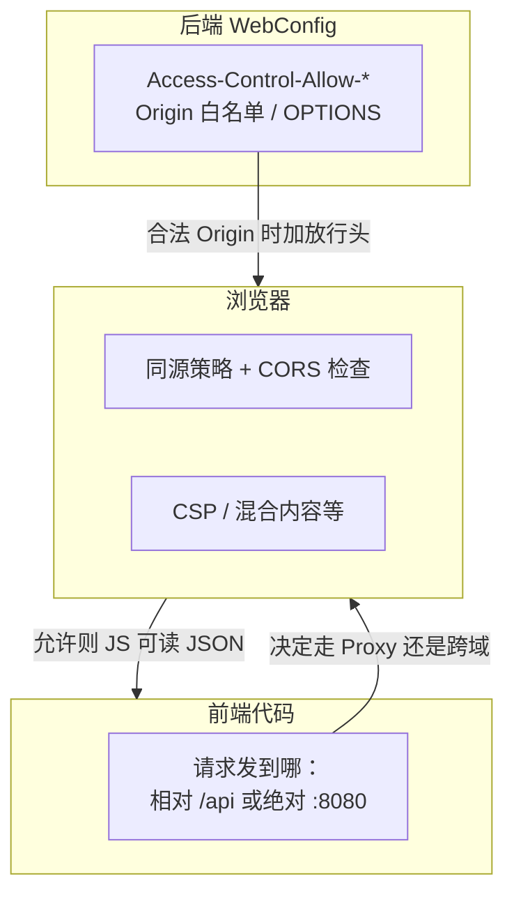
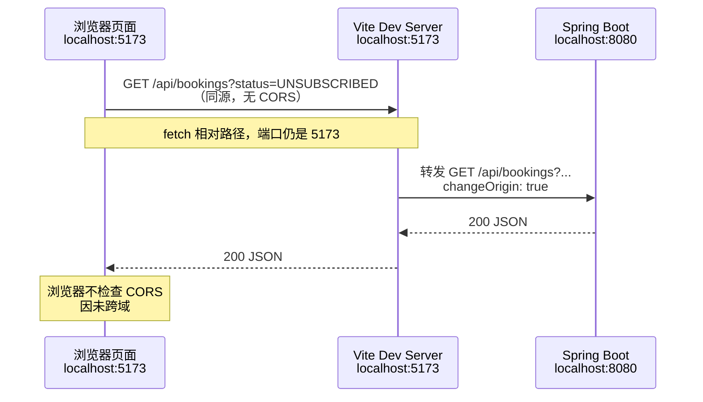
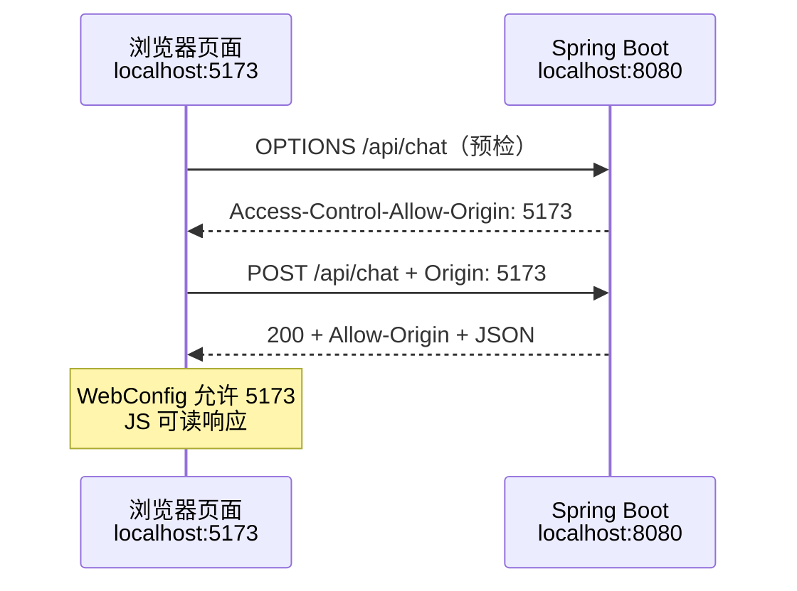
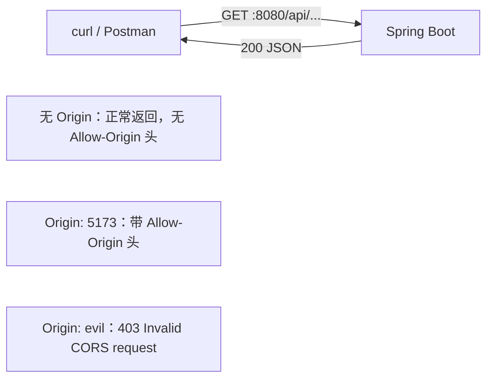

# 跨域说明：Vite Proxy 与 Spring CORS

本文说明本项目中 [`frontend/vite.config.ts`](../frontend/vite.config.ts) 与 [`backend/.../WebConfig.java`](../backend/src/main/java/com/demo/booking/config/WebConfig.java) 的关系，以及浏览器、`curl` 各自看到的请求路径。

---

## 1. 先搞清「跨域」是什么

浏览器有一个**同源策略**：

| 项 | 前端页面 | 后端 API |
|----|----------|----------|
| 协议 | `http` | `http` |
| 域名 | `localhost` | `localhost` |
| 端口 | **5173**（Vite） | **8080**（Spring Boot） |

协议、域名、端口三者有任一不同 → **跨域**。  
页面里的 `fetch('/api/bookings')` 若直接发到 `http://localhost:8080`，浏览器会拦截响应（除非后端返回允许的 CORS 头）。

**注意**：`curl`、Postman、后端单测**不受**同源策略限制；它们发请求不会触发浏览器的 CORS 检查。  
文档里的 `curl` 用来观察 **HTTP 响应头与 body**，模拟「带 Origin 头时后端怎么处理」。

---

## 2. 两块配置各自干什么？

### 2.1 Vite Proxy（`vite.config.ts`）

```typescript
server: {
  proxy: {
    '/api': {
      target: 'http://localhost:8080',
      changeOrigin: true,
    },
  },
},
```

| 作用 | 说明 |
|------|------|
| **谁在用** | 仅 **开发模式**（`pnpm dev`）下的 Vite 开发服务器 |
| **做什么** | 浏览器访问 `http://localhost:5173/api/...` 时，由 **Node/Vite 代为转发** 到 `http://localhost:8080/api/...` |
| **浏览器视角** | 请求 URL 仍是 `5173`，对浏览器来说是 **同源**，**不触发 CORS** |
| **changeOrigin** | 转发到后端时，把请求的 `Host` 等头改成目标地址，减少部分后端/host 校验问题 |

前端代码只写相对路径（见 `frontend/src/api/client.ts`）：

```typescript
fetch('/api/bookings?status=SUBSCRIBED')  // 实际打到 5173，再由 Vite 转发到 8080
```

### 2.2 Spring CORS（`WebConfig.java`）

```java
registry.addMapping("/api/**")
    .allowedOrigins("http://localhost:5173")
    .allowedMethods("GET", "POST", "OPTIONS")
    .allowedHeaders("*");
```

| 作用 | 说明 |
|------|------|
| **谁在用** | Spring Boot 后端，**始终生效**（dev / prod） |
| **做什么** | 当请求带 `Origin: http://localhost:5173` 时，在响应里加 `Access-Control-Allow-*`，浏览器才允许 JS 读响应 |
| **OPTIONS** | 浏览器在部分跨域 POST 前会发 **预检**；后端必须正确响应 OPTIONS |
| **白名单** | 只允许 `5173`；其他 Origin（如 `http://evil.example.com`）会 **403** |

### 2.3 二者关系（一句话）

- **正常开发（浏览器 + `pnpm dev`）**：走 **Vite 代理** → 浏览器认为同源 → **主要靠 Proxy，不依赖 CORS**。
- **浏览器直连 8080**（或生产环境前后端不同域）：**必须靠 WebConfig CORS**。
- **curl / 脚本直连 8080**：不需要 CORS，但加 `Origin` 头可验证 CORS 配置是否正确。

两者**互补**：Proxy 解决本地开发体验；CORS 解决「页面与 API 不同端口/域名」时的浏览器限制，并方便 curl 带 Origin 测试。

---

## 3. 浏览器直连后端（不经过 Vite Proxy）能成功吗？

**可以。** 按当前 `WebConfig` 配置，只要满足下面条件，页面里的 JS 用 `fetch('http://localhost:8080/api/...')` **不必经过 Proxy 也能成功**。

### 3.1 前提条件

| 条件 | 说明 |
|------|------|
| 页面 Origin | 必须是 **`http://localhost:5173`**（与 `allowedOrigins` 完全一致） |
| 请求路径 | 在 **`/api/**`** 下 |
| HTTP 方法 | **`GET`** 或 **`POST`**（与 `allowedMethods` 一致） |
| POST 聊天 | `Content-Type: application/json` 会先触发 **OPTIONS 预检**，预检也需通过 |

### 3.2 与本项目默认代码的关系

当前 [`frontend/src/api/client.ts`](../frontend/src/api/client.ts) 使用的是**相对路径**：

```typescript
fetch('/api/bookings?status=SUBSCRIBED')  // 打到 5173，走 Proxy
```

若要改成直连后端，需改为绝对地址，例如：

```typescript
fetch('http://localhost:8080/api/bookings?status=SUBSCRIBED')
```

此时浏览器判定 **5173 → 8080 跨域**，能否让 JS 读到响应，取决于下一节的 CORS 配置。

### 3.3 与走 Proxy 的对比

| | 经 Vite Proxy | 浏览器直连 `:8080` |
|--|---------------|-------------------|
| 浏览器是否跨域 | 否 | **是** |
| 依赖 CORS | 否 | **是** |
| 需改前端 URL | 否 | 是（绝对地址或 `VITE_API_BASE`） |
| 当前 demo 默认 | **是** | 否（但 CORS 已配好，可切换） |

### 3.4 会失败的情况（直连时）

1. **`localhost` ≠ `127.0.0.1`**：页面是 `http://127.0.0.1:5173`，白名单只有 `http://localhost:5173` → CORS 失败。
2. **Vite 端口变了**：例如 `5174`，未更新 `allowedOrigins`。
3. **Origin 不在白名单**：返回 **403 Invalid CORS request**（见第 7.7 节 curl 实测）。
4. **路径不在 `/api/**`**：CORS 规则不匹配。

---

## 4. 谁决定跨域请求「能不能成功」？

要区分 **「请求有没有到服务器」** 和 **「页面里的 JS 能不能用响应」**。

### 4.1 三方分工



| 角色 | 控制什么 |
|------|----------|
| **前端** | 请求 URL：相对 `/api` → Vite Proxy（不跨域）；绝对 `http://localhost:8080/api` → 跨域直连 |
| **后端 CORS** | 是否对某个 `Origin` 返回 `Access-Control-Allow-Origin` 等头；是否通过 OPTIONS 预检 |
| **浏览器** | 强制执行同源策略；检查响应头，决定 JS 能否读 body |

**结论**：直连 `:8080` 时，**对前端是否「成功」**，主要由 **后端 CORS 配置 + 浏览器检查** 共同决定；Proxy 路径则绕开 CORS，由 **Vite 是否转发** 决定。

### 4.2 CORS 拦的是什么？

| 现象 | 含义 |
|------|------|
| Network 里看到 **200**，Console 报 CORS error | 请求**已到后端**，业务可能已执行，但**浏览器不让 JS 读响应** |
| OPTIONS 预检 **失败** | 真正的 GET/POST 可能**根本不会发出** |
| curl 正常、浏览器报错 | **正常**——curl 不做 CORS 检查 |

因此：CORS 不是「防火墙挡请求」，而是 **限制跨域页面中的 JavaScript 访问响应**（预检失败时还会阻止发请求）。

---

## 5. 浏览器侧还会阻挡跨域吗？

**会。** 除后端 `WebConfig` 外，浏览器自身还有多层限制；不只靠「你去 Chrome 里开一个 CORS 开关」。

### 5.1 默认就会执行（内置安全策略）

**同源策略 + CORS 检查**是所有现代浏览器的默认行为，不是 optional 插件：

- 跨域且响应缺少合格 `Access-Control-Allow-*` → JS **无法** `response.json()`。
- 这是**浏览器内置机制**，不是用户日常会去改的设置。

### 5.2 环境与协议相关限制

| 机制 | 作用 | 典型场景 |
|------|------|----------|
| **混合内容（Mixed Content）** | HTTPS 页面请求 HTTP API 会被拦 | 前端 `https://`，API `http://localhost:8080` |
| **CSP（Content-Security-Policy）** | `connect-src` 限制可连接的 URL | 响应头或 meta 未包含 API 地址 → `fetch` 被拦 |
| **Private Network Access** | 公网页访问本机/内网更严格 | 线上站点访问 `localhost:8080` 可能需额外预检/权限 |
| **`file://` 打开 HTML** | Origin 为 `null` 或极受限 | 双击本地文件测 API，行为异常 |
| **`localhost` vs `127.0.0.1`** | 算**不同 Origin** | 与白名单字符串必须完全一致 |

### 5.3 用户或开发环境可引入的因素

| 类型 | 说明 |
|------|------|
| **浏览器扩展** | 广告拦截、隐私扩展可能干扰 `fetch`；「禁用 CORS」类扩展仅适合本地调试，不可依赖 |
| **启动参数** | 如 Chrome `--disable-web-security`（**极不安全**，仅临时调试） |
| **企业策略** | 公司管控浏览器时可能限制访问内网端口 |
| **禁用 JavaScript** | 页面逻辑无法执行 |

### 5.4 对本项目的含义

- **默认 `pnpm dev` + 相对路径 `/api`**：同源 + Proxy → **通常不涉及 CORS**。
- **改为直连 `8080`**：依赖 `WebConfig`；注意 **Origin 字符串完全一致**。
- **未来 HTTPS 前端 + HTTP 后端**：可能被**混合内容**拦截，与 CORS 无关，需统一 HTTPS 或反向代理。

---

## 6. 请求流程图

### 6.1 路径 A：浏览器 + Vite 开发（本项目默认）



### 6.2 路径 B：浏览器直连后端（跨域，靠 CORS）



### 6.3 路径 C：curl 直连后端（无浏览器 CORS 拦截）



---

## 7. 实测：curl 命令与响应

以下命令在 **backend :8080、frontend :5173 均已启动** 时执行（2026-06-13 本地环境）。

### 7.1 直连后端 GET（curl 不带 Origin）

**命令：**

```bash
curl -i "http://localhost:8080/api/bookings?status=UNSUBSCRIBED"
```

**响应（节选）：**

```http
HTTP/1.1 200
Content-Type: application/json

[{"id":1,"title":"北京-上海 G123","status":"UNSUBSCRIBED"},{"id":2,"title":"上海-深圳 D456","status":"UNSUBSCRIBED"},{"id":3,"title":"广州-北京 K789","status":"UNSUBSCRIBED"}]
```

**说明**：curl 不送 `Origin`，Spring 正常返回 JSON，**不会出现** `Access-Control-Allow-Origin`（浏览器跨域场景才需要）。

---

### 7.2 直连后端 GET（模拟浏览器跨域）

**命令：**

```bash
curl -i -H "Origin: http://localhost:5173" \
  "http://localhost:8080/api/bookings?status=UNSUBSCRIBED"
```

**响应（节选）：**

```http
HTTP/1.1 200
Access-Control-Allow-Origin: http://localhost:5173
Content-Type: application/json

[{"id":1,"title":"北京-上海 G123","status":"UNSUBSCRIBED"}, ...]
```

**说明**：`WebConfig` 识别合法 Origin，加上 CORS 头；浏览器里的 JS 此时可以读 body。

---

### 7.3 OPTIONS 预检（POST 聊天前浏览器可能先发）

**命令：**

```bash
curl -i -X OPTIONS "http://localhost:8080/api/chat" \
  -H "Origin: http://localhost:5173" \
  -H "Access-Control-Request-Method: POST" \
  -H "Access-Control-Request-Headers: content-type"
```

**响应（节选）：**

```http
HTTP/1.1 200
Access-Control-Allow-Origin: http://localhost:5173
Access-Control-Allow-Methods: GET,POST,OPTIONS
Access-Control-Allow-Headers: content-type
Access-Control-Max-Age: 1800
Content-Length: 0
```

**说明**：对应 `WebConfig` 里 `allowedMethods` / `allowedHeaders`；预检通过后浏览器才会发真正的 POST。

---

### 7.4 经 Vite 代理 GET（等同浏览器 `pnpm dev` 下的 fetch）

**命令：**

```bash
curl -i "http://localhost:5173/api/bookings?status=UNSUBSCRIBED"
```

**响应（节选）：**

```http
HTTP/1.1 200 OK
Content-Type: application/json

[{"id":1,"title":"北京-上海 G123","status":"UNSUBSCRIBED"}, ...]
```

**说明**：

- 请求先到 **5173**，Vite 内部转发到 **8080**。
- 响应里通常 **没有** `Access-Control-Allow-Origin`（对 curl 来说无所谓；对浏览器而言因为同源也不需要）。

---

### 7.5 经 Vite 代理 POST 聊天

**命令：**

```bash
curl -i -X POST "http://localhost:5173/api/chat" \
  -H "Content-Type: application/json" \
  -d '{"message":"有哪些票可以订？"}'
```

**响应（节选）：**

```http
HTTP/1.1 200 OK
Content-Type: application/json

{"reply":"目前有以下票可以订：\n\n1. **北京-上海 G123**\n2. **上海-深圳 D456**\n3. **广州-北京 K789**\n\n请问您想订哪张票？","error":null}
```

**说明**：与页面点「发送」等价——`ChatPanel` → `chatApi` → `POST /api/chat` → Vite 代理 → `ChatController`。

---

### 7.6 直连后端 POST（带合法 Origin）

**命令：**

```bash
curl -i -X POST "http://localhost:8080/api/chat" \
  -H "Origin: http://localhost:5173" \
  -H "Content-Type: application/json" \
  -d '{"message":"有哪些票可以订？"}'
```

**响应（节选）：**

```http
HTTP/1.1 200
Access-Control-Allow-Origin: http://localhost:5173
Content-Type: application/json

{"reply":"目前有以下票可以订：...", "error": null}
```

**说明**：不经过 Vite，完全靠 **CORS** 让浏览器可读；适合验证 `WebConfig` 是否配好。

---

### 7.7 非法 Origin（CORS 拒绝）

**命令：**

```bash
curl -i -H "Origin: http://evil.example.com" \
  "http://localhost:8080/api/bookings?status=UNSUBSCRIBED"
```

**响应：**

```http
HTTP/1.1 403

Invalid CORS request
```

**说明**：不在 `allowedOrigins` 白名单内；浏览器侧 JS 同样无法拿到数据。

---

### 7.8 健康检查（直连后端，无 Origin）

**命令：**

```bash
curl -i "http://localhost:8080/api/health"
```

**响应（节选）：**

```http
HTTP/1.1 200
Content-Type: application/json

{"deepseekConfigured":true,"deepseekReachable":true}
```

---

## 8. 对照表

| 场景 | 请求 URL | 是否跨域（浏览器） | 谁决定成功 | 响应中常见 CORS 头 |
|------|----------|-------------------|------------|-------------------|
| 页面 `pnpm dev` + `fetch('/api/...')` | `:5173/api/...` | 否 | **Vite Proxy** | 通常无（不需要） |
| 页面 `5173` + `fetch('http://localhost:8080/api/...')` | `:8080/api/...` | 是 | **WebConfig CORS** + 浏览器 | `Access-Control-Allow-Origin: 5173` |
| 页面 `127.0.0.1:5173` + 直连 `8080` | `:8080/api/...` | 是 | **失败**（Origin 不在白名单） | 403 或无 Allow-Origin |
| curl 直连 `:8080` 无 Origin | `:8080/api/...` | 不适用 | 无 CORS 检查 | 无 |
| curl 直连 `:8080` Origin=5173 | `:8080/api/...` | 模拟跨域 | **WebConfig CORS** | 有 Allow-Origin |
| curl 直连 `:8080` Origin=其他 | `:8080/api/...` | 模拟跨域 | 后端拒绝 | 403 |

---

## 9. 常见问题

**Q：有了 Proxy，为什么还要 CORS？**  
A：Proxy 只在 Vite 开发服务器运行时存在。生产环境若前后端不同域，或浏览器直连 `:8080`，仍需要 CORS。

**Q：不用 Proxy、浏览器直连后端，按现在配置能成功吗？**  
A：能。页面 Origin 为 `http://localhost:5173`、请求 `http://localhost:8080/api/**`、方法 GET/POST 时，`WebConfig` 会放行（见第 3 节）。

**Q：直连能不能成功，是后端配置控制的吗？**  
A：**主要是**，但是「后端 CORS 响应头 + 浏览器检查」一起决定 JS 能否读响应；前端还要把 URL 指到 `:8080`（见第 4 节）。

**Q：浏览器还有别的会挡跨域吗？**  
A：有。默认同源策略、混合内容、CSP、Private Network Access、`localhost`/`127.0.0.1` 不一致、扩展插件等（见第 5 节）。

**Q：Network 显示 200 但 Console 报 CORS？**  
A：请求已到服务器，但浏览器不让 JS 读 body；不等于后端没执行。

**Q：生产环境怎么配？**  
A：Nginx 同域反向代理 `/api`（类似 Vite Proxy），或在 `WebConfig` 里把 `allowedOrigins` 改成真实前端域名。本 demo 仅允许 `http://localhost:5173`。

**Q：为什么 `fetch` 写 `/api` 而不是 `http://localhost:8080/api`？**  
A：相对路径走 5173，命中 Vite 代理；写死 8080 会跨域，必须依赖 CORS。

**Q：CORS 报错但 curl 正常？**  
A：正常。curl 不执行浏览器 CORS；用 DevTools 看 `Access-Control-Allow-Origin` 与 Origin 是否匹配。

---

## 10. 本地复现步骤

```bash
# 终端 1：后端
export DEEPSEEK_API_KEY=your-key-here   # 聊天接口需要
cd backend && mvn spring-boot:run

# 终端 2：前端
pnpm install
pnpm dev

# 终端 3：按上文第 7 节逐条 curl
```

---

## 11. 相关文件

| 文件 | 职责 |
|------|------|
| [`frontend/vite.config.ts`](../frontend/vite.config.ts) | 开发时代理 `/api` → `:8080` |
| [`frontend/src/api/client.ts`](../frontend/src/api/client.ts) | 相对路径 `fetch` |
| [`backend/.../WebConfig.java`](../backend/src/main/java/com/demo/booking/config/WebConfig.java) | CORS 白名单与预检 |
| [`docs/ARCHITECTURE.md`](ARCHITECTURE.md) | 整体架构 |

---

更完整的系统说明见 [ARCHITECTURE.md](ARCHITECTURE.md)。
