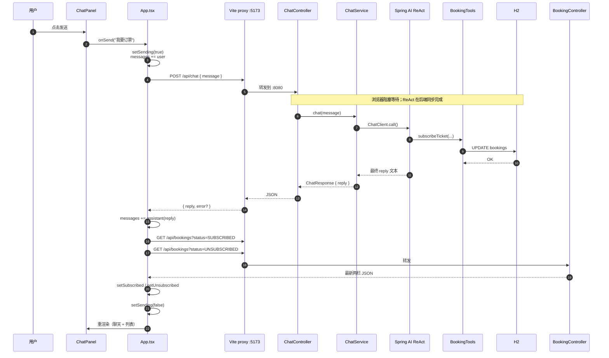
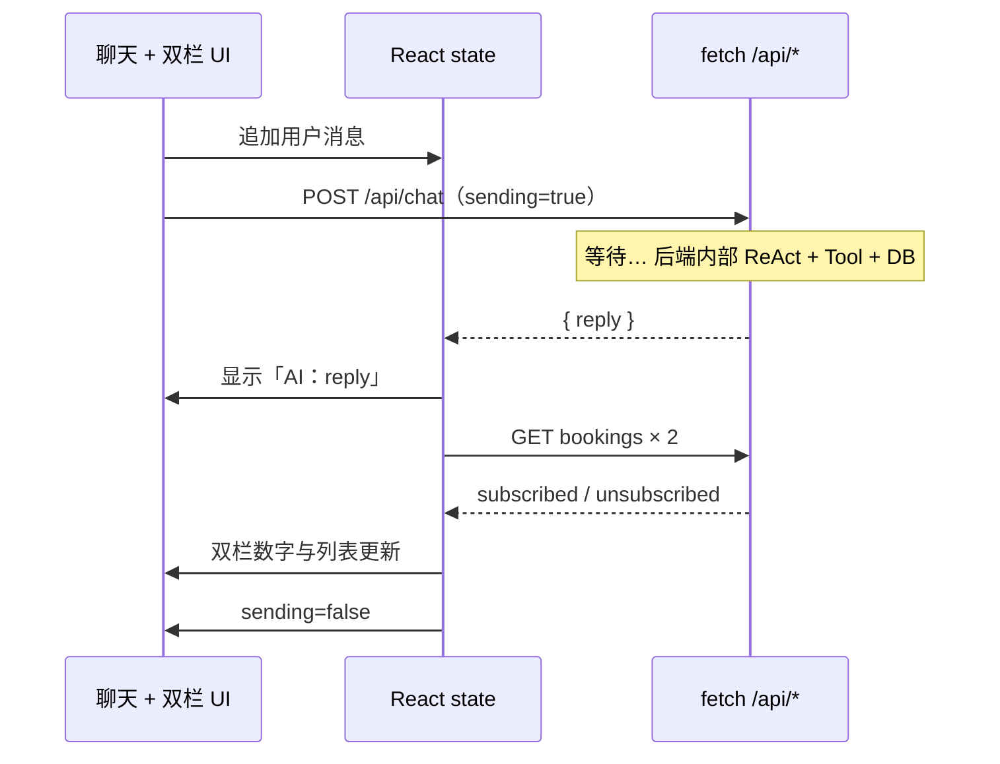
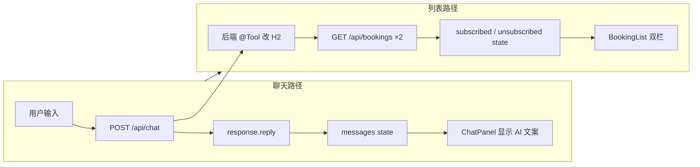

# 前端聊天与列表刷新流程

本文档说明：**用户发送聊天消息后，前端如何展示 Spring AI 的最终回复，以及如何感知订票数据变化并刷新双栏列表**。

适合配合 [ARCHITECTURE.md](./ARCHITECTURE.md) 阅读：架构手册讲全局；本文专注 **React 侧的数据流与 HTTP 边界**。

---

## 1. 核心结论

| 问题 | 答案 |
|------|------|
| 前端能否看到 ReAct 每一步、tool call？ | **不能**。无 WebSocket/SSE，tool 执行发生在后端单次 `POST /api/chat` 内部。 |
| AI 回复从哪来？ | HTTP 响应 JSON 的 **`reply` 字段**（模型整轮 ReAct 结束后的最终中文）。 |
| 列表如何更新？ | 聊天 **成功后** 再 `GET /api/bookings` 两次，用新数据 `setState`，**不是**监听 tool 事件。 |
| 谁改了数据库？ | 后端 `BookingTools` → `BookingService`；前端只通过 **列表 API** 读结果。 |

**一句话**：一次 POST 拿聊天文案，再 GET 列表拿最新订票状态。

---

## 2. 端到端时序（含前后端）

以用户发送「我要订票」为例：



### 2.1 前端视角的简化时序

只关心浏览器里发生什么：



---

## 3. 分阶段说明

### 3.1 挂载：首次加载列表

页面打开时 **不会** 调 `/api/chat`，只拉列表：

- `useEffect` → `loadBookings()`
- 并行 `GET /api/bookings?status=SUBSCRIBED` 与 `UNSUBSCRIBED`
- 写入 `subscribed` / `unsubscribed`，`BookingList` 展示

### 3.2 发送：乐观展示用户消息

`handleSendMessage` 在 **await 聊天 API 之前** 就把用户话放进 `messages`，聊天区立刻显示「你：xxx」。

同时 `sending=true`，输入框与按钮禁用（`ChatPanel` 显示「发送中...」）。

### 3.3 等待：前端无 ReAct 进度

`await sendChatMessage(message)` 对应 **一次** `POST /api/chat`。

后端在该请求内完成：

1. DeepSeek 推理  
2. `ToolCallingAdvisor` 执行 `@Tool`（如 `subscribeTicket`）  
3. 工具结果回传模型  
4. 生成最终 `reply`  

前端 **收不到** 中间步骤；ReAct 细节仅在后端日志（如 `[AI 第N步]`、`[Tool 被调用]`）。

### 3.4 展示 AI 回复

响应体形状（与 `types/booking.ts` 一致）：

```json
{
  "reply": "已为您成功订票：**北京-上海 G123**。",
  "error": null
}
```

`reply` 写入 `messages` 中 `role: 'assistant'` 的一条，`ChatPanel` 渲染为「AI：…」。

若 `error` 非空（如 Key 无效），仍会展示 `reply`，并在聊天区下方显示错误条。

### 3.5 刷新列表：拉模型（Pull after action）

**关键**：前端 **不知道** 是否调了 tool，约定是「聊完就重拉列表」：

```typescript
await loadBookings()
```

再次并行 GET 两栏；H2 已被后端 tool 修改，新 JSON 驱动 `BookingList` 更新（如「已订阅 (0)→(1)」）。

等待聊天 API 期间，双栏仍是 **旧数据**；只有 `loadBookings()` 完成后才与 DB 一致。

---

## 4. 相关代码索引

### 4.1 页面总控：`App.tsx`

| 职责 | 代码位置 |
|------|----------|
| 列表 state | `subscribed` / `unsubscribed` / `loading` |
| 聊天 state | `messages` / `sending` / `error` |
| 拉列表 | `loadBookings()` |
| 发送 + 展示 + 刷新 | `handleSendMessage()` |

```65:92:frontend/src/App.tsx
  const handleSendMessage = async (message: string) => {
    setSending(true)
    setError(null)

    setMessages((prev) => [...prev, { role: 'user', content: message }])

    try {
      const response = await sendChatMessage(message)

      setMessages((prev) => [
        ...prev,
        { role: 'assistant', content: response.reply },
      ])

      if (response.error) {
        setError(response.error)
      }

      await loadBookings()
    } catch (err) {
      setError(err instanceof Error ? err.message : '发送失败')
    } finally {
      setSending(false)
    }
  }
```

```37:53:frontend/src/App.tsx
  const loadBookings = useCallback(async () => {
    setLoading(true)
    setError(null)
    try {
      const [subscribedData, unsubscribedData] = await Promise.all([
        fetchBookings('SUBSCRIBED'),
        fetchBookings('UNSUBSCRIBED'),
      ])
      setSubscribed(subscribedData)
      setUnsubscribed(unsubscribedData)
    } catch (err) {
      setError(err instanceof Error ? err.message : '加载列表失败')
    } finally {
      setLoading(false)
    }
  }, [])
```

### 4.2 聊天 UI：`ChatPanel.tsx`

- **不** 直接调 API；通过 `onSend` 委托给 `App.tsx`  
- 只负责输入、展示 `messages`、根据 `sending` / `error` 更新 UI  

```31:38:frontend/src/components/ChatPanel.tsx
  const handleSubmit = async (event: SubmitEvent<HTMLFormElement>) => {
    event.preventDefault()
    const trimmed = input.trim()
    if (!trimmed || sending) {
      return
    }
    setInput('')
    await onSend(trimmed)
  }
```

### 4.3 API 层

| 文件 | 调用 | 作用 |
|------|------|------|
| `api/chatApi.ts` | `POST /api/chat` | 触发后端整轮 ReAct，返回 `{ reply }` |
| `api/bookingApi.ts` | `GET /api/bookings?status=` | 读 DB 当前列表 |
| `api/client.ts` | `fetch` 封装 | 相对路径 `/api/...`，开发时走 Vite 代理 |

```14:16:frontend/src/api/chatApi.ts
export function sendChatMessage(message: string): Promise<ChatResponse> {
  return postJson<ChatResponse>('/api/chat', { message })
}
```

```14:16:frontend/src/api/bookingApi.ts
export function fetchBookings(status: BookingStatus): Promise<Booking[]> {
  return getJson<Booking[]>(`/api/bookings?status=${status}`)
}
```

### 4.4 列表展示：`BookingList.tsx`

纯展示组件，props 变化即重渲染，**不**订阅任何「订票成功」事件：

```19:23:frontend/src/components/BookingList.tsx
export default function BookingList({
  subscribed,
  unsubscribed,
  loading,
}: BookingListProps) {
```

### 4.5 后端边界（前端可见部分）

聊天入口只返回最终文本，**不包含** tool 明细：

```36:40:backend/src/main/java/com/demo/booking/controller/ChatController.java
    @PostMapping
    public ChatResponse chat(@RequestBody ChatRequest request) {
        String message = request.getMessage() != null ? request.getMessage() : "";
        return chatService.chat(message);
    }
```

```25:28:backend/src/main/java/com/demo/booking/dto/ChatResponse.java
    public static ChatResponse success(String reply) {
        return new ChatResponse(reply, null);
    }
```

列表与聊天 **两条独立 API**；订票写操作只发生在 `/api/chat` 触发的后端 tool 内，前端通过 **读** `/api/bookings` 同步 UI。

### 4.6 开发环境：`/api` 如何到达后端

浏览器 `fetch('/api/chat')` 发往 **当前页同源**（如 `http://localhost:5173`），由 **Vite dev server** 代理到 Spring Boot，不是 React 提供的服务：

```14:18:frontend/vite.config.ts
      proxy: {
        '/api': {
          target: apiProxyTarget,
          changeOrigin: true,
        },
      },
```

详见 [CORS.md](./CORS.md)。

---

## 5. 数据流小结



两条路径在 **`handleSendMessage` 内顺序执行**：先拿到 `reply`，再 `loadBookings()`。列表刷新 **依赖** 聊天 POST 成功，**不依赖** 响应里是否携带订票详情。

---

## 6. 如何验证流程跑通

| 观察点 | 预期 |
|--------|------|
| 聊天区 | 先出现「你：…」，再出现「AI：…」 |
| 按钮 | 等待期间「发送中...」，结束后恢复 |
| 双栏 | **AI 回复出现后** 数量变化（如已订阅 +1） |
| 后端日志 | `[Tool 被调用]` + `[Chat] AI 回复` |
| 仅有 AI 文字、列表不变 | 可能未调 tool（模型行为），见 ARCHITECTURE 5.3 |

---

## 7. 当前设计说明与扩展方向

**本 Demo 刻意保持简单**：

- 单次 POST 同步等待，无流式输出  
- 列表在聊天成功后 **全量重拉**，无 WebSocket 推送  
- 前端 **不解析** tool call，不以 AI 文案推断订票结果  

若要做「ReAct 每一步实时展示」，需要后端 SSE/WebSocket 推送中间事件，前端增加流式 state；这超出当前项目范围。

---

## 8. 延伸阅读

- [ARCHITECTURE.md](./ARCHITECTURE.md) — 全局架构、ReAct 时序、Spring AI 2.0  
- [CORS.md](./CORS.md) — Vite 代理 vs 后端 CORS  
