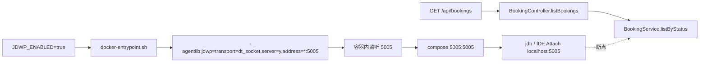

# JDB / JDWP 远程调试

> 对 Docker Compose 里的 Spring Boot 用 **JDWP** 开调试端口，再用 **jdb** 或 IDE Attach 下断点，观察一次真实 HTTP 请求如何走进 `BookingService`。

本文不调用 DeepSeek。断点打在订票列表查询，和聊天 / Tool Calling 无关。

配合阅读：[ARCHITECTURE.md](./ARCHITECTURE.md)（请求分层）、[scripts/jdb-debug-demo.sh](../scripts/jdb-debug-demo.sh)（可重复跑的命令行验收）。

---

## 1. 核心结论

| 问题 | 答案 |
|------|------|
| JVM 怎么被调试器连上？ | 启动参数 `-agentlib:jdwp=...`，本项目由 [`backend/docker-entrypoint.sh`](../backend/docker-entrypoint.sh) 在 `JDWP_ENABLED=true` 时追加 |
| 宿主机连哪个端口？ | `localhost:5005`（compose 把容器 `5005` 映射出来） |
| 一次能挂几个调试器？ | **一个**。第二个 `jdb` / IDE Attach 会 `Connection reset` |
| 本 Demo 断在哪？ | `BookingService.listByStatus`，由 `GET /api/bookings?status=UNSUBSCRIBED` 触发 |
| 命令行怎么验收？ | `./scripts/jdb-debug-demo.sh`（需 jdb、expect、curl） |

**一句话**：JDWP 是 JVM 的调试插座；jdb / IntelliJ Remote JVM Debug 都是往 `localhost:5005` 插同一根线。

---

## 2. 启动链：环境变量 → agentlib → 端口



[`docker-compose.yml`](../docker-compose.yml) 把三个变量传进 backend：

| 变量 | 默认 | 作用 |
|------|------|------|
| `JDWP_ENABLED` | `false` | `true` / `1` 才加 JDWP |
| `JDWP_PORT` | `5005` | 容器内外调试端口 |
| `JDWP_SUSPEND` | `n` | `y` 时 JVM **等调试器连上** 再跑 `main`；healthcheck 会一直 pending，frontend 的 `depends_on: service_healthy` 过不去 |

开启方式：

```bash
JDWP_ENABLED=true docker compose up --build
# 或在 .env 写 JDWP_ENABLED=true（.env 勿提交）
```

容器日志应出现：

```
JDWP remote debug enabled on port 5005 (suspend=n)
Listening for transport dt_socket at address: 5005
```

`suspend=n` 时这两行在 Spring 启动日志附近；进程已在跑，随时可以 Attach。

---

## 3. 用 demo 脚本走一遍（推荐）

前置：backend 已用 JDWP 起来，且 `GET http://127.0.0.1:8080/api/health/live` 返回 `{"status":"UP"}`。

```bash
# 宿主机需 JDK（自带 jdb）和 expect
./scripts/jdb-debug-demo.sh
```

脚本会：

1. `jdb -attach 127.0.0.1:5005`，`-sourcepath backend/src/main/java`（让 `list` 能打印源码）
2. `stop in com.demo.booking.service.BookingService.listByStatus`
3. `curl GET /api/bookings?status=UNSUBSCRIBED`（不经过前端、不打 DeepSeek）
4. 命中后执行 `where` / `list` / `locals` / `print status`
5. `clear` + `cont`，断言 HTTP 200 且 JSON 含 `UNSUBSCRIBED`
6. `quit` 断开，**不占用** 5005

成功时 stdout 末尾为 `jdb-demo PASS`。

GitHub Actions 用同一条脚本验收，见 [`.github/workflows/jdb-debug-demo.yml`](../.github/workflows/jdb-debug-demo.yml)：只起 backend（`JDWP_SUSPEND=n`），不启 frontend。

---

## 4. 手动 jdb（和脚本同一条路径）

JDWP **同时只接受一个** 调试器。先退出 IDE Attach 或其它 jdb。

```bash
jdb -attach 127.0.0.1:5005 -sourcepath backend/src/main/java
```

```
stop in com.demo.booking.service.BookingService.listByStatus
```

另开终端：

```bash
curl "http://127.0.0.1:8080/api/bookings?status=UNSUBSCRIBED"
```

curl 会卡住，直到 jdb 里 `cont`。命中后提示符从 `>` 变成线程名，例如 `http-nio-8080-exec-6[1]`。

| 命令 | 作用 |
|------|------|
| `where` | 栈。应看到 `BookingController.listBookings` → `BookingService.listByStatus` |
| `list` | 当前行附近源码。箭头在 `return bookingRepository.findByStatus(status)` |
| `locals` | 方法参数 `status` |
| `print status` | `"UNSUBSCRIBED"`（枚举 `toString`） |
| `clear ...listByStatus` | 删断点，避免 Docker HEALTHCHECK 以外的请求再停住 |
| `cont` | 放行当前线程 |
| `quit` | 断开；JVM 继续跑 |

中文 locale 下 jdb 输出是「设置断点」「断点命中」；CI 的 Ubuntu 一般是 `Set breakpoint` / `Breakpoint hit`。脚本两种都认。

---

## 5. 请求与源码对照

```47:48:backend/src/main/java/com/demo/booking/controller/BookingController.java
    public List<BookingResponse> listBookings(@RequestParam BookingStatus status) {
        return bookingService.listByStatus(status);
```

```45:48:backend/src/main/java/com/demo/booking/service/BookingService.java
    public List<BookingResponse> listByStatus(BookingStatus status) {
        return bookingRepository.findByStatus(status).stream()
                .map(BookingResponse::from)
                .toList();
```

`where` 里在 Controller 和 Service 之间常有 Spring CGLIB / `Method.invoke` 帧，这是代理，不是业务代码。

IDE 等价操作：Run → `Remote JVM Debug` → Host `localhost` Port `5005` → 在 `listByStatus` 行断点 → 浏览器打开 http://localhost:5173 或打上面的 curl。

---

## 6. 换断点（聊天 / Advisor）

同一套 JDWP，只改 `stop in` 的类和方法：

| 想看什么 | `stop in` | 怎么触发 |
|----------|-----------|----------|
| 订票列表 | `BookingService.listByStatus` | `GET /api/bookings?status=...` |
| 存活探针 | `HealthController.live` | `GET /api/health/live`（Docker HEALTHCHECK 每 10s 也会打，容易误停） |
| 聊天入口 | `ChatService.chat` | `POST /api/chat`（要有效 `DEEPSEEK_API_KEY`） |
| ReAct 日志 Advisor | `PromptLoggingAdvisor.before` | 同上 |

`HealthController.live` 不适合当练习断点：compose healthcheck 会反复命中，停住太久容器会变 `unhealthy`。

---

## 7. 常见失败

| 现象 | 原因 | 处理 |
|------|------|------|
| `Connection reset` / `无法附加到目标 VM` | 已有 jdb 或 IDE 占着 5005 | `lsof -nP -iTCP:5005`，退出旧调试器 |
| attach 成功但永远不命中 | 请求没打到这个进程，或断点类名/方法名写错 | 先 `curl /api/health/live`，再确认 `classes com.demo.booking.service.BookingService` |
| `list` 没有源码 | `-sourcepath` 不对，或容器镜像与当前工作区源码不一致 | 脚本默认 `backend/src/main/java`；改过 Java 后需重新 `docker compose up --build` |
| frontend 一直没起来 | `JDWP_SUSPEND=y` 时 JVM 等 Attach，healthcheck 不过 | 日常用 `suspend=n`；要看启动过程再开 `y`，并先 Attach 再等 healthy |
| CI 里 `jdb` 找不到 | runner 没装 JDK | workflow 使用 `actions/setup-java`（Temurin 21） |

---

## 8. 和「本地 mvn 调试」的差别

| | Docker + JDWP | 本机 `mvn spring-boot:run` |
|--|---------------|----------------------------|
| 进程在哪 | 容器内 `java -jar app.jar` | 宿主机 JVM |
| 调试器在哪 | 宿主机 jdb / IDE | 同一台机器，IDE 可直接 Debug |
| 源码 | 宿主机树；需与镜像编译所用源码一致 | IDE 模块源码 |
| 本 Demo 覆盖 | 脚本 + GitHub Actions | 不强制 |

远程调试看的是 **容器里正在跑的字节码**。改了 Java 只重启旧镜像不会换断点行号，需要重新 build backend 镜像。
