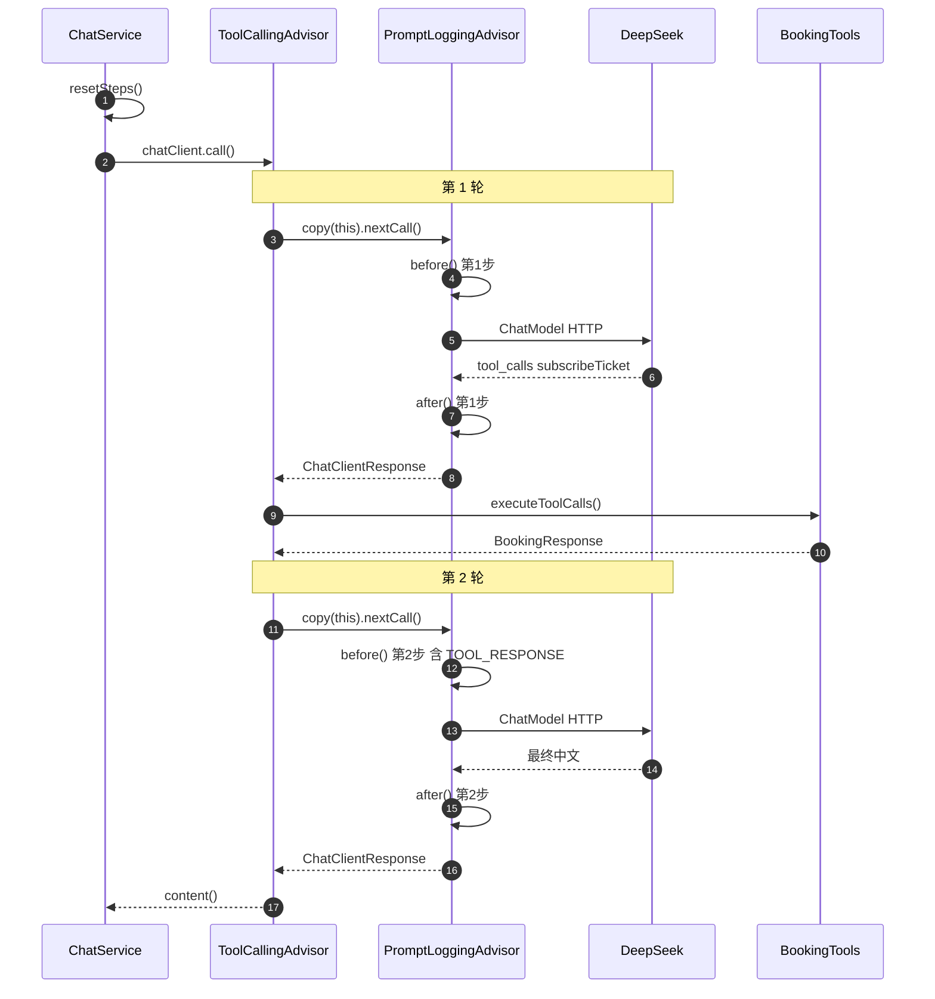

# PromptLoggingAdvisor 调用链与 before/after 时机

> 本 Demo 如何用自定义 Advisor **逐步观测** Spring AI 2.0 ReAct 循环里每一次发给 DeepSeek 的 Prompt 与模型 Response。

本文档说明：**谁负责调用 `PromptLoggingAdvisor`**、`before()` / `after()` 在 ReAct 的哪一环触发、与 `[Tool 被调用]` 的先后关系，以及为何必须设 `order = +400`。框架侧行为基于 [spring-projects/spring-ai v2.0.0](https://github.com/spring-projects/spring-ai/tree/v2.0.0)。

适合配合 [SPRING_AI_INTEGRATION.md](./SPRING_AI_INTEGRATION.md)（接入架构）、[ADVISOR_API.md](./ADVISOR_API.md)（Advisor 整体设计）、[ARCHITECTURE.md](./ARCHITECTURE.md)（ReAct 全局）、[TOOL_CALL_FORMAT.md](./TOOL_CALL_FORMAT.md)（tools / tool_calls 格式）阅读。

---

## 1. 核心结论

| 问题 | 答案 |
|------|------|
| 谁调用 `before` / `after`？ | **Spring AI Advisor 链**，不是业务代码手动调用 |
| 业务代码直接碰这个类做什么？ | 仅 `PromptLoggingAdvisor.resetSteps()` 重置 `[AI 第N步]` 计数 |
| `before` 何时触发？ | **每一轮**调用 DeepSeek **之前** |
| `after` 何时触发？ | DeepSeek **刚返回之后**、**执行 `@Tool` Java 方法之前** |
| `[Tool 被调用]` 何时出现？ | 在 **`after` 之后**，由 `ToolCallingAdvisor` → `ToolCallingManager` 触发 |
| 为何要 `order = +400`？ | 必须 **大于** `ToolCallingAdvisor`（+300），才能进入 **每一轮** ReAct 的内层链 |

**一句话**：`PromptLoggingAdvisor` 是挂在 `ToolCallingAdvisor` 循环 **内侧** 的观测 Advisor；`before`/`after` 包的是 **单次模型 HTTP 往返**，不包含工具 Java 执行本身。

---

## 2. 注册与入口：谁启动整条链？

### 2.1 注册方式

| Advisor | order | 如何注册 |
|---------|-------|----------|
| `ToolCallingAdvisor` | `HIGHEST_PRECEDENCE + 300` | `ChatConfig.defaultTools(bookingTools)` 后 **Spring AI 2.0 自动注册** |
| `PromptLoggingAdvisor` | `HIGHEST_PRECEDENCE + 400` | `ChatConfig` 显式 `.defaultAdvisors(new PromptLoggingAdvisor())` |

```61:62:backend/src/main/java/com/demo/booking/config/ChatConfig.java
                .defaultTools(bookingTools)   // 工具 schema 写入 options.toolCallbacks，非 SYSTEM 文本
                .defaultAdvisors(new PromptLoggingAdvisor())  // INFO=messages，DEBUG=tools
```

**注意**：不要再手动 `.advisors(ToolCallingAdvisor.builder()...)`，否则会与自动注册的实例 **重复**，链中出现两个工具 Advisor。

### 2.2 业务入口：`ChatService.chat()`

```60:67:backend/src/main/java/com/demo/booking/service/ChatService.java
        try {
            PromptLoggingAdvisor.resetSteps();  // 2.0：一次 HTTP 请求可能对应多步 Advisor 迭代
            // 单次 call()；ToolCallingAdvisor 在链内完成 ReAct，PromptLoggingAdvisor 记录每步 Prompt/Response
            String reply = chatClient
                    .prompt()
                    .user(userMessage.trim())
                    .call()
                    .content();
```

- **`resetSteps()`**：重置 `ThreadLocal` 步骤计数，保证一次用户聊天从 `[AI 第1步]` 重新计数。
- **`.call()`**：触发 `DefaultChatClient` → `DefaultAroundAdvisorChain.nextCall()` → 整条 Advisor 链。

业务代码 **从不** 直接调用 `before()` / `after()`。

`pingDeepSeek()`（健康检查）同样在 `call()` 前调用 `resetSteps()`，避免步骤计数污染下一次用户聊天。

### 2.3 `DefaultChatClient.call()` 如何进入链

`.call().content()` 最终会走到 `DefaultChatClient` 的观测包装，**真正启动 Advisor 链的是 `advisorChain.nextCall()`**：

```java
// DefaultChatClient.java: 655-658（Spring AI 2.0.0）
var chatClientResponse = observation.observe(() -> {
    var response = advisorChain.nextCall(chatClientRequest);
    observationContext.setResponse(response);
    return response;
});
```

因此：**一次 `chatClient.call()` = 一次外层链入口**；ReAct 多轮 DeepSeek 请求发生在 `ToolCallingAdvisor` 内部的多次 `copy(this).nextCall()`，而不是业务多次 `call()`。

---

## 3. Spring AI 如何调用 `before` / `after`？

`PromptLoggingAdvisor` 实现 [`BaseAdvisor`](https://github.com/spring-projects/spring-ai/blob/v2.0.0/spring-ai-client-chat/src/main/java/org/springframework/ai/chat/client/advisor/api/BaseAdvisor.java)。Spring AI 对 `BaseAdvisor` 的默认 `adviseCall` 模板：

```java
// BaseAdvisor.java: 47-53
default ChatClientResponse adviseCall(ChatClientRequest chatClientRequest, CallAdvisorChain callAdvisorChain) {
    ChatClientRequest processedChatClientRequest = before(chatClientRequest, callAdvisorChain);
    ChatClientResponse chatClientResponse = callAdvisorChain.nextCall(processedChatClientRequest);
    return after(chatClientResponse, callAdvisorChain);
}
```

调用链：

```text
ChatService.chat()
    └─ chatClient.prompt().user(...).call()
        └─ DefaultChatClient.doGetObservableChatClientResponse()
            └─ DefaultAroundAdvisorChain.nextCall()     【链调度器】
                └─ advisor.adviseCall(...)              【按 order 逐个 Advisor】
                    └─ PromptLoggingAdvisor
                        ├─ before()   ← 你实现的日志
                        ├─ nextCall() → 更内层（ChatModel）
                        └─ after()    ← 你实现的日志
```

[`DefaultAroundAdvisorChain.nextCall`](https://github.com/spring-projects/spring-ai/blob/v2.0.0/spring-ai-client-chat/src/main/java/org/springframework/ai/chat/client/advisor/DefaultAroundAdvisorChain.java#L98-L120) 从 deque 弹出 **order 最小** 的 Advisor，执行其 `adviseCall`，内层通过 `nextCall(this)` 继续向下。

**`copy(this).nextCall()` 的含义**（`ToolCallingAdvisor` 每轮 ReAct 使用）：

```java
// DefaultAroundAdvisorChain.java: 169-194（简化）
public CallAdvisorChain copy(CallAdvisor after) {
    // 只保留链中位于 after 之后的 Advisor（子链）
    var remaining = advisors.subList(afterAdvisorIndex + 1, advisors.size());
    return builder().pushAll(remaining).build();
}
```

以本项目为例，外层链顺序为：`ToolCallingAdvisor`（+300）→ `PromptLoggingAdvisor`（+400）→ `ChatModelCallAdvisor`（更内）。  
`ToolCallingAdvisor` 调用 `callAdvisorChain.copy(this).nextCall(...)` 时，**子链只剩** `PromptLoggingAdvisor` + `ChatModelCallAdvisor`，因此 `PromptLoggingAdvisor` 的 `before`/`after` 会包住 **每一轮** 模型 HTTP 往返。

---

## 4. Advisor order 与嵌套关系

Spring `Ordered`：**数值越小，优先级越高**，在请求方向 **越靠外层**。

| Advisor | order 数值 | 在链中的位置 |
|---------|------------|--------------|
| `ToolCallingAdvisor` | +300（更负） | **外层**：包住整个 ReAct `do-while` 循环 |
| `PromptLoggingAdvisor` | +400（较不那么负） | **内层**：在每一轮 `nextCall` 里，紧贴 ChatModel |

```68:74:backend/src/main/java/com/demo/booking/advisor/PromptLoggingAdvisor.java
    /**
     * Advisor 链 order：必须 &gt; ToolCallingAdvisor（+300）才能进入工具循环内部。
     */
    @Override
    public int getOrder() {
        return Ordered.HIGHEST_PRECEDENCE + 400;
    }
```

若 `PromptLoggingAdvisor` 的 order **≤ +300**（与 `ToolCallingAdvisor` 同级或更靠外），往往 **只能看到 ReAct 首尾**，看不到中间 `[AI 第1步] tool_calls` → `[AI 第2步] TOOL_RESPONSE` 的完整往返。

---

## 5. ReAct 循环内：`before` / `after` 的精确时机

`ToolCallingAdvisor` **不使用** `BaseAdvisor` 的默认 `adviseCall`，而是自定义 `do { ... } while (isToolCall)` 循环（[源码 :141-187](https://github.com/spring-projects/spring-ai/blob/v2.0.0/spring-ai-client-chat/src/main/java/org/springframework/ai/chat/client/advisor/ToolCallingAdvisor.java#L141-L187)）。

每一轮循环核心逻辑：

```java
// ToolCallingAdvisor.java（简化）
do {
    processedChatClientRequest = doBeforeCall(...);           // 默认空实现
    chatClientResponse = callAdvisorChain.copy(this).nextCall(processedChatClientRequest);
    // ↑ 内层链：PromptLoggingAdvisor.before → ChatModel → PromptLoggingAdvisor.after
    chatClientResponse = doAfterCall(...);                      // 默认空实现

    isToolCall = toolExecutionEligibilityChecker.isToolCallResponse(chatResponse);
    if (isToolCall) {
        toolExecutionResult = toolCallingManager.executeToolCalls(...);  // ← BookingTools 在这里
        instructions = doGetNextInstructionsForToolCall(...);            // 追加 TOOL_RESPONSE 等
    }
} while (isToolCall);
```

### 5.1 单轮时序（关键）

```text
ToolCallingAdvisor 第 N 轮
    │
    ├─ PromptLoggingAdvisor.before()          【打 [AI 第N步] 发送 Prompt】
    │
    ├─ ChatModel → DeepSeek HTTP              【真正模型请求】
    │
    ├─ PromptLoggingAdvisor.after()           【打 [AI 第N步] 收到 Response】
    │       （可能是 tool_calls，也可能是最终中文）
    │
    └─ 回到 ToolCallingAdvisor
            ├─ 若 hasToolCalls → executeToolCalls()
            │       └─ MethodToolCallback → BookingTools  【打 [Tool 被调用]】
            └─ 更新 instructions，进入第 N+1 轮
```

**易错点**：`[Tool 被调用]` **不在** `before` 与 `after` 之间，而在 **`after` 返回之后**。

### 5.2 以「我要订票」为例的完整日志顺序

| 顺序 | 日志 / 事件 | 发生环节 |
|------|-------------|----------|
| 1 | `[Chat] 收到用户消息: 我要订票` | `ChatService` |
| 2 | `[AI 第1步] 发送 Prompt` — SYSTEM + USER | `before()` 第 1 轮 |
| 3 | DEBUG：`注册的工具` … subscribeTicket 等 | `before()` 第 1 轮 |
| 4 | `[AI 第1步] 收到 Response` — ASSISTANT (tool_calls) | `after()` 第 1 轮 |
| 5 | `[Tool 被调用] subscribeTicket` | `ToolCallingAdvisor` 执行工具 |
| 6 | Hibernate UPDATE bookings | `BookingService` |
| 7 | `[AI 第2步] 发送 Prompt` — 含 TOOL_RESPONSE | `before()` 第 2 轮 |
| 8 | `[AI 第2步] 收到 Response` — 最终中文 | `after()` 第 2 轮 |
| 9 | `[Chat] AI 回复: ...` | `ChatService` 拿到 `content()` |

一次用户 `POST /api/chat` 对应 **一次** `chatClient.call()`，但 Advisor 链内可能有 **多轮** DeepSeek 请求（日志 `[AI 第1步]`、`[AI 第2步]`）。

### 5.3 完整控制台日志示例（「我要订票」）

```text
[Chat] 收到用户消息: 我要订票

[AI 第1步] 发送 Prompt（messages）:
  [1] SYSTEM: 你是订票助手...
  [2] USER: 我要订票

[AI 第1步] 注册的工具（options → API tools 字段，非 messages）:   ← DEBUG 级别
  [1] subscribeTicket
      description: ...
      inputSchema: {"type":"object",...}

[AI 第1步] 收到 Response:
ASSISTANT (tool_calls)
      - subscribeTicket({})

[Tool 被调用] subscribeTicket, title=null          ← after 之后，非 before/after 之间

[AI 第2步] 发送 Prompt（messages）:
  [1] SYSTEM: ...
  [2] USER: 我要订票
  [3] ASSISTANT (tool_calls) ...
  [4] TOOL_RESPONSE
      - subscribeTicket => {"id":1,"title":"北京-上海 G123",...}

[AI 第2步] 收到 Response:
ASSISTANT: 已成功为您订票：**北京-上海 G123**。

[Chat] AI 回复: 已成功为您订票：**北京-上海 G123**。
```

---

## 6. `before()` 与 `after()` 各打印什么？

### 6.1 `before()` — 发送前

```52:59:backend/src/main/java/com/demo/booking/advisor/PromptLoggingAdvisor.java
    public ChatClientRequest before(ChatClientRequest request, AdvisorChain advisorChain) {
        int step = STEP.get() + 1;
        STEP.set(step);
        log.info("[AI 第{}步] 发送 Prompt（messages）:\n{}", step, formatMessages(request));
        log.debug("[AI 第{}步] 注册的工具（options → API tools 字段，非 messages）:\n{}",
                step, formatRegisteredTools(request));
        return request;
    }
```

| 日志级别 | 内容 | 对应 DeepSeek 请求 |
|----------|------|-------------------|
| **INFO** | `messages`：SYSTEM / USER / ASSISTANT / TOOL_RESPONSE | 请求体 `messages[]` |
| **DEBUG** | `ToolDefinition`：name / description / inputSchema | 请求体 `tools[]`（**不在 messages 里**） |

### 6.2 `after()` — 模型返回后

```62:66:backend/src/main/java/com/demo/booking/advisor/PromptLoggingAdvisor.java
    public ChatClientResponse after(ChatClientResponse response, AdvisorChain advisorChain) {
        log.info("[AI 第{}步] 收到 Response:\n{}", STEP.get(), formatResponse(response));
        return response;
    }
```

| 模型输出 | 日志表现 |
|----------|----------|
| 要调工具 | `ASSISTANT (tool_calls)` + `- subscribeTicket({})` |
| 最终回复 | `ASSISTANT: 已为您成功订票...` |
| 工具结果（作为下一轮输入） | 出现在 **下一轮** `before()` 的 `TOOL_RESPONSE`，不在本轮 `after()` |

`after()` **不修改** request/response，只观测并原样返回。

---

## 7. Mermaid：Advisor 链与 ReAct 两轮



---

## 8. 与 `ToolCallingAdvisor` 的分工

| 组件 | 职责 | 本 Demo 是否自定义 |
|------|------|-------------------|
| `ToolCallingAdvisor` | ReAct `do-while`、检测 `tool_calls`、调用 `executeToolCalls`、拼下一轮 messages | 否（框架自动） |
| `PromptLoggingAdvisor` | 每轮模型往返前后打日志 | 是（本项目实现） |
| `BookingTools` | 真正执行业务 `@Tool` | 是 |

Spring AI 2.0 相对 1.x：**ReAct 循环从 ChatModel 内部上移到 Advisor 链**，因此 `PromptLoggingAdvisor` 才能插进循环 **内部** 逐步观测；1.x 外层 Advisor 往往只能看到首尾两次调用。

| 版本 | ReAct 循环位置 | `PromptLoggingAdvisor` 能看到的 |
|------|----------------|--------------------------------|
| **1.0.x** | `ChatModel` 内部 `while (toolCalls)` | 通常只有首尾两次 Prompt/Response |
| **1.1.x** | `ToolCallAdvisor`（+300）Advisor 链内 | 每步往返（需 order +400 位于其内侧） |
| **2.0.x** | `ToolCallingAdvisor`（+300）自动注册 | 同上；类名改为 `ToolCallingAdvisor`，无需手动 `.advisors(...)` |

本项目当前：**Spring Boot 4.1 + Spring AI 2.0**，仅显式注册 `PromptLoggingAdvisor`；`ToolCallingAdvisor` 由 `defaultTools()` 自动加入链。

---

## 9. 日志配置

| 环境 | 配置 | 能看到什么 |
|------|------|------------|
| 本地默认 | `application.yml` → `com.demo.booking: INFO` | 仅 INFO：`messages` + Response |
| Docker Compose | `LOGGING_LEVEL_COM_DEMO_BOOKING=DEBUG` | 额外 DEBUG：tools schema |
| 临时本地 DEBUG | `logging.level.com.demo.booking.advisor.PromptLoggingAdvisor=DEBUG` | 同上 |

**勿**在 `application.yml` 里单独把 `PromptLoggingAdvisor` 锁为 INFO，否则会覆盖 Docker 的 DEBUG，看不到 `inputSchema`。

验证关键字：

| 关键字 | 含义 |
|--------|------|
| `[AI 第N步] 发送 Prompt` | 第 N 轮 `before()` |
| `[AI 第N步] 注册的工具` | 第 N 轮 `before()` DEBUG |
| `[AI 第N步] 收到 Response` | 第 N 轮 `after()` |
| `ASSISTANT (tool_calls)` | 模型决定调工具 |
| `TOOL_RESPONSE` | 下一轮 `before()` 中可见工具返回值 |
| `[Tool 被调用]` | Java `@Tool` 真正执行（在 `after` 之后） |

---

## 10. 常见误解

| 误解 | 事实 |
|------|------|
| `ChatService` 调用了 `before()` | 只调 `resetSteps()`；`before`/`after` 由 Advisor 链触发 |
| 工具执行在 `before` 和 `after` 之间 | 工具在 **`after` 之后**，由 `ToolCallingAdvisor` 执行 |
| 工具定义在 INFO 的 SYSTEM 里 | 工具在 **DEBUG 的 options → API `tools` 字段** |
| 一次 chat 只对应一步 `[AI 第1步]` | 有 tool call 时通常 **至少两步** |
| order 越小越靠内 | **order 越小越靠外**；+400 比 +300 **更靠内** |

---

## 11. 相关源码索引

### 11.1 本仓库

| 文件 | 职责 |
|------|------|
| [`PromptLoggingAdvisor.java`](https://github.com/liweinan/springai_demo/blob/main/backend/src/main/java/com/demo/booking/advisor/PromptLoggingAdvisor.java) | `before` / `after` / `resetSteps` / order |
| [`ChatConfig.java`](https://github.com/liweinan/springai_demo/blob/main/backend/src/main/java/com/demo/booking/config/ChatConfig.java) | 注册 Advisor + `defaultTools` |
| [`ChatService.java`](https://github.com/liweinan/springai_demo/blob/main/backend/src/main/java/com/demo/booking/service/ChatService.java) | `call()` 入口 + `resetSteps()` |

### 11.2 Spring AI 2.0.0

| 类 | 链接 |
|----|------|
| `BaseAdvisor` | [BaseAdvisor.java](https://github.com/spring-projects/spring-ai/blob/v2.0.0/spring-ai-client-chat/src/main/java/org/springframework/ai/chat/client/advisor/api/BaseAdvisor.java) |
| `DefaultAroundAdvisorChain` | [DefaultAroundAdvisorChain.java](https://github.com/spring-projects/spring-ai/blob/v2.0.0/spring-ai-client-chat/src/main/java/org/springframework/ai/chat/client/advisor/DefaultAroundAdvisorChain.java) |
| `ToolCallingAdvisor` | [ToolCallingAdvisor.java](https://github.com/spring-projects/spring-ai/blob/v2.0.0/spring-ai-client-chat/src/main/java/org/springframework/ai/chat/client/advisor/ToolCallingAdvisor.java) |
| `DefaultChatClient`（`call()` 入口） | [DefaultChatClient.java](https://github.com/spring-projects/spring-ai/blob/v2.0.0/spring-ai-client-chat/src/main/java/org/springframework/ai/chat/client/DefaultChatClient.java) |

---

## 12. 延伸阅读

- [ARCHITECTURE.md](./ARCHITECTURE.md) — §5 Spring AI 与 ReAct 时序
- [TOOL_CALL_FORMAT.md](./TOOL_CALL_FORMAT.md) — messages vs `tools`、`tool_calls` 格式
- [FRONTEND_CHAT_FLOW.md](./FRONTEND_CHAT_FLOW.md) — 前端为何看不到 ReAct 中间步骤
- [Spring AI Advisors 官方文档](https://docs.spring.io/spring-ai/reference/api/advisors.html)
- [Spring AI 2.0 Composable Tool Calling 博客](https://spring.io/blog/2026/06/15/spring-ai-composable-tool-calling)
