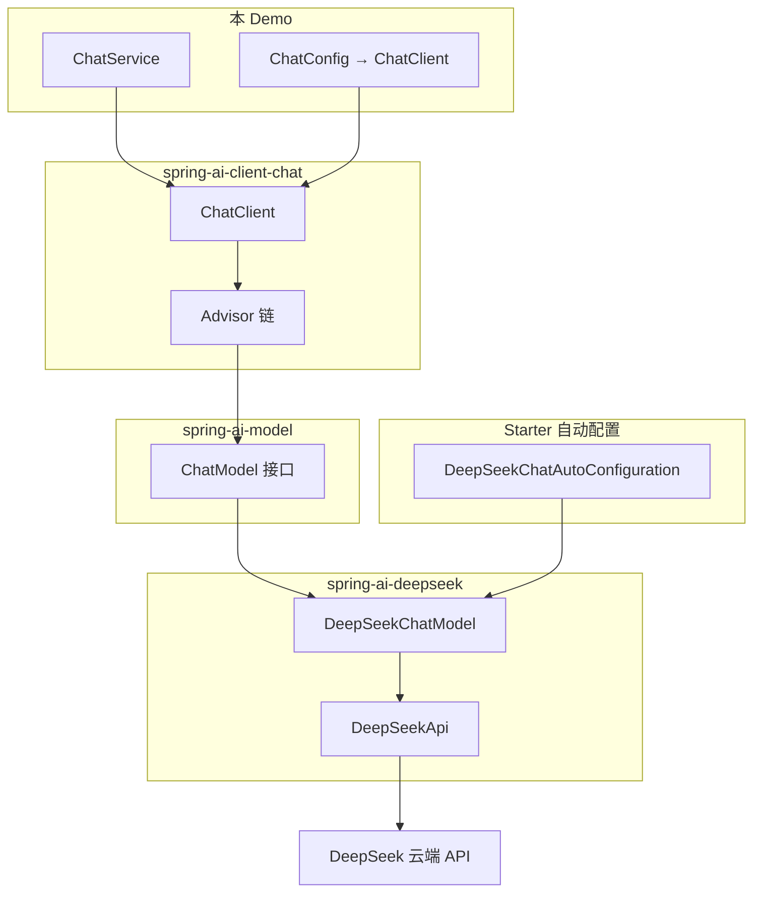

# Spring AI 大模型接入说明

> 框架如何实现多厂商大模型接入，以及**本 Demo 项目**具体用了哪条路径。

本文档基于 [spring-projects/spring-ai v2.0.0](https://github.com/spring-projects/spring-ai/tree/v2.0.0) 与 [spring-projects/spring-ai v2.0.1-SNAPSHOT](https://github.com/spring-projects/spring-ai) 源码整理，面向自学阅读本仓库的同学。

相关文档：

- 本项目整体架构 → [ARCHITECTURE.md](./ARCHITECTURE.md)
- `ChatClient` / `Advisor` / Starter 关系 → [ADVISOR_API.md](./ADVISOR_API.md)
- `@Tool` → DeepSeek API 格式 → [TOOL_CALL_FORMAT.md](./TOOL_CALL_FORMAT.md)

---

## 1. 本项目用的是什么接入方式？

**结论：DeepSeek 原生 Starter，直连云端 API，不是 Ollama。**

| 对比项 | 本项目（当前） | Ollama 接入 DeepSeek |
|--------|----------------|----------------------|
| Maven 依赖 | `spring-ai-starter-model-deepseek` | `spring-ai-starter-model-ollama` |
| 实现类 | `DeepSeekChatModel` | `OllamaChatModel` |
| 连接目标 | DeepSeek 云端（`platform.deepseek.com`） | 本地/自建 Ollama 服务 |
| 认证 | 环境变量 `DEEPSEEK_API_KEY` | 通常无需 Key |
| 模型名 | `deepseek-chat` | 如 `deepseek-r1`（Ollama 本地 pull） |

依赖声明：

```56:60:backend/pom.xml
        <!-- Spring AI DeepSeek 原生 Starter：支持 Tool Calling / ReAct -->
        <dependency>
            <groupId>org.springframework.ai</groupId>
            <artifactId>spring-ai-starter-model-deepseek</artifactId>
        </dependency>
```

配置（`backend/src/main/resources/application.yml`）：

```yaml
spring:
  ai:
    deepseek:
      api-key: ${DEEPSEEK_API_KEY:}
      chat:
        options:
          model: deepseek-chat
          temperature: 0.1
```

全项目无 `ollama` 相关依赖或配置。

---

## 2. Spring AI 模块分层（框架侧）

Spring AI 用 **三层 Maven 模块** 组织大模型接入：

```
spring-ai-parent
├── spring-ai-model              # 核心抽象：Model、ChatModel、Prompt、Tool 等
├── spring-ai-client-chat        # 高层 ChatClient + Advisor 链
├── spring-ai-commons            # Document、Media 等通用类型
│
├── models/                      # 各厂商 Provider 实现（纯 Java，无 Spring Boot）
│   ├── spring-ai-openai
│   ├── spring-ai-anthropic
│   ├── spring-ai-ollama
│   ├── spring-ai-deepseek       ← 本 Demo 底层实现
│   └── ...
│
├── auto-configurations/models/  # Spring Boot 自动配置
│   ├── spring-ai-autoconfigure-model-deepseek
│   ├── spring-ai-autoconfigure-model-chat-client
│   └── ...
│
└── starters/                    # 面向用户的 Starter 依赖聚合
    ├── spring-ai-starter-model-deepseek   ← 本 Demo 只引入这一个
    ├── spring-ai-starter-model-ollama
    └── ...
```

**Starter 只做依赖聚合**，以 DeepSeek 为例同时拉入：

| 层级 | 模块 | 职责 |
|------|------|------|
| Starter | `spring-ai-starter-model-deepseek` | 聚合 autoconfigure + model + client |
| AutoConfig | `spring-ai-autoconfigure-model-deepseek` | 注册 Bean、读 `application.yml` |
| 实现 | `spring-ai-deepseek` | `DeepSeekChatModel`，HTTP 调 DeepSeek API |
| 核心 | `spring-ai-model` | `ChatModel`、`Prompt` 等接口 |
| 客户端 | `spring-ai-client-chat` | `ChatClient` Fluent API |

---

## 3. 核心抽象：统一模型接口

所有 AI 模型继承泛型接口 `Model<TReq, TRes>`：

```java
public interface Model<TReq extends ModelRequest<?>, TRes extends ModelResponse<?>> {
    TRes call(TReq request);
}
```

对话模型扩展为 `ChatModel`：

```java
public interface ChatModel extends Model<Prompt, ChatResponse>, StreamingChatModel {
    ChatResponse call(Prompt prompt);
    Flux<ChatResponse> stream(Prompt prompt);
}
```

| 类型 | 作用 |
|------|------|
| `Prompt` | 请求：消息列表 + `ChatOptions` |
| `ChatResponse` | 响应：含 `Generation` 列表 |
| `Message` | `UserMessage`、`SystemMessage`、`AssistantMessage`、`ToolResponseMessage` |
| `ChatOptions` | 跨 Provider 可移植配置（model、temperature 等） |

各 Provider **直接实现** `ChatModel`（基于接口的 Adapter 模式），无统一 `AbstractChatModel` 基类。

---

## 4. 自动配置与 Bean 注册

### 4.1 DeepSeek：注册 `ChatModel`

`DeepSeekChatAutoConfiguration` 在 classpath 存在且满足条件时注册 `DeepSeekChatModel`：

```java
@AutoConfiguration
@ConditionalOnProperty(name = "spring.ai.model.chat", havingValue = "deepseek", matchIfMissing = true)
public class DeepSeekChatAutoConfiguration {
    @Bean
    @ConditionalOnMissingBean
    public DeepSeekChatModel deepSeekChatModel(...) { ... }
}
```

流程：

1. 读取 `spring.ai.deepseek.*`
2. 构建 `DeepSeekApi`（Spring `RestClient` + `WebClient`）
3. 注入 `ToolCallingManager`、`ObservationRegistry`
4. 返回 `DeepSeekChatModel` Bean

### 4.2 ChatClient：消费 `ChatModel`

`ChatClientAutoConfiguration` 注入已存在的 `ChatModel`，注册 prototype 的 `ChatClient.Builder`：

```java
@Bean
@Scope("prototype")
ChatClient.Builder chatClientBuilder(..., ChatModel chatModel, ...) {
    return ChatClient.builder(chatModel, ...);
}
```

本 Demo **未使用**自动配置的 Builder，而是在 `ChatConfig` 中手动 `@Bean ChatClient`，但注入的 `chatModel` 仍来自上述自动配置。

### 4.3 Provider 切换

多个 Starter 共存时，用 `spring.ai.model.chat` 选择 Provider：

```properties
spring.ai.model.chat=deepseek   # 或 openai / ollama / anthropic / ...
```

---

## 5. 本项目的完整调用链

```
ChatService.chat()
  └─ chatClient.prompt().user(msg).call().content()
       └─ Advisor 链（见 ADVISOR_API.md）
            ├─ ToolCallingAdvisor（ReAct 工具循环）
            ├─ PromptLoggingAdvisor（逐步日志）
            └─ ChatModelCallAdvisor（链尾）
                 └─ chatModel.call(Prompt)        ← ChatModel 接口
                      └─ DeepSeekChatModel        ← spring-ai-deepseek
                           └─ DeepSeekApi
                                └─ HTTP → DeepSeek 云端（deepseek-chat）
```

数据转换层次：

```
Spring AI 领域对象          Provider 原生对象
─────────────────────────────────────────────
Prompt (Message[])    ↔    ChatCompletionRequest（DeepSeek API JSON）
ChatOptions           ↔    DeepSeekChatOptions
ChatResponse          ←    API Response → Generation
```

---

## 6. ChatClient 与 `spring-ai-starter-model-deepseek` 的关系

| 组件 | 职责 |
|------|------|
| `spring-ai-starter-model-deepseek` | 提供 `DeepSeekChatModel` + 自动配置 + ChatClient 库 |
| `ChatClient` | 应用层 Fluent API + Advisor 链 |
| `ChatModel` | 二者之间的桥梁接口 |

- **Starter 提供能力，不强制用法**：可只用 `ChatModel`，不用 `ChatClient`。
- **ChatClient 不绑定 DeepSeek**：绑定的是 `ChatModel`；换 OpenAI Starter 后业务写法可不变。

更细的 Advisor 责任链、order 语义 → [ADVISOR_API.md](./ADVISOR_API.md)

---

## 7. 新增 Provider 的标准模式（扩展阅读）

1. `models/spring-ai-xxx`：实现 `ChatModel` / `EmbeddingModel`
2. 封装厂商 API（SDK 或自研 HTTP Client）
3. 提供 `XxxChatOptions extends ChatOptions`
4. `auto-configurations/...`：`@ConditionalOnProperty` + `@Bean`
5. `starters/spring-ai-starter-model-xxx`：聚合依赖

横切能力（所有 Provider 共享）：

| 能力 | 说明 |
|------|------|
| Tool Calling | `ToolCallingManager` + `ToolCallingAdvisor` |
| 观测 | Micrometer `ObservationRegistry` |
| 重试 | `RetryTemplate` |

---

## 8. 架构总览



---

## 9. 源码索引

### 本仓库

| 文件 | 说明 |
|------|------|
| [`backend/pom.xml`](../backend/pom.xml) | 引入 `spring-ai-starter-model-deepseek` |
| [`application.yml`](../backend/src/main/resources/application.yml) | DeepSeek API Key 与模型配置 |
| [`ChatConfig.java`](../backend/src/main/java/com/demo/booking/config/ChatConfig.java) | 组装 `ChatClient` |
| [`ChatService.java`](../backend/src/main/java/com/demo/booking/service/ChatService.java) | 唯一 `.call()` 入口 |

### Spring AI 框架

| 类 | 链接 |
|----|------|
| `Model` | [Model.java](https://github.com/spring-projects/spring-ai/blob/v2.0.0/spring-ai-model/src/main/java/org/springframework/ai/model/Model.java) |
| `ChatModel` | [ChatModel.java](https://github.com/spring-projects/spring-ai/blob/v2.0.0/spring-ai-model/src/main/java/org/springframework/ai/chat/model/ChatModel.java) |
| `DeepSeekChatModel` | [DeepSeekChatModel.java](https://github.com/spring-projects/spring-ai/blob/v2.0.0/models/spring-ai-deepseek/src/main/java/org/springframework/ai/deepseek/DeepSeekChatModel.java) |
| `DeepSeekChatAutoConfiguration` | [DeepSeekChatAutoConfiguration.java](https://github.com/spring-projects/spring-ai/blob/v2.0.0/auto-configurations/models/spring-ai-autoconfigure-model-deepseek/src/main/java/org/springframework/ai/model/deepseek/autoconfigure/DeepSeekChatAutoConfiguration.java) |
| `ChatClientAutoConfiguration` | [ChatClientAutoConfiguration.java](https://github.com/spring-projects/spring-ai/blob/v2.0.0/auto-configurations/models/chat/client/spring-ai-autoconfigure-model-chat-client/src/main/java/org/springframework/ai/model/chat/client/autoconfigure/ChatClientAutoConfiguration.java) |

### 官方文档

- [Spring AI Reference](https://docs.spring.io/spring-ai/reference/)
- [ChatModel API](https://docs.spring.io/spring-ai/reference/api/chatmodel.html)
- [ChatClient API](https://docs.spring.io/spring-ai/reference/api/chatclient.html)
