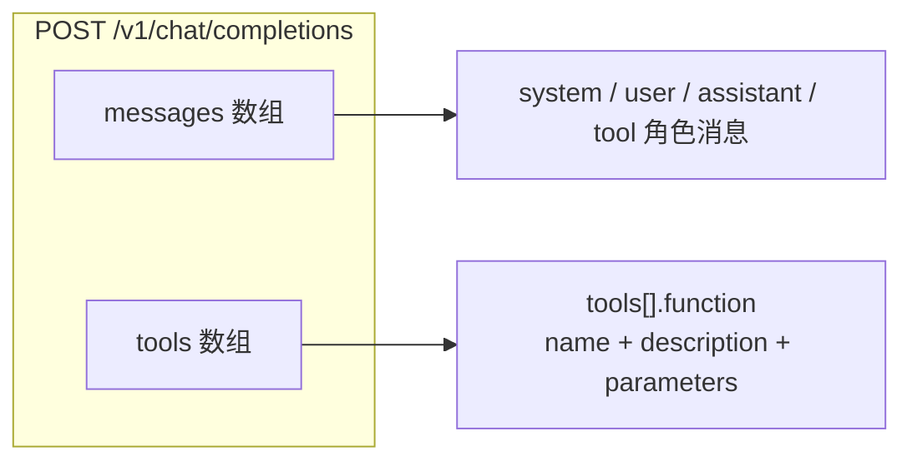
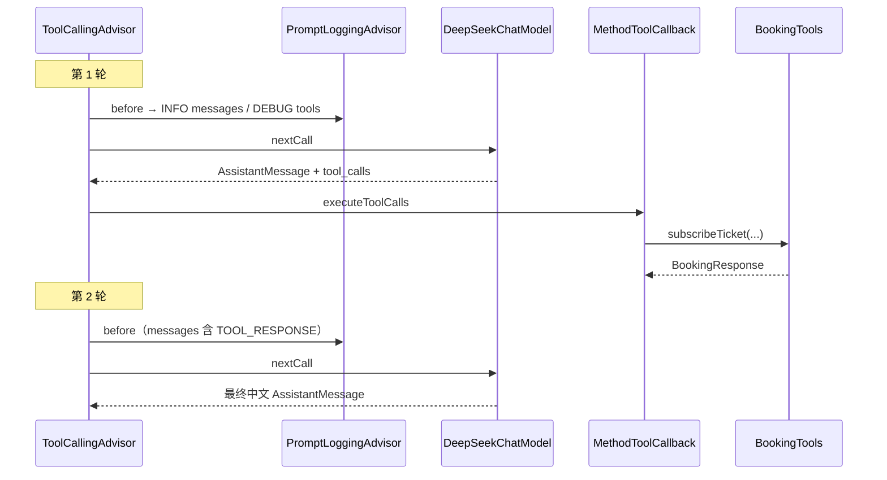
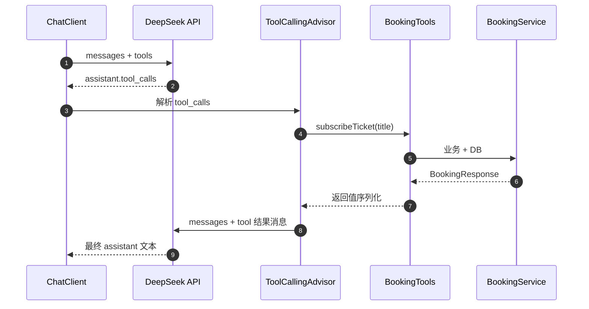
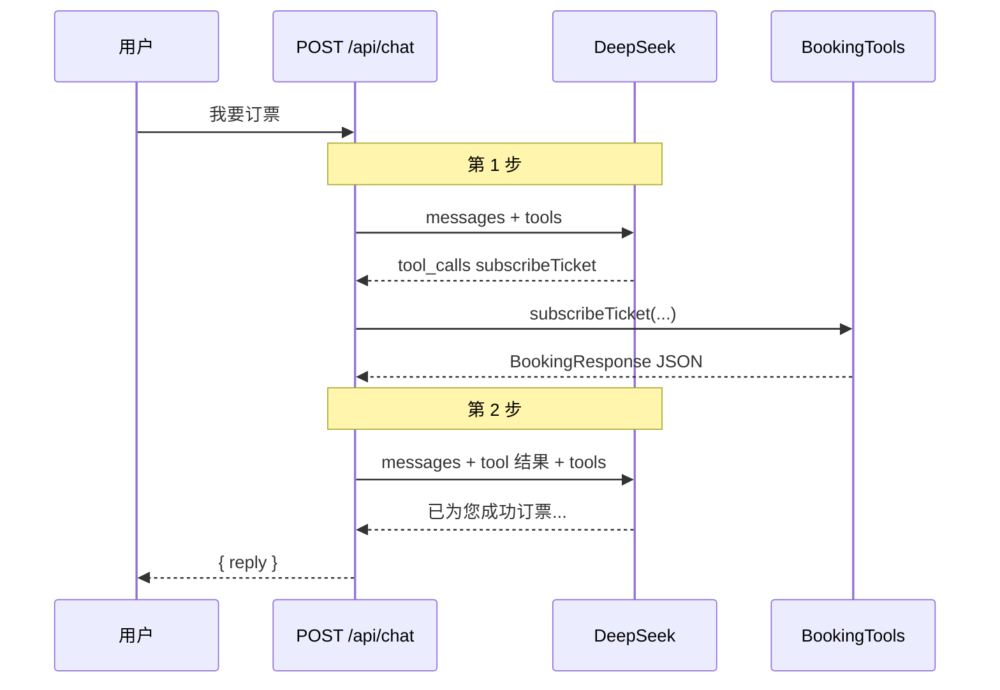

# Tool Call 调用格式说明

> 从 `@Tool` 注解到 DeepSeek HTTP 请求里的 `tools` 字段——结合本 Demo 日志与 **Spring AI 2.0.0** 源码说明完整调用链。

本文档说明：本项目中 **`@Tool` 方法如何被 Spring AI 转成发给 DeepSeek 的工具定义**，以及 **模型返回 `tool_calls` 后如何在后端执行并回传**。框架侧分析基于 [spring-projects/spring-ai](https://github.com/spring-projects/spring-ai) **v2.0.0**（commit [`dd1186432`](https://github.com/spring-projects/spring-ai/commit/dd1186432)），与本项目 `pom.xml` 中 `<spring-ai.version>2.0.0</spring-ai.version>` 一致。

适合配合 [ARCHITECTURE.md](./ARCHITECTURE.md)（ReAct 全局）与 [FRONTEND_CHAT_FLOW.md](./FRONTEND_CHAT_FLOW.md)（前端只看最终 `reply`）阅读。

---

## 1. 这是什么协议？

| 名称 | 本项目是否使用 | 说明 |
|------|----------------|------|
| **Function / Tool Calling**（OpenAI 兼容） | ✅ 是 | DeepSeek `chat/completions` 的 `tools` + `tool_calls` 字段 |
| **MCP**（Model Context Protocol） | ❌ 否 | 跨进程/跨服务的工具标准协议；Spring AI 可接 MCP，本 Demo 未用 |
| **A2A**（Agent-to-Agent） | ❌ 否 | 多 Agent 互相协作协议；本项目是单体 ChatClient + 单模型 |

**一句话**：`@Tool` 是 Spring AI 对 **大模型 API 层 Function Calling** 的 Java 封装，工具在 **同一次 HTTP 请求** 里以 JSON Schema 形式注册，模型在响应里声明要调哪个函数；**不是** MCP Server，也 **不是** Agent 间互联。

主流 chat 模型（含 DeepSeek）普遍对 tool calling 做过 **post-training / 对齐**（SFT、偏好学习等），而非仅靠 prompt 临场学会格式；学术脉络与代表论文见 **§13**。

### 1.1 规范与标准：分层对照

**没有一个叫「Tool Call 协议」的单一 RFC**；本 Demo 使用的格式由 **几份既有标准 + 行业 API 约定** 叠加而成：

```text
JSON Schema（IETF / json-schema.org 标准）
    ↓  描述 function.parameters：type、properties、required…
OpenAI 兼容 Chat Completions + Tools（事实上的行业参考实现）
    ↓  描述 HTTP 信封：messages[]、tools[]、tool_calls[]、arguments 为 JSON 字符串
DeepSeek API（声明兼容 OpenAI 风格 Tool Calls）
    ↓
Spring AI @Tool + JsonSchemaGenerator（Java 封装，非独立国际标准）
    ↓
本 Demo BookingTools → DeepSeek deepseek-chat
```

#### 参数层：JSON Schema

Spring AI [`JsonSchemaGenerator.generateForMethodInput`](https://github.com/spring-projects/spring-ai/blob/v2.0.0/spring-ai-model/src/main/java/org/springframework/ai/util/json/schema/JsonSchemaGenerator.java#L135-L138) 输出的 `inputSchema` 遵循 [**JSON Schema**](https://json-schema.org/)，本项目为 **Draft 2020-12**（`$schema` 字段可见）。

| schema 字段 | 含义 | 规范来源 |
|-------------|------|----------|
| `type: "object"` | 参数整体为对象 | JSON Schema |
| `properties` | 各参数字段及类型 | JSON Schema |
| `required` | 必填参数名列表 | JSON Schema |
| `additionalProperties: false` | 禁止未声明字段（Spring AI 默认） | JSON Schema + Spring AI 生成策略 |

各模型厂商通常只支持 JSON Schema 的 **子集**；启用 `strict` 等选项时约束更严，以厂商文档为准。

#### 信封层：OpenAI 兼容 Tools / Function Calling

HTTP 请求/响应的外壳对齐 [**OpenAI Chat Completions — Function calling / Tools**](https://platform.openai.com/docs/guides/function-calling)[^3]；DeepSeek 文档说明其 Tool Calls [**兼容 OpenAI 风格**](https://api-docs.deepseek.com/)[^4]。

| API 字段 | 作用 | 标准性质 |
|----------|------|----------|
| `messages[]` | system / user / assistant / tool 对话 | OpenAI API 约定（广泛被跟进） |
| `tools[]` | 本轮可调用的函数列表 | 同上 |
| `tools[].type: "function"` | 工具类型 | 同上 |
| `tools[].function.name` | 函数名 | 同上 |
| `tools[].function.description` | 自然语言说明 | 同上 |
| `tools[].function.parameters` | **JSON Schema 对象**（非字符串） | OpenAI 约定 + JSON Schema |
| 响应 `tool_calls[].function.arguments` | 参数 payload，类型为 **JSON 字符串** | OpenAI 约定（需二次 parse） |

Spring AI 将 `ToolDefinition.inputSchema` 经 `DeepSeekChatModel.getFunctionTools()` 填入 `function.parameters`；模型以 `tool_calls` 回传——这是 **Function Calling 生态的通用形态**，不是 Spring 私有 wire format。

#### 框架层：不是国际标准

| 组件 | 性质 |
|------|------|
| `@Tool` / `@ToolParam` | Spring AI Java API |
| `ToolDefinitions` / `MethodToolCallback` | Spring AI 实现细节 |
| `generateForMethodInput` | 生成 **标准 JSON Schema**，但生成逻辑本身无独立 RFC |

#### 与 MCP / A2A 的区分（概要）

| 规范 | 与本格式关系 |
|------|----------------|
| **MCP** | 独立协议（Client ↔ MCP Server）；**不是** `chat/completions` 里的 `tools[]` |
| **A2A** | Agent 间协作协议；**不是** 单次 completion 内的 function calling |

详细对比见 **§11**；`generateForMethodInput` 输出亦 **不是** MCP wire format（见 **§3.3.4**）。

---

## 2. 请求体结构：两路并列

发给 DeepSeek 的请求可以拆成 **两块同级字段**，不要误以为工具写进了 SYSTEM 文本：



| 字段 | 内容 | 本项目日志 |
|------|------|------------|
| `messages` | 对话历史：system prompt、用户话、assistant 回复、tool 结果 | `PromptLoggingAdvisor` **INFO**：`[AI 第N步] 发送 Prompt（messages）` |
| `tools` | 可调用的函数列表（JSON Schema 参数） | **DEBUG**：`注册的工具（options → API tools 字段，非 messages）` |

源码注释：

```26:27:backend/src/main/java/com/demo/booking/config/ChatConfig.java
 *   <li>用户发消息 → system + 用户消息进入 {@code messages}；{@code @Tool} 定义进入 {@code options.toolCallbacks} → API {@code tools}</li>
```

```29:31:backend/src/main/java/com/demo/booking/advisor/PromptLoggingAdvisor.java
 * 工具<strong>不会</strong>出现在 INFO 的 messages 列表里：Spring AI 把 {@code @Tool} 注册结果放进
 * {@link ToolCallingChatOptions#getToolCallbacks()}，由 {@code DeepSeekChatModel} 转成 HTTP 请求体中的
 * {@code tools} 字段，与 {@code messages} 并列，而非一条 SYSTEM 文本。
```

### 2.1 示例：用户说「你好」（无 tool call）

**messages**（INFO 日志可见）：

```
[1] SYSTEM: 你是订票助手。必须严格遵守：...
[2] USER: 你好
```

**tools**（DEBUG 日志可见，每步 ReAct 都会带上）：

```
[1] listUnsubscribedTickets
    description: 查询当前所有未订阅（可订）的票。...
    inputSchema: { "type": "object", "properties": {}, ... }
[2] listSubscribedTickets
    ...
[3] subscribeTicket
    ...
[4] cancelSubscription
    ...
```

对应 HTTP JSON 骨架：

```json
{
  "model": "deepseek-chat",
  "messages": [
    { "role": "system", "content": "你是订票助手。必须严格遵守：..." },
    { "role": "user", "content": "你好" }
  ],
  "tools": [
    {
      "type": "function",
      "function": {
        "name": "listUnsubscribedTickets",
        "description": "查询当前所有未订阅（可订）的票。用户询问可订列表时调用。",
        "parameters": {
          "$schema": "https://json-schema.org/draft/2020-12/schema",
          "type": "object",
          "properties": {},
          "required": [],
          "additionalProperties": false
        }
      }
    }
  ]
}
```

日志里的 `inputSchema` 经 `DeepSeekChatModel` 解析后，就是上面 `function.parameters` 对象。

---

## 3. Spring AI 源码走读（v2.0.0）

本节按 **BLOG 式「宏观 → 微观」** 顺序：先给出总调用链，再逐文件对照源码行号。所有框架引用均指向 GitHub 上的 **spring-projects/spring-ai** 标签 **v2.0.0**，不使用本地路径。

### 3.1 总调用链：注册工具 vs 执行工具

工具生命周期分 **两条链**：**出站**（Java → HTTP `tools`）与 **入站**（HTTP `tool_calls` → Java 方法）。

```text
【出站：@Tool → DeepSeek 请求 tools 字段】

ChatConfig.defaultTools(bookingTools)
    └─ DefaultChatClientBuilder.defaultTools()（DefaultChatClientBuilder.java:195-197）
        └─ MethodToolCallbackProvider.getToolCallbacks()（MethodToolCallbackProvider.java:86-107）
            └─ ToolDefinitions.from(toolMethod)（ToolDefinitions.java:58-59）
                └─ builder(toolMethod).build()（ToolDefinitions.java:47-52）
                    ├─ ① ToolUtils.getToolName(method)
                    ├─ ② ToolUtils.getToolDescription(method)
                    └─ ③ JsonSchemaGenerator.generateForMethodInput(method)（:135-189）
                        └─ DefaultToolDefinition(name, description, inputSchema)
                            └─ 写入 ToolCallingChatOptions.toolCallbacks

ChatService.chat() → ChatClient.call()
    └─ ToolCallingAdvisor.adviseCall() 循环（ToolCallingAdvisor.java:141-187）
        └─ callAdvisorChain.nextCall() → DeepSeekChatModel
            └─ createRequest() 合并 toolDefinitions（DeepSeekChatModel.java:407-414）
                └─ getFunctionTools()（DeepSeekChatModel.java:419-424）
                    └─ DeepSeekApi.FunctionTool.Function(description, name, inputSchema)
                        └─ HTTP JSON: tools[].function.parameters

【入站：DeepSeek tool_calls → BookingTools 方法】

DeepSeek 响应 assistant.tool_calls
    └─ ToolCallingAdvisor：toolExecutionEligibilityChecker（ToolCallingAdvisor.java:159-164）
        └─ ToolCallingManager.executeToolCalls()
            └─ MethodToolCallback.call(toolInput)（MethodToolCallback.java:100-122）
                └─ extractToolArguments：JSON 字符串 → Map
                └─ buildMethodArguments → callMethod
                    └─ BookingTools.subscribeTicket(title)  【本 Demo 业务入口】
```

**参见**（按链路顺序）：

- [`DefaultChatClientBuilder.java`](https://github.com/spring-projects/spring-ai/blob/v2.0.0/spring-ai-client-chat/src/main/java/org/springframework/ai/chat/client/DefaultChatClientBuilder.java)
- [`MethodToolCallbackProvider.java`](https://github.com/spring-projects/spring-ai/blob/v2.0.0/spring-ai-model/src/main/java/org/springframework/ai/tool/method/MethodToolCallbackProvider.java)
- [`ToolDefinitions.java`](https://github.com/spring-projects/spring-ai/blob/v2.0.0/spring-ai-model/src/main/java/org/springframework/ai/tool/support/ToolDefinitions.java)
- [`ToolUtils.java`](https://github.com/spring-projects/spring-ai/blob/v2.0.0/spring-ai-model/src/main/java/org/springframework/ai/tool/support/ToolUtils.java)
- [`DefaultToolDefinition.java`](https://github.com/spring-projects/spring-ai/blob/v2.0.0/spring-ai-model/src/main/java/org/springframework/ai/tool/definition/DefaultToolDefinition.java)
- [`JsonSchemaGenerator.java`](https://github.com/spring-projects/spring-ai/blob/v2.0.0/spring-ai-model/src/main/java/org/springframework/ai/util/json/schema/JsonSchemaGenerator.java)
- [`DeepSeekChatModel.java`](https://github.com/spring-projects/spring-ai/blob/v2.0.0/models/spring-ai-deepseek/src/main/java/org/springframework/ai/deepseek/DeepSeekChatModel.java)
- [`ToolCallingAdvisor.java`](https://github.com/spring-projects/spring-ai/blob/v2.0.0/spring-ai-client-chat/src/main/java/org/springframework/ai/chat/client/advisor/ToolCallingAdvisor.java)
- [`MethodToolCallback.java`](https://github.com/spring-projects/spring-ai/blob/v2.0.0/spring-ai-model/src/main/java/org/springframework/ai/tool/method/MethodToolCallback.java)

### 3.2 注册：`defaultTools` 扫描 `@Tool`

本 Demo 在 [`ChatConfig.java`](https://github.com/liweinan/springai_demo/blob/main/backend/src/main/java/com/demo/booking/config/ChatConfig.java) 调用 `.defaultTools(bookingTools)`。Spring AI 侧等价于：

```java
// DefaultChatClientBuilder.java: 195-197
@Override
public Builder defaultTools(Object... toolObjects) {
    this.defaultRequest.tools(toolObjects);
    return this;
}
```

[`MethodToolCallbackProvider`](https://github.com/spring-projects/spring-ai/blob/v2.0.0/spring-ai-model/src/main/java/org/springframework/ai/tool/method/MethodToolCallbackProvider.java) 对传入 Bean 做反射扫描：凡带 `@Tool` 的方法，各生成一个 `MethodToolCallback`：

```java
// MethodToolCallbackProvider.java: 94-100
.map(toolMethod -> MethodToolCallback.builder()
    .toolDefinition(ToolDefinitions.from(toolMethod))
    .toolMetadata(ToolMetadata.from(toolMethod))
    .toolMethod(toolMethod)
    .toolObject(toolObject)
    .toolCallResultConverter(ToolUtils.getToolCallResultConverter(toolMethod))
    .build())
```

Spring AI 2.0 还会在 [`DefaultChatClient.autoRegisterToolCallingAdvisor()`](https://github.com/spring-projects/spring-ai/blob/v2.0.0/spring-ai-client-chat/src/main/java/org/springframework/ai/chat/client/DefaultChatClient.java#L1217-L1237) 中 **自动挂载** `ToolCallingAdvisor`（order ≈ `HIGHEST_PRECEDENCE + 300`），因此本 Demo **不必** 手动 `.advisors(ToolCallingAdvisor.builder()...)`。

### 3.3 生成 schema：`ToolDefinitions.from` 与 `generateForMethodInput`

[`ToolDefinitions.from(Method)`](https://github.com/spring-projects/spring-ai/blob/v2.0.0/spring-ai-model/src/main/java/org/springframework/ai/tool/support/ToolDefinitions.java#L58-L59) **不是**「空壳再调 schema」——它在同一次 `builder(method).build()` 里 **按固定顺序组装三件套**，第三步才调用 `generateForMethodInput`：

```text
ToolDefinitions.from(toolMethod)
    └─ builder(toolMethod)（ToolDefinitions.java:47-52）
        ├─ ① ToolUtils.getToolName(method)              → name
        ├─ ② ToolUtils.getToolDescription(method)       → description
        └─ ③ JsonSchemaGenerator.generateForMethodInput(method)  → inputSchema
            └─ DefaultToolDefinition.Builder.build()（DefaultToolDefinition.java:69-76）
                └─ record DefaultToolDefinition(name, description, inputSchema)
```

对应源码：

```java
// ToolDefinitions.java: 47-52, 58-59
return DefaultToolDefinition.builder()
    .name(ToolUtils.getToolName(method))
    .description(ToolUtils.getToolDescription(method))
    .inputSchema(JsonSchemaGenerator.generateForMethodInput(method));
// from() 等价于 builder(method).build()
```

#### 3.3.1 ① `getToolName` — 工具叫什么

[`ToolUtils.getToolName`](https://github.com/spring-projects/spring-ai/blob/v2.0.0/spring-ai-model/src/main/java/org/springframework/ai/tool/support/ToolUtils.java#L57-L68) 读取 `@Tool` 注解（若有）：

| 条件 | 结果 |
|------|------|
| 无 `@Tool` | 方法名，如 `subscribeTicket` |
| `@Tool(name = "xxx")` 非空 | 用 `name` |
| 有 `@Tool` 但 `name` 为空 | 仍用方法名 |

本 Demo 未写 `@Tool(name=...)`，故 **`function.name = "subscribeTicket"`**。

#### 3.3.2 ② `getToolDescription` — 描述从哪来

[`ToolUtils.getToolDescription`](https://github.com/spring-projects/spring-ai/blob/v2.0.0/spring-ai-model/src/main/java/org/springframework/ai/tool/support/ToolUtils.java#L76-L83)：

| 条件 | 结果 |
|------|------|
| 无 `@Tool` | 把方法名拆成可读文字 |
| `@Tool(description = "...")` 非空 | **原样** 作为 `function.description` |
| 有 `@Tool` 但 description 为空 | 退回方法名 |

**要点**：`@Tool(description = "...")` 只影响 HTTP 里的 **description 字段**，**不会**自动写入 JSON Schema 的 `properties` 或 `required`。

#### 3.3.3 ③ `generateForMethodInput` — schema 怎么拼

[`JsonSchemaGenerator.generateForMethodInput`](https://github.com/spring-projects/spring-ai/blob/v2.0.0/spring-ai-model/src/main/java/org/springframework/ai/util/json/schema/JsonSchemaGenerator.java#L135-L189) **只关心方法参数签名**，与 name/description 无关。对 `subscribeTicket(String title)` 的内部流程：

```text
generateForMethodInput(method)
    └─ 创建根对象 schema（:136-142）
        $schema = draft/2020-12，type = object，properties = {}，required = []
    └─ for 每个参数 i（:144-178）
        ├─ parameterName = method.getParameters()[i].getName()     → "title"（需 javac -parameters）
        ├─ 跳过 ToolContext 参数（:147-153）【框架注入，不给大模型看】
        ├─ 跳过 Kotlin suspend 合成 Continuation（:155-159）
        ├─ isMethodParameterRequired(method, i) → true 则加入 required（:161-163）
        ├─ generateSchema(参数类型) → String 为 { "type": "string" }（:164）
        ├─ hoistDefsToRoot、去掉 format（:170-172）
        ├─ getMethodParameterDescription → 仅有 @ToolParam 等注解才写 description（:173-176）
        └─ properties[parameterName] = 参数 schema 节点（:177）
    └─ 若 $defs 为空则删除（:180-182）
    └─ 写入 required 数组（:184-185）
    └─ processSchemaOptions → forbidAdditionalProperties（:205-208）
        → "additionalProperties": false
    └─ return schema.toPrettyString()（:189）
```

核心循环代码（与上文逐步对应）：

```java
// JsonSchemaGenerator.java: 135-142, 144-178, 184-189
ObjectNode schema = JacksonUtils.getDefaultJsonMapper().createObjectNode();
schema.put("$schema", SchemaVersion.DRAFT_2020_12.getIdentifier());
schema.put("type", "object");
ObjectNode properties = schema.putObject("properties");
List<String> required = new ArrayList<>();

for (int i = 0; i < method.getParameterCount(); i++) {
    String parameterName = method.getParameters()[i].getName();
    Type parameterType = method.getGenericParameterTypes()[i];
    // 跳过 ToolContext、Kotlin Continuation ...
    if (isMethodParameterRequired(method, i)) {
        required.add(parameterName);
    }
    ObjectNode parameterNode = generateSchema(subtypeSchemaGenerator, parameterType);
    // hoistDefs、remove format、可选 description ...
    properties.set(parameterName, parameterNode);
}
var requiredArray = schema.putArray("required");
required.forEach(requiredArray::add);
processSchemaOptions(schemaOptions, schema);
return schema.toPrettyString();
```

**`required` 判定优先级**（[`isMethodParameterRequired`](https://github.com/spring-projects/spring-ai/blob/v2.0.0/spring-ai-model/src/main/java/org/springframework/ai/util/json/schema/JsonSchemaGenerator.java#L231-L255)）：

| 优先级 | 注解 | 效果 |
|--------|------|------|
| 1 | `@ToolParam(required = false)` | 可选 |
| 2 | `@JsonProperty(required = false)` | 可选 |
| 3 | `@Schema` 的 required 模式 | 按注解 |
| 4 | `@Nullable` / JSpecify Nullness | 可选 |
| 5 | **以上皆无** | **默认必填**（`PROPERTY_REQUIRED_BY_DEFAULT = true`）[^1] |

类注释原文：

> If none of these annotations are present, the default behavior is to consider the property as **required** and not to include a description.

因此 `subscribeTicket(String title)` 在无 `@ToolParam` / `@Nullable` 时生成：

```json
{
  "type": "object",
  "properties": { "title": { "type": "string" } },
  "required": ["title"],
  "additionalProperties": false
}
```

无参方法如 `listUnsubscribedTickets()`：循环 0 次 → `properties: {}`，`required: []`。

**`subscribeTicket` 三字段对照**（说明 description 与 schema 分工）：

| ToolDefinition 字段 | 生成来源 | 本 Demo 值 |
|---------------------|----------|-----------|
| `name` | ① `getToolName` | `subscribeTicket` |
| `description` | ② `@Tool(description=...)` | 「订阅一张票… title 可选…」 |
| `inputSchema` | ③ `generateForMethodInput` | `required: ["title"]`（与 description 文字可不一致） |

若希望 schema 与「title 可选」一致，应对参数标注 `@ToolParam(required = false)` 或 `@Nullable`（见 §4.4）。

#### 3.3.4 这段代码是 MCP 吗？

**不是。** `generateForMethodInput` 输出的是 [**JSON Schema**](https://json-schema.org/) 语法的 function 入参描述，经 OpenAI 兼容 **`tools[].function.parameters`** 字段发给 DeepSeek——属于 **Function Calling / Tool Calling**（见 **§1.1**），**不是** MCP 的 JSON-RPC wire format。Spring AI 可另接 MCP Server，但本 Demo 与本方法均走 **进程内 `@Tool` + DeepSeek `tools` 字段** 路径（对比见 **§11**）。

### 3.4 出站：`DeepSeekChatModel` 写入 HTTP `tools`

[`DeepSeekChatModel.createRequest`](https://github.com/spring-projects/spring-ai/blob/v2.0.0/models/spring-ai-deepseek/src/main/java/org/springframework/ai/deepseek/DeepSeekChatModel.java#L407-L414) 从 `ToolCallingManager.resolveToolDefinitions(options)` 取出工具列表，再映射为 DeepSeek API 结构：

```java
// DeepSeekChatModel.java: 419-424
private List<DeepSeekApi.FunctionTool> getFunctionTools(List<ToolDefinition> toolDefinitions) {
    return toolDefinitions.stream().map(toolDefinition -> {
        var function = new DeepSeekApi.FunctionTool.Function(
                toolDefinition.description(), toolDefinition.name(), toolDefinition.inputSchema());
        return new DeepSeekApi.FunctionTool(function);
    }).toList();
}
```

[`DeepSeekApi.FunctionTool.Function`](https://github.com/spring-projects/spring-ai/blob/v2.0.0/models/spring-ai-deepseek/src/main/java/org/springframework/ai/deepseek/api/DeepSeekApi.java#L397-L429) 的三参数构造器把 **JSON Schema 字符串** 解析为 `parameters` Map：

```java
// DeepSeekApi.java: 428-429
public Function(String description, String name, String jsonSchema) {
    this(description, name, jsonHelper.fromJsonToMap(jsonSchema), null);
}
```

这就是 Docker DEBUG 日志里 `inputSchema: { ... }` 与 HTTP 体 `tools[].function.parameters` 的对应关系。`PromptLoggingAdvisor` 在 Advisor 链内读到的正是 **`ToolCallingChatOptions.getToolCallbacks()`** 里的 `ToolDefinition`，尚未序列化进 `messages`。

### 3.5 ReAct 循环：`ToolCallingAdvisor`

Spring AI 2.0 把工具循环从 `ChatModel` 内部 **上移到 Advisor 链**[^2]。[`ToolCallingAdvisor.adviseCall`](https://github.com/spring-projects/spring-ai/blob/v2.0.0/spring-ai-client-chat/src/main/java/org/springframework/ai/chat/client/advisor/ToolCallingAdvisor.java#L141-L187) 的核心是 `do { ... } while (isToolCall)`：

```java
// ToolCallingAdvisor.java: 152-164, 186-187
chatClientResponse = callAdvisorChain.copy(this).nextCall(processedChatClientRequest);
// ...
isToolCall = this.toolExecutionEligibilityChecker.isToolCallResponse(chatResponse);
if (isToolCall) {
    ToolExecutionResult toolExecutionResult = this.toolCallingManager
        .executeToolCalls(processedChatClientRequest.prompt(), chatResponse);
    instructions = this.doGetNextInstructionsForToolCall(...);
}
// ...
while (isToolCall);
```

本 Demo 的 [`PromptLoggingAdvisor`](https://github.com/liweinan/springai_demo/blob/main/backend/src/main/java/com/demo/booking/advisor/PromptLoggingAdvisor.java) 设 `order = HIGHEST_PRECEDENCE + 400`，**大于** `ToolCallingAdvisor` 的 +300，因此能插进循环内部，逐步打印 `[AI 第1步]`、`[AI 第2步]`。



### 3.6 入站：`MethodToolCallback` 解析 `arguments`

模型返回的 `function.arguments` 是 JSON **字符串**。执行时 [`MethodToolCallback.call`](https://github.com/spring-projects/spring-ai/blob/v2.0.0/spring-ai-model/src/main/java/org/springframework/ai/tool/method/MethodToolCallback.java#L100-L122) 将其还原为 Java 调用：

```java
// MethodToolCallback.java: 109-114, 120-122
Map<String, Object> toolArguments = this.extractToolArguments(toolInput);
Object[] methodArguments = this.buildMethodArguments(toolArguments, toolContext);
Object result = this.callMethod(methodArguments);
// ...
return this.toolCallResultConverter.convert(result, returnType);
```

`extractToolArguments` 用 Jackson 把 `"{\"title\":\"G123\"}"` 反序列化为 `Map`，再按参数名绑定到 `subscribeTicket(String title)`。返回值序列化后写入 `ToolResponseMessage`，作为下一轮 `messages` 中的 **tool 角色** 消息回灌模型。

---

## 4. `@Tool` 方法 → 工具定义

### 4.1 映射规则

| Java 侧 | API 侧 `function.*` | 规则 |
|---------|---------------------|------|
| 方法名 | `name` | 默认 `subscribeTicket`；可用 `@Tool(name = "...")` 覆盖 |
| `@Tool(description = "...")` | `description` | 告诉模型何时、如何调用 |
| 方法参数（反射） | `parameters` | 由 `JsonSchemaGenerator` 生成 **JSON Schema Draft 2020-12** |

注册入口：

```61:62:backend/src/main/java/com/demo/booking/config/ChatConfig.java
                .defaultTools(bookingTools)   // 工具 schema 写入 options.toolCallbacks，非 SYSTEM 文本
                .defaultAdvisors(new PromptLoggingAdvisor())  // INFO=messages，DEBUG=tools
```

Spring AI 2.0 在 `defaultTools(...)` 后 **自动注册** `ToolCallingAdvisor`，无需手写 ReAct 循环。

### 4.2 本项目四个工具的 schema（实测）

以下 schema 与 Docker DEBUG 日志一致（由 `BookingTools` + Spring AI 2.0 生成）：

#### listUnsubscribedTickets / listSubscribedTickets（无参）

```json
{
  "$schema": "https://json-schema.org/draft/2020-12/schema",
  "type": "object",
  "properties": {},
  "required": [],
  "additionalProperties": false
}
```

#### subscribeTicket(String title) / cancelSubscription(String title)

```json
{
  "$schema": "https://json-schema.org/draft/2020-12/schema",
  "type": "object",
  "properties": {
    "title": {
      "type": "string"
    }
  },
  "required": ["title"],
  "additionalProperties": false
}
```

### 4.3 参数 schema 的生成细节

- **参数名**：来自 Java 编译参数名（Maven 已开 `-parameters`）。
- **参数描述**：可用 `@ToolParam(description = "...")` 写入 schema 的 `properties.xxx.description`。
- **是否必填**：默认 **所有参数 required**；可用 `@ToolParam(required = false)` 或 `@Nullable` 标为可选。
- **无参方法**：`properties` 为空对象，`required` 为空数组。

### 4.4 已知不一致：`subscribeTicket` 的 title

`@Tool` 的 description 写「title 可选」，但 schema 里 `"required": ["title"]`——原因见 **§3.3.2–§3.3.3**：description 与 schema 分属 `ToolDefinition` 的不同字段，**schema 以 `generateForMethodInput` 生成为准**。

业务层 `BookingService.subscribeTicket` 允许 `title == null` 时订第一张票；若希望 schema 与行为一致，应对参数标注：

```java
public BookingResponse subscribeTicket(@ToolParam(required = false) String title)
```

---

## 5. 模型返回：tool_calls 格式

当用户说「我要订票」时，模型通常 **不先回中文**，而是返回 **assistant + tool_calls**：

```json
{
  "role": "assistant",
  "content": null,
  "tool_calls": [
    {
      "id": "call_abc123",
      "type": "function",
      "function": {
        "name": "subscribeTicket",
        "arguments": "{}"
      }
    }
  ]
}
```

或带关键词：

```json
"function": {
  "name": "cancelSubscription",
  "arguments": "{\"title\":\"北京到上海\"}"
}
```

**要点**：

- `arguments` 是 **JSON 字符串**（不是嵌套对象），需解析后映射到 Java 方法参数。
- `name` 必须与 `tools[].function.name` 完全一致（如 `subscribeTicket`）。
- 本项目 INFO 日志中表现为：`ASSISTANT (tool_calls)` + `- subscribeTicket({})`。

---

## 6. 工具执行与结果回传



### 6.1 Spring AI 内部消息类型

| 阶段 | Spring AI Message | DeepSeek role | 日志中的表现 |
|------|-------------------|---------------|--------------|
| 用户输入 | `UserMessage` | `user` | `USER: ...` |
| 系统提示 | `SystemMessage` | `system` | `SYSTEM: ...` |
| 模型要调工具 | `AssistantMessage`（含 toolCalls） | `assistant` | `ASSISTANT (tool_calls)` |
| 工具返回值 | `ToolResponseMessage` | `tool` | `TOOL_RESPONSE` + `name => data` |
| 最终回复 | `AssistantMessage`（纯文本） | `assistant` | `ASSISTANT: 已为您...` |

工具真正执行时，`BookingTools` 会打 INFO：

```
[Tool 被调用] subscribeTicket, title=null
```

### 6.2 工具返回值

- Java 方法返回值（如 `BookingResponse`、`List<BookingResponse>`）由 Spring AI **序列化为 JSON 字符串**，放入 tool 结果消息。
- 模型读 tool 结果后，再生成面向用户的 **一句中文**（见 `ChatConfig` system prompt 第 5 条）。
- 前端 **只收到** 最终 `reply` 字符串，**看不到** tool_calls 与 tool 结果（见 [FRONTEND_CHAT_FLOW.md](./FRONTEND_CHAT_FLOW.md)）。

---

## 7. 完整 ReAct 一轮（订票）示例

用户消息：`我要订票`

| 步骤 | 发给 DeepSeek 的 messages 变化 | tools | 模型输出 |
|------|-------------------------------|-------|----------|
| 第 1 步 | SYSTEM + USER | 4 个工具全集 | `tool_calls: subscribeTicket` |
| （执行） | — | — | Java 执行 + H2 UPDATE |
| 第 2 步 | SYSTEM + USER + ASSISTANT(tool_calls) + TOOL_RESPONSE | 4 个工具全集 | 最终中文 reply |



一次 HTTP `POST /api/chat` 在服务端可能触发 **多步** Advisor 迭代（日志 `[AI 第1步]`、`[AI 第2步]`），对前端仍是一次同步等待。

---

## 8. 与 System Prompt 的分工

| 内容 | 放在哪 | 作用 |
|------|--------|------|
| 工具 **能做什么**、参数 **类型/schema** | `tools[].function` | 供模型结构化调用 |
| 工具 **何时必须调**、**禁止编造** | `messages` 里 SYSTEM | 行为约束、中文风格 |

两者 **互补**：schema 不会自动包含「禁止未调工具就声称成功」这类业务规则，所以 `ChatConfig.defaultSystem` 仍然必要。

---

## 9. 如何在本项目里观察

### 9.1 日志关键字

| 关键字 | 含义 |
|--------|------|
| `[AI 第N步] 发送 Prompt（messages）` | 当轮发给模型的对话消息 |
| `[AI 第N步] 注册的工具` | 当轮 `tools` 定义（需 DEBUG） |
| `ASSISTANT (tool_calls)` | 模型决定调工具 |
| `TOOL_RESPONSE` | 工具返回值已回灌 |
| `[Tool 被调用]` | Java 方法真正执行 |

### 9.2 开启 DEBUG

Docker Compose 默认已对 `com.demo.booking` 开 DEBUG。本地运行时可加：

```yaml
logging:
  level:
    com.demo.booking.advisor.PromptLoggingAdvisor: DEBUG
```

或环境变量：`LOGGING_LEVEL_COM_DEMO_BOOKING=DEBUG`。

---

## 10. 本仓库源码索引

Spring AI 框架侧详见 **§3**；本 Demo 业务与观测相关文件：

| 文件 | 职责 |
|------|------|
| [`BookingTools.java`](https://github.com/liweinan/springai_demo/blob/main/backend/src/main/java/com/demo/booking/tools/BookingTools.java) | `@Tool` 方法定义 |
| [`ChatConfig.java`](https://github.com/liweinan/springai_demo/blob/main/backend/src/main/java/com/demo/booking/config/ChatConfig.java) | `defaultTools` + system prompt |
| [`PromptLoggingAdvisor.java`](https://github.com/liweinan/springai_demo/blob/main/backend/src/main/java/com/demo/booking/advisor/PromptLoggingAdvisor.java) | 打印 messages / tool schema |
| [`ChatService.java`](https://github.com/liweinan/springai_demo/blob/main/backend/src/main/java/com/demo/booking/service/ChatService.java) | `chatClient.call()` 入口 |
| [`BookingService.java`](https://github.com/liweinan/springai_demo/blob/main/backend/src/main/java/com/demo/booking/service/BookingService.java) | 工具背后的业务逻辑 |

---

## 11. 与 MCP / A2A 的对比（扩展阅读）

规范分层背景见 **§1.1**。若将来要把订票能力 **暴露给多个 AI 应用** 或 **跨语言调用**，可考虑 MCP Server；若要做 **多 Agent 分工协作**，才涉及 A2A。本 Demo 刻意保持 **进程内 `@Tool` + DeepSeek Function Calling**，便于理解 ReAct 最小闭环。

| 维度 | 本项目 Tool Calling | MCP | A2A |
|------|---------------------|-----|-----|
| 工具位置 | 同 JVM 内 Java 方法 | 独立 MCP Server | 远程 Agent |
| 传输 | 模型 API 的 `tools` / `tool_calls` | JSON-RPC 等 | Agent 间任务协议 |
| 前端可见性 | 仅最终 `reply` | 取决于集成方式 | 取决于编排层 |

---

## 12. 延伸阅读

- **§13 相关学术论文** — Tool Learning / Function Calling 综述、训练与 benchmark
- [ARCHITECTURE.md](./ARCHITECTURE.md) — §5 Spring AI 与 ReAct 时序
- [FRONTEND_CHAT_FLOW.md](./FRONTEND_CHAT_FLOW.md) — 前端为何看不到 tool call
- [JSON Schema 规范](https://json-schema.org/)
- [OpenAI — Function calling / Tools](https://platform.openai.com/docs/guides/function-calling)
- [DeepSeek API 文档](https://api-docs.deepseek.com/)
- [Spring AI Tools 官方文档](https://docs.spring.io/spring-ai/reference/api/tools.html)
- [Spring AI 2.0 Composable Tool Calling 博客](https://spring.io/blog/2026/06/15/spring-ai-composable-tool-calling)

---

## 13. 相关学术论文（Tool Learning / Function Calling）

本节汇总与 **工具学习、函数调用、ReAct** 相关的代表论文与 benchmark。主流大模型对 tool calling 的能力，在研究中通常通过 **工具轨迹数据 + SFT（有时含 RL）** 系统性提升，而非仅依赖推理期 prompt；商用模型（OpenAI、Anthropic、DeepSeek 等）的训练配方多数未公开，但 API 形态与公开 benchmark 可与下列文献对照。

### 13.1 综述（入门首选）

| 论文 | 链接 | 要点 |
|------|------|------|
| **Tool Learning with Foundation Models**（Qin 等，ACM CSUR 2024） | [ACM](https://doi.org/10.1145/3691626) / [arXiv:2404.08488](https://arxiv.org/abs/2404.08488) | 工具学习范式、SFT/RL、benchmark 总览 |
| **Tool Learning with Large Language Models: A Survey** | [arXiv:2405.17935](https://arxiv.org/abs/2405.17935) | 四阶段：规划 → 选工具 → **tool calling** → 生成回复 |
| **LLM with Tools: A Survey** | [arXiv:2409.18807](https://arxiv.org/abs/2409.18807) | fine-tuning 与 in-context learning 教模型用工具 |
| **Tool learning with language models**（Springer 2025） | [Springer](https://link.springer.com/article/10.1007/s44336-025-00024-x) | 四阶段框架、评测与安全 |

### 13.2 代表性工作（训练、数据与 ReAct）

| 论文 | 链接 | 要点 |
|------|------|------|
| **ReAct: Synergizing Reasoning and Acting in Language Models**（Yao 等，2022） | [arXiv:2210.03629](https://arxiv.org/abs/2210.03629) | Reason + Act 交替；本 Demo ReAct 循环的概念来源 |
| **Gorilla: Large Language Model Connected with Massive APIs** | [arXiv:2305.15334](https://arxiv.org/abs/2305.15334) | 面向 API/函数调用的微调与 APIBench |
| **ToolLLM: Facilitating Large Language Models to Master 16000+ Real-world APIs** | [arXiv:2307.16789](https://arxiv.org/abs/2307.16789) | ToolBench 数据 + **ToolLLaMA** SFT |
| **ToolACE: Winning the Points of LLM Function Calling**（ICLR 2025） | [arXiv:2409.00920](https://arxiv.org/abs/2409.00920) | **合成 function calling 训练数据**；SFT 后小模型接近 GPT-4 级调用表现 |

### 13.3 评测与 Leaderboard

| 名称 | 链接 | 测什么 |
|------|------|--------|
| **Berkeley Function Calling Leaderboard (BFCL)** | [Gorilla Leaderboard](https://gorilla.cs.berkeley.edu/leaderboard.html) | 单轮/多轮 function calling、多语言 API |
| **APIBench**（Gorilla 配套） | 见 [Gorilla 论文](https://arxiv.org/abs/2305.15334) | API 选择与调用准确率 |
| **APIBank** | 见 ToolLLM / ToolACE 引用 | 真实风格 API 调用 benchmark |
| **T-Eval** | 见 §13.1 综述 | 将 tool use 拆为推理、规划等子能力 |

### 13.4 与商用模型、本 Demo 的关系

| 层面 | 说明 |
|------|------|
| **研究侧** | 大量工作表明 SFT/RL on tool-use 轨迹可系统性提升调用准确率（见 §13.2） |
| **产品侧** | GPT-4、Claude、Gemini、DeepSeek 等通常具备 tool-use 对齐，但 **数据与训练细节多不公开** |
| **本 Demo** | 使用 **已对齐的 chat 模型** + JSON Schema（§1.1）+ `ToolCallingAdvisor` ReAct 循环；仍可能出现未调工具就编造，故 system prompt 与 `[Tool 被调用]` 日志仍必要 |

OpenAI 平台除 **自定义 `type: function` 工具** 外，还有内置 tools（web search、code interpreter 等）、Structured Outputs、Assistants/Realtime/Responses 等 **不同 API 形态**；本 Demo 的 `@Tool` 仅对应 **Chat Completions 自定义 function 工具** 这一条路径。

### 13.5 建议阅读顺序

1. [arXiv:2405.17935](https://arxiv.org/abs/2405.17935) — 建立 tool learning 全局图  
2. [arXiv:2210.03629](https://arxiv.org/abs/2210.03629)（ReAct）— 理解推理与执行交替  
3. [arXiv:2307.16789](https://arxiv.org/abs/2307.16789) 或 [arXiv:2409.00920](https://arxiv.org/abs/2409.00920) — 看专门数据 + SFT 如何做 function calling  
4. [BFCL](https://gorilla.cs.berkeley.edu/leaderboard.html) — 看各模型 function calling 量化对比  

## References

[^1]: Spring AI，`JsonSchemaGenerator` 类注释 — 参数默认 required 与 `@ToolParam` / `@Nullable` 覆盖规则。[`JsonSchemaGenerator.java` v2.0.0](https://github.com/spring-projects/spring-ai/blob/v2.0.0/spring-ai-model/src/main/java/org/springframework/ai/util/json/schema/JsonSchemaGenerator.java#L53-L71)

[^2]: Spring 官方博客，*Tool Calling in Spring AI 2.0: A Composable, Agentic Architecture*（2026-06-15）— 说明 2.0 将 ReAct 循环上移到 Advisor 链、以及 `@Tool` / `ToolCallingAdvisor` 组合方式。<https://spring.io/blog/2026/06/15/spring-ai-composable-tool-calling>

[^3]: OpenAI Platform Documentation — *Function calling* / Tools in Chat Completions。定义 `tools`、`tool_calls` 及 `function.parameters`（JSON Schema）的 API 形态。<https://platform.openai.com/docs/guides/function-calling>

[^4]: DeepSeek API Documentation — 说明 API 与 OpenAI 兼容，含 Tool Calls 用法。<https://api-docs.deepseek.com/>
