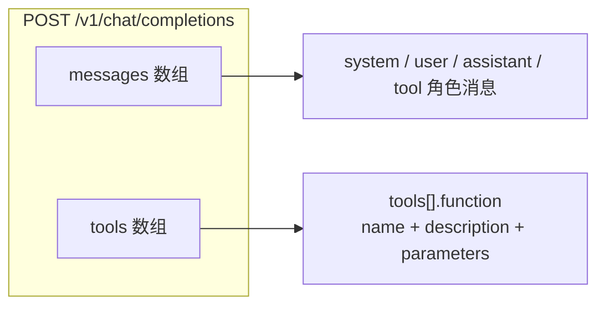
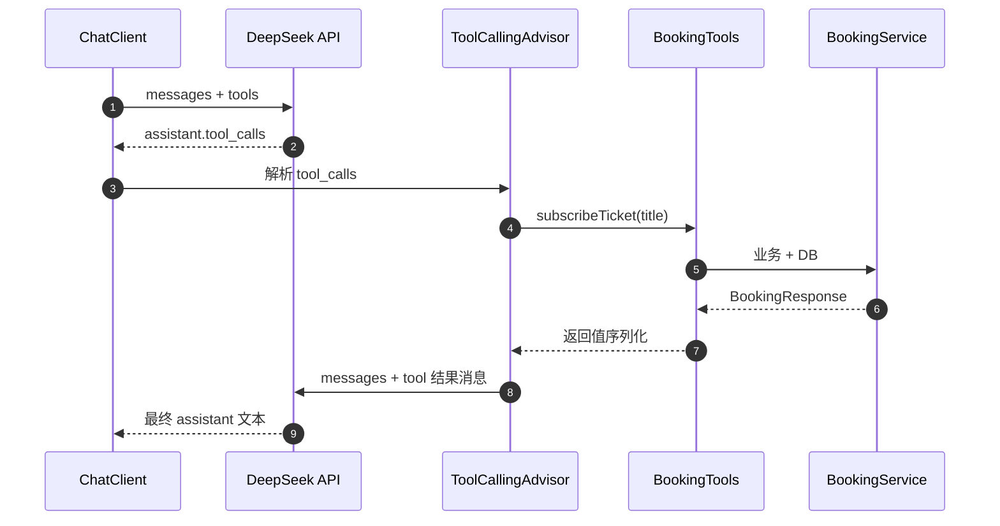
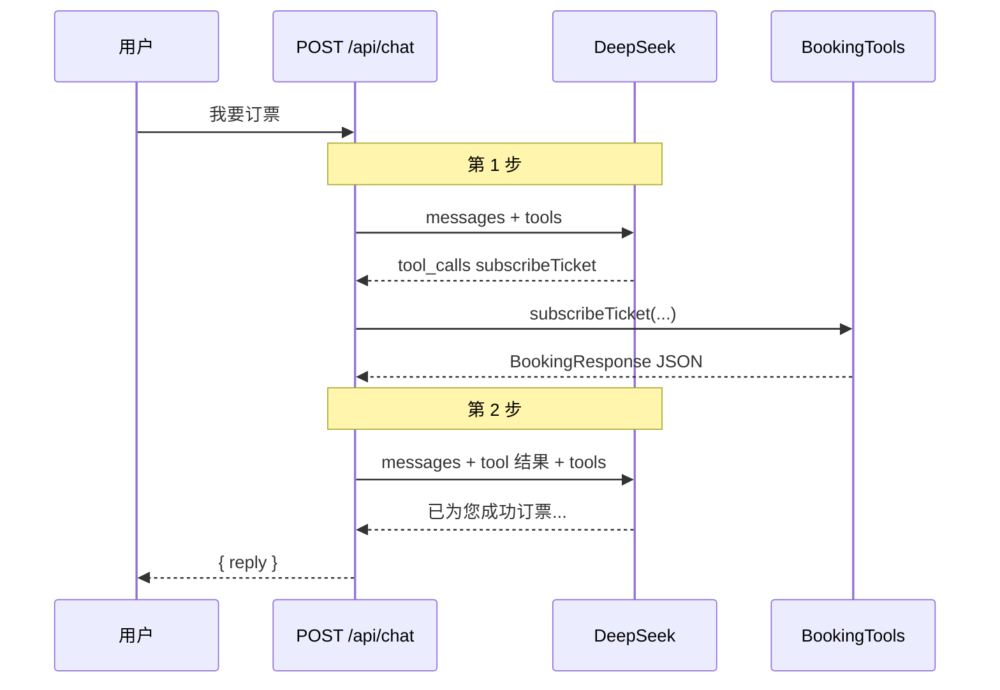

# Tool Call 调用格式说明

本文档说明：本项目中 **`@Tool` 方法如何被 Spring AI 转成发给 DeepSeek 的工具定义**，以及 **模型返回 `tool_calls` 后如何在后端执行并回传**。内容基于本项目源码与 Docker 后端 DEBUG 日志。

适合配合 [ARCHITECTURE.md](./ARCHITECTURE.md)（ReAct 全局）与 [FRONTEND_CHAT_FLOW.md](./FRONTEND_CHAT_FLOW.md)（前端只看最终 `reply`）阅读。

---

## 1. 这是什么协议？

| 名称 | 本项目是否使用 | 说明 |
|------|----------------|------|
| **Function / Tool Calling**（OpenAI 兼容） | ✅ 是 | DeepSeek `chat/completions` 的 `tools` + `tool_calls` 字段 |
| **MCP**（Model Context Protocol） | ❌ 否 | 跨进程/跨服务的工具标准协议；Spring AI 可接 MCP，本 Demo 未用 |
| **A2A**（Agent-to-Agent） | ❌ 否 | 多 Agent 互相协作协议；本项目是单体 ChatClient + 单模型 |

**一句话**：`@Tool` 是 Spring AI 对 **大模型 API 层 Function Calling** 的 Java 封装，工具在 **同一次 HTTP 请求** 里以 JSON Schema 形式注册，模型在响应里声明要调哪个函数；**不是** MCP Server，也 **不是** Agent 间互联。

---

## 2. 请求体结构：两路并列

发给 DeepSeek 的请求可以拆成 **两块同级字段**，不要误以为工具写进了 SYSTEM 文本：



| 字段 | 内容 | 本项目日志 |
|------|------|------------|
| `messages` | 对话历史：system prompt、用户话、assistant 回复、tool 结果 | `PromptLoggingAdvisor` **INFO**：`[AI 第N步] 发送 Prompt（messages）` |
| `tools` | 可调用的函数列表（JSON Schema 参数） | **DEBUG**：`注册的工具（options → API tools 字段，非 messages）` |

源码注释：

```26:27:backend/src/main/java/com/demo/booking/config/ChatConfig.java
 *   <li>用户发消息 → system + 用户消息进入 {@code messages}；{@code @Tool} 定义进入 {@code options.toolCallbacks} → API {@code tools}</li>
```

```29:31:backend/src/main/java/com/demo/booking/advisor/PromptLoggingAdvisor.java
 * 工具<strong>不会</strong>出现在 INFO 的 messages 列表里：Spring AI 把 {@code @Tool} 注册结果放进
 * {@link ToolCallingChatOptions#getToolCallbacks()}，由 {@code DeepSeekChatModel} 转成 HTTP 请求体中的
 * {@code tools} 字段，与 {@code messages} 并列，而非一条 SYSTEM 文本。
```

### 2.1 示例：用户说「你好」（无 tool call）

**messages**（INFO 日志可见）：

```
[1] SYSTEM: 你是订票助手。必须严格遵守：...
[2] USER: 你好
```

**tools**（DEBUG 日志可见，每步 ReAct 都会带上）：

```
[1] listUnsubscribedTickets
    description: 查询当前所有未订阅（可订）的票。...
    inputSchema: { "type": "object", "properties": {}, ... }
[2] listSubscribedTickets
    ...
[3] subscribeTicket
    ...
[4] cancelSubscription
    ...
```

对应 HTTP JSON 骨架：

```json
{
  "model": "deepseek-chat",
  "messages": [
    { "role": "system", "content": "你是订票助手。必须严格遵守：..." },
    { "role": "user", "content": "你好" }
  ],
  "tools": [
    {
      "type": "function",
      "function": {
        "name": "listUnsubscribedTickets",
        "description": "查询当前所有未订阅（可订）的票。用户询问可订列表时调用。",
        "parameters": {
          "$schema": "https://json-schema.org/draft/2020-12/schema",
          "type": "object",
          "properties": {},
          "required": [],
          "additionalProperties": false
        }
      }
    }
  ]
}
```

日志里的 `inputSchema` 经 `DeepSeekChatModel` 解析后，就是上面 `function.parameters` 对象。

---

## 3. `@Tool` 方法 → 工具定义

### 3.1 映射规则

| Java 侧 | API 侧 `function.*` | 规则 |
|---------|---------------------|------|
| 方法名 | `name` | 默认 `subscribeTicket`；可用 `@Tool(name = "...")` 覆盖 |
| `@Tool(description = "...")` | `description` | 告诉模型何时、如何调用 |
| 方法参数（反射） | `parameters` | 由 `JsonSchemaGenerator` 生成 **JSON Schema Draft 2020-12** |

注册入口：

```61:62:backend/src/main/java/com/demo/booking/config/ChatConfig.java
                .defaultTools(bookingTools)   // 工具 schema 写入 options.toolCallbacks，非 SYSTEM 文本
                .defaultAdvisors(new PromptLoggingAdvisor())  // INFO=messages，DEBUG=tools
```

Spring AI 2.0 在 `defaultTools(...)` 后 **自动注册** `ToolCallingAdvisor`，无需手写 ReAct 循环。

### 3.2 本项目四个工具的 schema（实测）

以下 schema 与 Docker DEBUG 日志一致（由 `BookingTools` + Spring AI 2.0 生成）：

#### listUnsubscribedTickets / listSubscribedTickets（无参）

```json
{
  "$schema": "https://json-schema.org/draft/2020-12/schema",
  "type": "object",
  "properties": {},
  "required": [],
  "additionalProperties": false
}
```

#### subscribeTicket(String title) / cancelSubscription(String title)

```json
{
  "$schema": "https://json-schema.org/draft/2020-12/schema",
  "type": "object",
  "properties": {
    "title": {
      "type": "string"
    }
  },
  "required": ["title"],
  "additionalProperties": false
}
```

### 3.3 参数 schema 的生成细节

- **参数名**：来自 Java 编译参数名（Maven 已开 `-parameters`）。
- **参数描述**：可用 `@ToolParam(description = "...")` 写入 schema 的 `properties.xxx.description`。
- **是否必填**：默认 **所有参数 required**；可用 `@ToolParam(required = false)` 或 `@Nullable` 标为可选。
- **无参方法**：`properties` 为空对象，`required` 为空数组。

### 3.4 已知不一致：`subscribeTicket` 的 title

`@Tool` 的 description 写「title 可选」，但 schema 里 `"required": ["title"]`——因为 `String title` 在 Spring AI 默认规则下 **算必填**。

业务层 `BookingService.subscribeTicket` 允许 `title == null` 时订第一张票；若希望 schema 与行为一致，应对参数标注：

```java
public BookingResponse subscribeTicket(@ToolParam(required = false) String title)
```

---

## 4. 模型返回：tool_calls 格式

当用户说「我要订票」时，模型通常 **不先回中文**，而是返回 **assistant + tool_calls**：

```json
{
  "role": "assistant",
  "content": null,
  "tool_calls": [
    {
      "id": "call_abc123",
      "type": "function",
      "function": {
        "name": "subscribeTicket",
        "arguments": "{}"
      }
    }
  ]
}
```

或带关键词：

```json
"function": {
  "name": "cancelSubscription",
  "arguments": "{\"title\":\"北京到上海\"}"
}
```

**要点**：

- `arguments` 是 **JSON 字符串**（不是嵌套对象），需解析后映射到 Java 方法参数。
- `name` 必须与 `tools[].function.name` 完全一致（如 `subscribeTicket`）。
- 本项目 INFO 日志中表现为：`ASSISTANT (tool_calls)` + `- subscribeTicket({})`。

---

## 5. 工具执行与结果回传



### 5.1 Spring AI 内部消息类型

| 阶段 | Spring AI Message | DeepSeek role | 日志中的表现 |
|------|-------------------|---------------|--------------|
| 用户输入 | `UserMessage` | `user` | `USER: ...` |
| 系统提示 | `SystemMessage` | `system` | `SYSTEM: ...` |
| 模型要调工具 | `AssistantMessage`（含 toolCalls） | `assistant` | `ASSISTANT (tool_calls)` |
| 工具返回值 | `ToolResponseMessage` | `tool` | `TOOL_RESPONSE` + `name => data` |
| 最终回复 | `AssistantMessage`（纯文本） | `assistant` | `ASSISTANT: 已为您...` |

工具真正执行时，`BookingTools` 会打 INFO：

```
[Tool 被调用] subscribeTicket, title=null
```

### 5.2 工具返回值

- Java 方法返回值（如 `BookingResponse`、`List<BookingResponse>`）由 Spring AI **序列化为 JSON 字符串**，放入 tool 结果消息。
- 模型读 tool 结果后，再生成面向用户的 **一句中文**（见 `ChatConfig` system prompt 第 5 条）。
- 前端 **只收到** 最终 `reply` 字符串，**看不到** tool_calls 与 tool 结果（见 [FRONTEND_CHAT_FLOW.md](./FRONTEND_CHAT_FLOW.md)）。

---

## 6. 完整 ReAct 一轮（订票）示例

用户消息：`我要订票`

| 步骤 | 发给 DeepSeek 的 messages 变化 | tools | 模型输出 |
|------|-------------------------------|-------|----------|
| 第 1 步 | SYSTEM + USER | 4 个工具全集 | `tool_calls: subscribeTicket` |
| （执行） | — | — | Java 执行 + H2 UPDATE |
| 第 2 步 | SYSTEM + USER + ASSISTANT(tool_calls) + TOOL_RESPONSE | 4 个工具全集 | 最终中文 reply |



一次 HTTP `POST /api/chat` 在服务端可能触发 **多步** Advisor 迭代（日志 `[AI 第1步]`、`[AI 第2步]`），对前端仍是一次同步等待。

---

## 7. 与 System Prompt 的分工

| 内容 | 放在哪 | 作用 |
|------|--------|------|
| 工具 **能做什么**、参数 **类型/schema** | `tools[].function` | 供模型结构化调用 |
| 工具 **何时必须调**、**禁止编造** | `messages` 里 SYSTEM | 行为约束、中文风格 |

两者 **互补**：schema 不会自动包含「禁止未调工具就声称成功」这类业务规则，所以 `ChatConfig.defaultSystem` 仍然必要。

---

## 8. 如何在本项目里观察

### 8.1 日志关键字

| 关键字 | 含义 |
|--------|------|
| `[AI 第N步] 发送 Prompt（messages）` | 当轮发给模型的对话消息 |
| `[AI 第N步] 注册的工具` | 当轮 `tools` 定义（需 DEBUG） |
| `ASSISTANT (tool_calls)` | 模型决定调工具 |
| `TOOL_RESPONSE` | 工具返回值已回灌 |
| `[Tool 被调用]` | Java 方法真正执行 |

### 8.2 开启 DEBUG

Docker Compose 默认已对 `com.demo.booking` 开 DEBUG。本地运行时可加：

```yaml
logging:
  level:
    com.demo.booking.advisor.PromptLoggingAdvisor: DEBUG
```

或环境变量：`LOGGING_LEVEL_COM_DEMO_BOOKING=DEBUG`。

---

## 9. 相关源码索引

| 文件 | 职责 |
|------|------|
| `backend/.../tools/BookingTools.java` | `@Tool` 方法定义 |
| `backend/.../config/ChatConfig.java` | `defaultTools` + system prompt |
| `backend/.../advisor/PromptLoggingAdvisor.java` | 打印 messages / tool schema |
| `backend/.../service/ChatService.java` | `chatClient.call()` 入口 |
| `backend/.../service/BookingService.java` | 工具背后的业务逻辑 |

Spring AI 框架侧（不在本仓库）：

| 类 | 职责 |
|----|------|
| `ToolDefinitions` / `JsonSchemaGenerator` | `@Tool` 方法 → `ToolDefinition.inputSchema` |
| `MethodToolCallbackProvider` | 扫描 `@Tool` 生成 `ToolCallback` |
| `ToolCallingAdvisor` | 解析 `tool_calls`、执行 Java 方法、回灌结果 |
| `DeepSeekChatModel` | `ToolDefinition` → HTTP `tools` 字段 |

---

## 10. 与 MCP / A2A 的对比（扩展阅读）

若将来要把订票能力 **暴露给多个 AI 应用** 或 **跨语言调用**，可考虑 MCP Server；若要做 **多 Agent 分工协作**，才涉及 A2A。本 Demo 刻意保持 **进程内 `@Tool` + DeepSeek Function Calling**，便于理解 ReAct 最小闭环。

| 维度 | 本项目 Tool Calling | MCP | A2A |
|------|---------------------|-----|-----|
| 工具位置 | 同 JVM 内 Java 方法 | 独立 MCP Server | 远程 Agent |
| 传输 | 模型 API 的 `tools` / `tool_calls` | JSON-RPC 等 | Agent 间任务协议 |
| 前端可见性 | 仅最终 `reply` | 取决于集成方式 | 取决于编排层 |

---

## 11. 延伸阅读

- [ARCHITECTURE.md](./ARCHITECTURE.md) — §5 Spring AI 与 ReAct 时序
- [FRONTEND_CHAT_FLOW.md](./FRONTEND_CHAT_FLOW.md) — 前端为何看不到 tool call
- [Spring AI Tools 官方文档](https://docs.spring.io/spring-ai/reference/api/tools.html)
